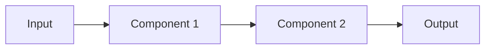

# genai-specs Methodology Skill

This skill provides deep understanding of the genai-specs development methodology used in the knowledge-agent project.

## When to Activate

This skill should be active when:
- Creating new work items or features
- Understanding project structure
- Writing user stories and acceptance criteria
- Planning feature implementation
- Organizing tasks and steps
- Reviewing compliance with genai-specs standards

## genai-specs Overview

genai-specs is a specification-driven development methodology designed for AI-assisted software development. It provides structured formats for requirements, design, and task breakdown that both humans and AI can understand.

**Repository**: https://github.com/betsalel-williamson/genai-specs

## Core Principles

### 1. Single Source of Truth

- All feature specifications live in `.work-items/{feature-name}/`
- No duplication of specifications across files
- Symlinks in `.claude/plans/` indicate active work
- Git history tracks all changes

### 2. ACID Tasks

Tasks must be **Atomic, Consistent, Isolated, and Durable**:

- **Atomic**: Each step is indivisible - either complete or not started
- **Consistent**: Completing a step leaves the system in valid state
- **Isolated**: Steps can be worked on independently
- **Durable**: Once complete, the work persists (tests, code, artifacts)

### 3. Verification Protocol

Never mark work complete without verification:
- All acceptance criteria met
- All tests passing
- Design implemented as specified
- Documentation updated
- Code quality standards met

> "Prematurely marking tasks as complete can lead to incomplete work and hinder project progress."

## Work Item Structure

### Directory Layout

```
.work-items/
├── {feature-name}/
│   ├── user-story.md          # User stories and acceptance criteria
│   ├── design.md              # Technical architecture and design
│   ├── task.md                # Task breakdown and test strategy
│   ├── 01_{step_name}.md      # Detailed step 1 implementation
│   ├── 02_{step_name}.md      # Detailed step 2 implementation
│   ├── 03_{step_name}.md      # ...
│   └── ...
```

### Example: 02-document-ingestion

```
.work-items/02-document-ingestion/
├── user-story.md                      # Research Analyst persona, EARS criteria
├── design.md                          # Architecture, components, data flow
├── task.md                            # 5-step breakdown with TDD strategy
├── 01_file_upload_endpoint.md         # File upload API implementation
├── 02_link_ingestion_endpoint.md      # URL ingestion with Firecrawl
├── 03_parse_and_chunk.md              # Document parsing and chunking
├── 04_generate_embeddings.md          # Vector embedding generation
└── 05_persist_artifacts.md            # Artifact storage and pipeline
```

## File Templates

### user-story.md Format

```markdown
# User Story: {Feature Name}

## User Persona

**Name:** {Persona Name}
**Description:** {Who they are and what they need}

## Story

**As a** {persona}
**I want to** {capability}
**so that** {benefit}

## Acceptance Criteria (EARS Format)

- WHEN {condition} THEN I SHALL {expected outcome}
- WHEN {condition} THEN I SHALL {expected outcome}
- IF {condition} THEN I SHALL {expected outcome}
- WHEN {condition} THEN I SHALL {expected outcome}

## Success Metrics

- ✅ {Measurable criterion 1}
- ✅ {Measurable criterion 2}
- ✅ {Measurable criterion 3}
```

#### EARS Format

**E**asy **A**pproach to **R**equirements **S**yntax:

- **WHEN** {trigger/precondition} **THEN** {system response}
- **IF** {condition} **THEN** {consequent}
- **WHERE** {feature applies} {requirement}
- **WHILE** {state} {requirement}

Example from 02-document-ingestion:
```
- WHEN I upload a PDF, DOCX, or Markdown file THEN I SHALL receive confirmation with an ingestion ID
- IF I upload an unsupported file type THEN I SHALL receive a clear error message indicating which types are supported
- WHEN a document is processed THEN I SHALL see it parsed into searchable chunks with preserved metadata
```

### design.md Format

```markdown
# Design: {Feature Name}

## Architecture Overview

{High-level description of the feature architecture}

## Components

### Component 1: {Name}

**Purpose**: {What it does}

**Interface**:
- Input: {Data structures}
- Output: {Data structures}
- Errors: {Error conditions}

**Dependencies**:
- External: {Libraries, services}
- Internal: {Other components}

### Component 2: {Name}
...

## Data Flow

1. {Step 1 description}
2. {Step 2 description}
3. {Step 3 description}



## API Contracts

### Endpoint: POST /api/endpoint

**Request**:
```json
{
  "field": "value"
}
```

**Response**:
```json
{
  "status": "success",
  "data": {}
}
```

## Data Models

### Model 1
...

## Error Handling

{How errors are handled and propagated}

## Security Considerations

{Authentication, authorization, validation, SSRF protection, etc.}

## Performance Considerations

{Scalability, caching, optimization strategies}
```

### task.md Format

```markdown
# Task Breakdown: {Feature Name}

## Overview

{Brief summary of what this feature accomplishes}

## Requirements Traceability

- Links to: `user-story.md` - {brief reference}
- Links to: `design.md` - {brief reference}
- Original tasks: {Task IDs from migration if applicable}

## Test Strategy

- **Unit Tests**: {What to unit test}
- **Integration Tests**: {What to integration test}
- **Acceptance Tests**: {How to verify acceptance criteria}

## Sequential Steps (TDD Approach)

Each step follows Red → Green → Refactor cycle:

### 01 - {Step Title}

**Objective**: {What this step accomplishes}

**Acceptance Criteria**:
- {Specific criterion 1}
- {Specific criterion 2}
- {Specific criterion 3}

**TDD Cycle**:
1. **Red**: {What tests to write}
2. **Green**: {What to implement}
3. **Refactor**: {What to improve}

**Estimated Time**: {X-Y hours/minutes}

### 02 - {Step Title}
...
```

### {N}_{step_name}.md Format

```markdown
# Step {N}: {Step Title}

## Objective

{Detailed description of what this step accomplishes}

## Atomic Implementation

This step is atomic: {explain how it's indivisible}

## TDD Cycle

### Red Phase

Write failing tests that define expected behavior:

```python
# tests/test_{feature}.py

def test_{scenario}():
    """Test that {component} {behavior}."""
    # ARRANGE
    {setup code}

    # ACT
    {execution code}

    # ASSERT
    {verification code}
```

{Additional test examples}

**Run tests**: `pytest tests/test_{feature}.py -v`

**Expected outcome**: Tests fail with clear error messages

### Green Phase

Implement minimal code to make tests pass:

**Create/modify files**:
- `{module}/{file}.py` - {purpose}

**Implementation**:

```python
# {module}/{file}.py

def {function_name}({parameters}) -> {return_type}:
    """{Docstring}"""
    {minimal implementation}
```

**Dependencies to add** (if any):
```
{package}=={version}
```

**Run tests**: `pytest tests/test_{feature}.py -v`

**Expected outcome**: All tests pass ✅

### Refactor Phase

Improve code quality while keeping tests green:

**Refactoring checklist**:
- [ ] Extract common patterns
- [ ] Add type hints
- [ ] Add comprehensive docstrings
- [ ] Add logging statements
- [ ] Improve variable/function names
- [ ] Add error handling
- [ ] Remove duplicated code

**Run full test suite**: `pytest tests/ -v`

**Expected outcome**: All tests still pass, code is cleaner

## Completion Criteria

- [ ] All tests passing
- [ ] Code follows project standards
- [ ] Type hints present
- [ ] Docstrings complete
- [ ] Logging added
- [ ] No TODO comments
- [ ] Ready to commit

## Commit Message Template

```
feat({feature}): {step title}

- {What was implemented}
- {Tests added}
- {Any notes}

Acceptance criteria: {X}/{X} met
Test coverage:  faster)

🤖 Generated with Claude Code
Co-Authored-By: Claude <noreply@anthropic.com>
```
```

## Active Work Management

### Starting a Feature

**Manual**:
```bash
cd .claude/plans
ln -s ../../.work-items/02-document-ingestion/task.md 02-document-ingestion-task.plan.md
git add .
git commit -m "chore: start 02-document-ingestion"
```

**Using script** (recommended):
```bash
./scripts/start-feature.sh 02-document-ingestion
```

**Or using slash command**:
```
/start-feature 02-document-ingestion
```

### Working on a Feature

1. Read symlinked `task.md` in `.claude/plans/`
2. Read current step file (e.g., `01_file_upload_endpoint.md`)
3. Follow TDD cycle: RED → GREEN → REFACTOR
4. Commit after each step
5. Move to next step

### Completing a Feature

**Manual**:
```bash
rm .claude/plans/02-document-ingestion-task.plan.md
git add .
git commit -m "feat: complete 02-document-ingestion - all criteria met"
```

**Using script** (recommended):
```bash
./scripts/complete-feature.sh 02-document-ingestion
```

**Or using slash command**:
```
/complete-feature 02-document-ingestion
```

## Compliance Checklist

Before marking any work complete, verify:

### Step Completion
- [ ] All tests for this step passing
- [ ] Implementation matches step specification
- [ ] Code quality standards met (type hints, docstrings, logging)
- [ ] Step committed to git
- [ ] Time tracking recorded

### Feature Completion
- [ ] All numbered steps complete
- [ ] All acceptance criteria from user-story.md met
- [ ] All components from design.md implemented
- [ ] Full test suite passing
- [ ] No TODO comments
- [ ] Documentation updated
- [ ] Symlink removed from `.claude/plans/`
- [ ] Completion commit created

## Common Mistakes to Avoid

### ❌ Don't: Skip acceptance criteria verification
```
# BAD: Assuming feature is complete without checking
rm .claude/plans/02-document-ingestion-task.plan.md
# (Without verifying all criteria met)
```

### ✅ Do: Verify systematically
```
# GOOD: Use verification command
/verify-step  # For current step
/complete-feature 02-document-ingestion  # For full feature (includes verification)
```

### ❌ Don't: Create steps that aren't atomic
```markdown
# BAD: Step mixes multiple concerns
### 01 - Setup Everything

Implement database, API, frontend, and deployment
```

### ✅ Do: Make each step atomic and focused
```markdown
# GOOD: Each step is focused and testable
### 01 - Implement File Upload Endpoint
### 02 - Implement Link Ingestion Endpoint
### 03 - Implement Document Parsing
...
```

### ❌ Don't: Write vague acceptance criteria
```markdown
# BAD: Not measurable or testable
- System should work well
- Performance should be good
- Users should be happy
```

### ✅ Do: Write specific, testable criteria (EARS format)
```markdown
# GOOD: Specific and measurable
- WHEN I upload a PDF file THEN I SHALL receive an ingestion ID within 500ms
- WHEN I search with a query THEN I SHALL see results ranked by relevance score
- IF I provide an invalid URL THEN I SHALL receive a 400 error with explanation
```

### ❌ Don't: Mix implementation details in user stories
```markdown
# BAD: Too implementation-focused
As a user, I want the system to use Qdrant with COSINE similarity
and LangChain RecursiveCharacterTextSplitter with 1000 char chunks...
```

### ✅ Do: Focus on user value, put tech in design.md
```markdown
# GOOD: User-focused (user-story.md)
As a Research Analyst, I want to search my uploaded documents
so that I can find relevant information quickly

# Technical details go in design.md:
## Vector Search Implementation
- Vector store: Qdrant
- Similarity metric: COSINE
- Chunking: RecursiveCharacterTextSplitter (1000 chars, 200 overlap)
```

## Integration with Development Tools

### Slash Commands for genai-specs Workflow

- `/start-feature {name}` - Create symlink, show user story
- `/next-step` - Identify current step, show TDD guidance
- `/verify-step` - Check acceptance criteria for current step
- `/complete-feature {name}` - Verify all criteria and complete

### Git Integration

Symlinks are git-tracked, providing visibility:

```bash
# See when feature work started
git log --all -- .claude/plans/02-document-ingestion-task.plan.md

# See current active features
ls .claude/plans/*.plan.md

# See completed features
git log --all --oneline -- .claude/plans/ | grep "complete"
```

## References

- **genai-specs repository**: https://github.com/betsalel-williamson/genai-specs
- **EARS syntax**: https://alistairmavin.com/ears/
- **ACID principles**: Classical database transaction properties applied to tasks
- **Cursor Plans**: Original pattern for `.cursor/plans/` (adapted to `.claude/plans/`)

## Remember

- **Specifications before implementation** - Write user stories, design, tasks first
- **Atomic steps** - Each step should be complete and testable independently
- **EARS criteria** - Use WHEN/IF/WHERE/WHILE for clear requirements
- **Verify before completing** - Never skip verification protocol
- **Git tracks progress** - Symlinks show active work, commits show completion
- **Single source of truth** - `.work-items/` is canonical, plans are views

This skill helps you maintain rigorous specification-driven development throughout the knowledge-agent project, ensuring clarity, completeness, and AI-assisted efficiency.
