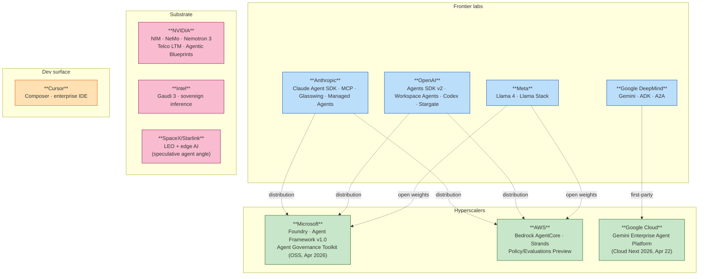
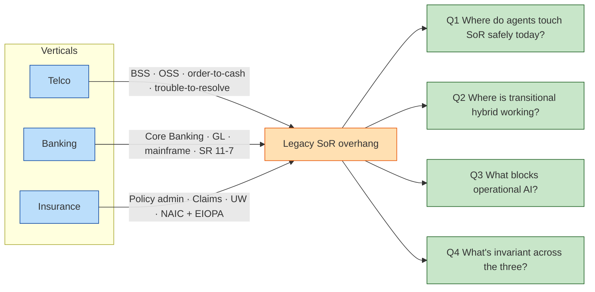
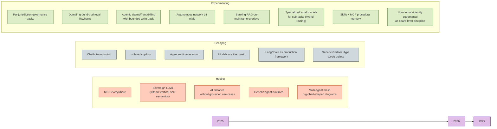

# Agentic AI Industry Scan — April 2026

> **Executive verdict.** Agentic AI is moving from "LLM apps with tools" into an enterprise software architecture category. The market is converging on **six layers** (model · context · tool execution · orchestration · governance · observability) that buyers now have to evaluate explicitly. The strategic battle is no longer prompt quality. It is **control over enterprise context, workflow ownership, identity, evaluation, and the right to intermediate between the user and existing systems-of-record**. From an Amdocs-class SI's seat, the productive way to read this market is in **three tracks** — Cognitive overlay, Transitional hybrid, Operational AI — applied across telco, banking, and insurance, all of which share the legacy-SoR pattern.

---

## Executive summary

1. **Overlay is at production scale; operational is not.** Verizon (28k care reps on Vertex/Gemini), AT&T's "Ask AT&T" (100k users, ~27B tokens/day, 71 GenAI solutions on Foundry), JPMorgan's LLM Suite (200k+ employees), BBVA (120k employees on ChatGPT Enterprise), Allianz Project Nemo (7-agent claims pipeline), Aviva (80+ AI models, £60M saved 2024) all run *Cognitive overlay* in production. *Operational AI* is narrowly scoped and mostly contingent on a writable cloud-native ledger that does not yet exist at most banks (JPM Apex / Thought Machine), greenfield (Lemonade), or single-line (CFC cyber UW Lane Assist; Capital One auto-dealer Concierge) *(Cai, 2025; AT&T, 2025; CNBC, 2025; PYMNTS, 2025; Allianz, 2025; Aviva, 2025; Stocktitan, 2025; CFC, 2025; VentureBeat, 2025)*.
2. **The transitional hybrid is the live battleground for the next 4–6 quarters.** Microsoft Agent Governance Toolkit (open-sourced 2 April 2026), AWS AgentCore Gateway/Policy/Evaluations (Preview 2026), and Google A2A + ADK in Gemini Enterprise Agent Platform (Cloud Next 2026) all converge on the same shape: a policy-enforcing gateway between the agent and the SoR, with OpenTelemetry semantics. SI revenue accrues here *(Microsoft Open Source, 2026; AWS, 2026; Google Cloud, 2026)*.
3. **Standards have consolidated.** MCP went from ~2M to **97M monthly SDK downloads in 16 months** and was donated to the Linux Foundation **Agentic AI Foundation (AAIF)** in December 2025 alongside Block's `goose` and OpenAI's `AGENTS.md`. The runtime/governance protocol layer is no longer a moat *(Linux Foundation, 2025; AAIF, 2026)*.
4. **The single most dangerous adversary for an Amdocs-class SI is Cohere.** Bell Canada strategic partnership (July 2025), STC "North for Telecom" (LEAP 2025), and the Aleph Alpha acquisition (April 2026, $600M Schwarz Group anchor in Cohere Series E) replicate the SI's exact pitch: vertical agent platform + sovereign data residency + named Tier-1 telco logos. Mistral (Orange Le Chat Pro, Proximus NXT) is the secondary EU threat. **Eclipse LMOS** (DT origin, Eclipse-governed, ADL donated October 2025) is the third — and is the one telco RFPs will name within 18 months *(CNBC, 2026; Bell Canada, 2025; Orange, 2025; Eclipse Foundation, 2025)*.
5. **Services revenue is structurally exposed.** BCG explicitly frames agentic AI as both a $200B opportunity *and* a direct threat to technology-service delivery models. EY Canvas embedding a multi-agent framework into 160,000 audit engagements (with Microsoft technology) is the cleanest proof point that professional services are **rebuilding their own delivery platforms around agents** — they are not only advising on them *(BCG, 2025; EY Canvas, 2026)*.
6. **Governance is the product.** Deloitte: 75% plan agentic deployment within 2 years; **only 21% have mature agent governance**. KPMG: identity, audit, non-human access and authorization gaps are now *board-level risks*. Bain: **80% of GenAI use cases met or exceeded expectations, but only 23% of companies can tie initiatives to measurable revenue or cost impact**. The killer question is no longer "does the agent work?" — it is "can we prove business impact under controlled risk?" *(Deloitte, 2026; KPMG, 2026; Bain, 2025)*.
7. **The science of evaluation is broken — and that is a strategic opening.** MAST failure taxonomy (NeurIPS 2025), judge instability (EMNLP 2025 Findings), 37% lab-to-production gap, ~50× cost variance for similar accuracy. The SI that pairs **domain ground truth** with continuous online evaluation builds a private flywheel hyperscaler-shipped OpenInference traces cannot replicate *(Cemri et al., 2025; ACL Findings, 2025; Galileo, 2026)*.

**Confidence**: High on overlay evidence and standards-consolidation. Medium on per-vertical operational evidence (sample skews to Tier-1; vendor PR contamination is real). Low-Medium on long-horizon adoption-rate predictions (the consultancy spread is 14% to 79% on essentially the same questions — see §2.1).

---

## 1. The integrated frame: three tracks × six layers

The market is best understood as the *intersection* of two orthogonal frames:

- **Three tracks** (where the agent touches the SoR): **Cognitive overlay** (reads, summarizes, drafts; humans dispose) — **Transitional hybrid** (bounded write-back through policy gates) — **Operational AI** (agent binds, posts, settles, configures; replaces the SoR-action surface).
- **Six layers** (categories any agent product must address): **Model** · **Context** · **Tool execution** · **Orchestration** · **Governance** · **Observability**.

```mermaid
flowchart TB
    subgraph Tracks["**THREE TRACKS** (where the agent touches SoR)"]
        direction LR
        TR1["**Cognitive overlay** 🟧<br/>Read · Retrieve · Summarize · Draft<br/>Human disposes"]
        TR2["**Transitional hybrid** 🟨<br/>Bounded write-back<br/>via policy + approval gates"]
        TR3["**Operational AI** 🟩<br/>Bind · Post · Settle · Configure<br/>Replaces SoR-action surface"]
    end
    subgraph Layers["**SIX LAYERS** (categories any agent product must address)"]
        direction LR
        L1["**Model**<br/>Frontier · OSS · sovereign<br/>multi-model dynamic routing"]
        L2["**Context**<br/>Knowledge graph · RAG<br/>process mining · provenance"]
        L3["**Tool execution**<br/>APIs · MCP servers · browser/computer<br/>workflow engines"]
        L4["**Orchestration**<br/>State machines · graph workflows<br/>multi-agent · durable execution"]
        L5["**Governance**<br/>Identity · policy · secrets<br/>delegated authority · audit"]
        L6["**Observability**<br/>Trace · replay · provenance<br/>cost attribution · drift"]
    end
    SoR[("Legacy SoR<br/>BSS · GL/Core Banking · Policy Mgmt")]
    TR1 -->|reads| SoR
    TR2 -->|writes through gateway<br/>+ MCP + audit + HITL| SoR
    TR3 -.->|replaces or owns<br/>(rare today)| SoR

    classDef t1 fill:#ffccbc,stroke:#bf360c,color:#000
    classDef t2 fill:#fff59d,stroke:#f57f17,color:#000
    classDef t3 fill:#dcedc8,stroke:#33691e,color:#000
    classDef ly fill:#e1f5fe,stroke:#0277bd,color:#000
    classDef sor fill:#d1c4e9,stroke:#4527a0,color:#000
    class TR1 t1
    class TR2 t2
    class TR3 t3
    class L1,L2,L3,L4,L5,L6 ly
    class SoR sor
```

**Decision tree (used to triage opportunities throughout this scan):**
1. *Does the agent commit a transaction to the SoR?* → No: **Overlay**. Yes: continue.
2. *Is the commit reversible without external counterparty involvement?* → No (GL post, treaty pricing, network reconfig in production): high-risk path → **Operational** (rare today).
3. *Reversible with HITL approval before commit?* → **Transitional hybrid**.
4. *Greenfield (no legacy SoR)?* → **Operational by default** (Lemonade pattern).

**Where margin accrues at each layer.** The protocol war for the bottom is over (MCP/AAIF/OpenInference). Margin no longer accrues at the model, runtime, governance protocol, or eval layer. It accrues at:

- **Vertical SoR adapters** (Telco BSS, Bank Core, Policy admin) — Layer 2/3 with deep semantics.
- **Per-jurisdiction obligation packs** (EU AI Act, NAIC, EIOPA, SR 11-7, GSMA) — Layer 5 productized as SKUs.
- **Domain ground-truth eval flywheels** (call-center QA, network KPIs, claim outcomes, billing reconciliations) — Layer 6 enriched by years of operator/insurer/bank data.

This is the SI's defensible footprint.

---

## 2. Cross-actor signal map

### 2.1 Consultancies — the hype owners

| Firm | Headline 2025–26 thesis | Track tilt | Rigor |
|---|---|---|---|
| **Gartner** | "40% of enterprise apps will feature task-specific AI agents by end-2026 (up from <5% in 2025)"; "60% of brands will use agentic AI for one-to-one interactions by 2028"; "by 2027, over 40% of agentic projects will be cancelled" — strongest skeptic. | **Overlay & Transitional bullish; Operational bearish.** | High *(Gartner, 2025a; 2025b)* |
| **Deloitte** | Ambition vs activation gap: 75% plan to deploy agentic within 2 years; only 21% have mature governance; 74% expect agents at least moderately by 2027. | **Transitional bullish.** | High; n=3,235 across 24 countries *(Deloitte, 2026)* |
| **KPMG** | "2026 = orchestrated super-agent ecosystems"; agent deployment quadrupled (11% → 42% peak) before settling at 26%; **identity and non-human access are board-level risks** — strongest call for AI Gateway-style governance; **61% of boards "not actively exploring agentic AI"** — sharpest contrarian boardroom data. | **Transitional bullish.** | High; longitudinal Pulse *(KPMG, 2026)* |
| **EY** | 89% insist HITL remains crucial; banking 99% awareness vs 31% implementation; insurance ~50% have agentic in test/prod. **EY Canvas embeds a multi-agent framework into 160,000 audit engagements** (with Microsoft) — internal proof of professional-services rebuild. | **Overlay & Transitional bullish; Operational bearish.** | High; multi-pulse *(EY, 2025a/b; EY Canvas, 2026)* |
| **PwC** | "Agentic AI is an exponential workforce multiplier"; 79% report agents adopted; 88% increasing budgets specifically for agentic. | **Operational bullish — most aspirational.** | Mixed; framing-heavy *(PwC, 2025)* |
| **Bain** | "A purist view of architecture won't meet the moment"; expect "rapid, fitful, hard-to-predict progress"; vendor lock-in and domain solutions, not unified platforms. **80% of GenAI use cases met/exceeded expectations; only 23% of companies tie initiatives to measurable revenue or cost.** Closest to this scan's posture. | **Transitional bullish.** | High; named-author research *(Bain, 2025)* |
| **BCG** | "5% of firms are future-built and capture the value gap"; agents reduce low-value work 25–40%, accelerate processes 30–50%; agentic AI = 17% of AI value 2025 → 29% by 2028. **Frames agentic AI as both a $200B opportunity AND a direct threat to technology-service delivery models** — load-bearing for any SI's strategic posture. | **Operational bullish.** | Mixed; aspirational headline *(BCG, 2025a/b)* |
| **Accenture** | "Declaration of Autonomy" Tech Vision 2025; acquired Avanseus February 2026 for autonomous-network telco capability; expanded Google Cloud partnership around Gemini Enterprise. | **Operational bullish; vertical-specific.** | Marketing-loaded but capital-deploying *(Accenture, 2025; 2026)* |
| **Thoughtworks** | "Vibe coding" displaced by "context engineering"; AI antipatterns flagged; "sustained human judgment" required. **93% of IT leaders plan to deploy AI agents by 2026** (Agentic AI Advantage report); engineering-grounded skepticism. | **Overlay & Transitional bullish; Operational skeptic.** | High practitioner rigor; low statistical *(Thoughtworks, 2025)* |

**Convergence.** Every firm flags governance, observability, and data readiness as universal blockers. Every firm agrees most enterprises are not ready to operate agents safely at scale.

**Divergence.** PwC + Accenture + BCG project rapid scaled value; Gartner + Bain + Thoughtworks expect "rapid but fitful" with high failure rates. The KPMG board finding (61% not exploring) directly contradicts the PwC adoption narrative (79% adopted) — these are not the same definition of "adopted."

**Source-quality call for the SI.** Weight Bain, EY, Deloitte, Gartner, KPMG for substantive operational claims. Use Accenture and PwC primarily as evidence of **executive-team narrative pressure** the SI must respond to in client conversations, not as ground truth on adoption maturity. Thoughtworks Tech Radar is the cleanest engineering-grounded counter-weight.

---

### 2.2 Hyperscalers and major platform strategy



**Strategic readings:**

- **Microsoft** — owns the SoR floor (Dynamics 365 industry agents in banking/insurance/telco), the user surface (M365 Copilot), the agent-build platform (Copilot Studio + Agent Framework v1.0), and the **first-party governance toolkit (Agent Governance Toolkit, OSS, April 2026)**. **Commerzbank "Ava" autonomously resolves 75% of inbound conversations** on Foundry Agent Service — the bellwether for transitional-hybrid in banking. AT&T → Microsoft (~100k employees on Azure AI Foundry, 71 GenAI solutions). FiberCop on D365 Contact Center *(Microsoft Customer Stories, 2026; Microsoft Open Source, 2026; Microsoft Industry, 2026)*.
- **Google Cloud** — **Gemini Enterprise Agent Platform** (Cloud Next 2026, 22 April 2026) merges Vertex AI + Agentspace with A2A as the inter-agent control plane in production at 150+ orgs. Verizon (28k care reps, 95% answerability), Bell Canada Network AI Ops, Deutsche Bank Lumina (97% accuracy, 40% time reduction), Generali France voice claims *(Google Cloud, 2026; Cai, 2025; PYMNTS, 2026)*.
- **AWS** — **Bedrock AgentCore** (GA October 2025); **Policy + Evaluations Preview 2026**; framework-neutral (Strands, LangGraph, LlamaIndex, CrewAI, Strands). Amdocs multi-year MWC26 partnership. OpenAI Frontier $110B distribution deal March 2026 *(AWS, 2025; 2026)*.
- **Anthropic** — **Claude Agent SDK + MCP**; **MCP donated to Linux Foundation AAIF, December 2025**; **Project Glasswing** (April 2026, AI security with Cisco $100M credits + Apple/Google/MS/Nvidia/Palo Alto/CrowdStrike). Allianz Project Nemo (insurance), Infosys (SI partner for telco/FS/insurance), PwC Cowork (financial services + life sciences), SK Telecom $100M strategic investment + Telco-LLM with Global Telco AI Alliance *(Anthropic, 2025; 2026; FStech, 2026; CRN Asia, 2026; PwC press, 2026)*.
- **OpenAI** — **Agents SDK v2** (sandbox tool orchestration, tracing, handoffs); **ChatGPT Workspace Agents**; Codex; AGENTS.md (donated to AAIF). **Deutsche Telekom multi-year (~200k employees, December 2025)** is the largest single telco-LLM-lab commitment to date. Morgan Stanley, BNY, Commonwealth Bank, T-Mobile US named. Stargate UAE (200 MW live 2026, 1 GW planned) with G42, Oracle, NVIDIA, Cisco, SoftBank *(OpenAI, 2025–2026; CNBC, 2025)*.
- **Meta** — Llama 4 (Scout, Maverick, Behemoth roadmap); **Llama Stack** as enterprise reference distribution (NVIDIA NeMo microservices integrated). Capital One Concierge, Reliance partnership for enterprise AI in India. **The reported Manus acquisition dispute** (April 2026: China blocked Meta's planned acquisition of Manus, framing it a national-strategic AI asset) is a strategic signal: general-purpose agents are now geopolitical assets *(Meta, 2025; Reuters/various, 2026)*.
- **NVIDIA** — **Telco LTM 30B + AI-RAN with Nokia ($1B partnership) + T-Mobile + GSMA Open Telco AI**; HUMAIN 500 MW sovereign factories; Saudi 250k Blackwell GPUs; UAE chip mega-deal. The clearest *Operational AI* lead in network domain *(NVIDIA, 2025; 2026)*.
- **Intel** — Gaudi 3 (HL-338 PCIe, +20% throughput / 2× price-performance vs H100 on Llama 2 70B inference); **e& enterprise sovereign inference platform** for UAE/Saudi/Egypt/Oman/Turkey/Qatar/South Africa. Lower-cost regional inference is the wedge *(Intel, 2025; e&, 2025)*.
- **Cursor** — ~$2B ARR, targeting $50B valuation; Composer agent (multi-file, automated test loops, video/log/screenshot recording added February 2026); ~60% of revenue is enterprise. The de facto agent IDE inside the SI middle layer *(TechBuzz / Next Web, 2026)*.
- **SpaceX / Starlink** — connectivity-AI angle (LEO + on-orbit preprocessing). Reported Cursor option/acquisition speculation is *unverified market chatter*; the real signal is that mission-critical engineering firms increasingly see coding agents as strategic infrastructure *(Computer Weekly, 2026; flagged speculative)*.

**Where the meta-adversary lives.** The single most likely SI-workflow absorber in 2026–2027 is **Microsoft**: only player owning (a) SoR floor, (b) user surface, (c) agent-build platform, (d) first-party governance toolkit, and (e) Foundry as multi-model home (GPT-5.x + Claude + Phi). Anthropic is second-most-dangerous via the SI channel (PwC, Infosys, SKT). NVIDIA is third, bounded to telco-network workflows.

---

### 2.3 Chinese & sovereign challengers

**Chinese model layer is now frontier-credible at fractional cost.** DeepSeek V4 Preview (24 April 2026, 1M-token context, MoE, dual-mode), Qwen3.6-Plus (April 2026, MCP-native, AgentScope orchestrator, Wukong agent platform), Moonshot Kimi K2.6 (20 April 2026, 1T MoE, **300 sub-agents over 4,000 coordinated steps autonomously over 5 days**), GLM-4.6/4.7 (MIT-licensed, sovereign-friendly), ERNIE 5.0 (Baidu World 2025), Tencent Hunyuan 3.0 (April 2026, WeChat AI agent integration), ByteDance Doubao 2.0 (February 2026, "Agent era"). **Qwen has overtaken Llama in cumulative HF downloads (Qwen 942M vs Llama 476M, March 2026)** *(MIT Tech Review, 2026; Dataconomy, 2026; Marktechpost, 2026; HuggingFace, 2026)*.

**The Manus signal is geopolitical.** Manus launched as a general AI agent in China in 2025; in April 2026 multiple reports said China blocked Meta's planned acquisition of Manus, framing it as a **national-strategic AI asset**. *Implication for enterprise buyers*: cross-border agent platforms may become subject to export, data, and ownership restrictions. *Implication for the SI*: general-purpose agents are now sovereign assets; betting on a single global agent platform is increasingly fragile.

**The lead is in raw model economics and open-weights distribution. It is not in named EU/NA telco/bank/insurer enterprise references** outside Greater China.

**Sovereign challengers are converting EU/MENA digital-sovereignty mandates into operator-bundled deals:**

- **Mistral** — Orange Le Chat Pro bundled with Mobile Pro (February 2025); Proximus NXT (November 2025); EU sovereign positioning with named telco refs. *Codestral hosted on Orange Business sovereign infrastructure.*
- **Cohere** — **Bell Canada strategic partnership (July 2025) — largest commercial customer**; **STC "North for Telecom"** (LEAP 2025); **Aleph Alpha acquisition (April 2026, $600M Schwarz Group anchor)** consolidates German public sector reach. **The single most dangerous adversary template for an Amdocs-class SI.**
- **G42 (UAE)** — Digital Embassies + Greenshield (January 2026); Stargate UAE 5GW campus; Jais (Arabic LLM). *Sovereignty-as-a-service* — sells the legal/control wrapper, not just the model.
- **Humain (Saudi)** — center3 + Humain JV (December 2025) for 1GW DC capacity (250MW initial); Humain takes 51%, center3 49%. PIF-owned national AI vehicle. *Watch as the buyer, not yet the builder.*
- **Aleph Alpha** — effectively absorbed into Cohere (April 2026); the standalone EU sovereign pure-play narrative is now a Cohere-fronted transatlantic one. **Important signal: standalone EU sovereign labs are not surviving on their own.**

**Sharp call.** Telco is the wedge in every sovereign deal — operators are simultaneously customer, distributor, and infrastructure host. The biggest 18-month threat to a US-aligned SI like Amdocs is **Cohere**, not the hyperscalers. Mistral is the secondary EU threat. LMOS is a credible third because Deutsche Telekom will push it into telco RFPs.

---

### 2.4 Open-source ecosystem — the anti-lock-in layer

| Layer | Status | Evidence |
|---|---|---|
| **Model weights** | Fully commoditized | Qwen / DeepSeek / Llama / Gemma / Mistral / GLM all open *(HuggingFace, 2026)* |
| **Inference serving** | Fully commoditized | vLLM, SGLang, TensorRT-LLM are the production defaults *(YottaLabs, 2026)* |
| **Tool/data plane** | Commoditized as of December 2025 | **MCP under AAIF**, 97M monthly downloads, 5,800+ servers *(Linux Foundation, 2025)* |
| **Agent runtime** | Actively commoditizing | **LangGraph 1.0** (October 2025, first telco-prod ref: Vodafone Italy/Fastweb) — **Microsoft Agent Framework 1.0** (April 2026, AutoGen + Semantic Kernel consolidation) — **Eclipse LMOS + ADL** (October 2025, DT-native, telco-RFP-ready) *(LangChain, 2025; Visual Studio Magazine, 2026; Eclipse Foundation, 2025)* |
| **Agent governance / eval** | Standardizing | OWASP Agentic Top 10, EU AI Act mappings, OpenInference, OpenTelemetry GenAI semconv |
| **Vertical SoR adapters** | **Defensible** | Telco (Amdocs aOS, Netcracker), banking core (Temenos, TCS BaNCS, Thought Machine), insurance Policy (Guidewire Palisades + Agent Studio, Sapiens, Cytora) |

**Notable framework dynamics (Q4 2025 – Q1 2026):**

- **LangGraph** (state-machine + checkpoints) survives where stateful loops are required — Vodafone Italy/Fastweb production multi-agent care platform on LangGraph + LangSmith is the canonical European telco reference *(LangChain, 2025)*.
- **Microsoft Agent Framework 1.0** (April 2026) absorbed AutoGen + Semantic Kernel; default for any .NET-aligned bank/insurer stack.
- **Eclipse LMOS** powers DT's Frag Magenta OneBOT (>2M conversations across 3 countries, 380 use cases, agent build time 15d → 2d). DT donated **Agent Definition Language (ADL)** to Eclipse Foundation October 2025 — first open ADL for enterprise agents. *Will appear in EU telco RFPs within 18 months.*
- **CrewAI** for fast multi-agent prototyping; **LlamaIndex** when retrieval and document intelligence dominate; **Pydantic AI** for typed/schema discipline; **DSPy / Haystack / Mastra / MetaGPT** for specialized roles.
- **AAIF founding members (December 2025)**: AWS, Anthropic, Block, Bloomberg, Cloudflare, Google, Microsoft, OpenAI as Platinum. The agent-stack equivalent of CNCF — neutral governance is now the chosen vehicle for what used to be vendor-proprietary control. Amdocs needs to be at the table, not in the audience.

**The memo's sharp call.** Margin no longer accrues at the model, runtime, protocol, or eval layer. It accrues at vertical SoR adapters + per-jurisdiction governance packs + domain ground-truth flywheels. This is the SI's defensible footprint.

---

### 2.5 Builder & community signal layer (Tier-3, fenced)

**Not load-bearing for any numeric claim.** Captures vibe shifts and contrarian takes from r/LocalLLaMA, r/AIAgents, r/LangChain, r/ClaudeAI, X (Karpathy, Willison, Swyx, Husain, Yan, Lambert), Latent Space, Cognitive Revolution, AIE Summit, MCP Dev Summit NA 2026.

**Top 10 themes (Q4 2025 – Q1 2026):**

1. 🔥→📉 **The "LangChain Exit"** — production teams quietly migrate to raw vendor SDKs (OpenAI Agents SDK / Claude Agent SDK / direct calls); LangGraph survives where stateful loops/checkpoints are required *(Ravoid, 2026; HN, 2025)*.
2. 🔥 **Context engineering replaces prompt engineering** as the load-bearing skill (Karpathy framing, June 2025, still being cited in Q1 2026).
3. 🔥 **MCP becoming "enterprise plumbing"** — and the audit/auth/governance pain that comes with it. Production teams converging on 5–8 MCP servers behind a gateway, not 30 loose ones *(AAIF, 2026; Vercel AI SDK 6, 2026)*.
4. 📉 **Multi-agent fragility backlash** — Cognition's mid-2025 essay still cited; "single-agent + rich tools beats multi-agent swarms" is consensus in r/AIAgents *(Cognition; Nate's Newsletter, 2026)*.
5. 🔥 **Evals as the new craft** — Hamel Husain / Shreya Shankar cohorts; 2,000+ trained engineers including OpenAI/Anthropic teams *(Lenny's Newsletter, 2026)*.
6. 🔥 **Claude Code in CI/CD with hooks** — headless mode + PreToolUse/PostToolUse hooks; per-workflow token caps as policy enforcement *(Code With Seb, 2026; Pixelmojo, 2026)*.
7. 🧪 **Agent Skills > MCP for procedural memory** — Simon Willison's framing; tools (MCP) and procedure (Skills) split cleanly *(Willison, 2026; Subramanya, 2025)*.
8. 🔥 **"Agentic engineering" as named successor to "vibe coding"** *(Willison, 2026; TeamDay, 2026)*.
9. 🔥 **"Agents breaking containment" — Swyx's 2026 thesis** — 2026 is coding agents leaking into ops/SRE/support/finance *(Latent Space, 2026; Lambert, 2026)*.
10. 🧪 **Specialized small open models for repetitive sub-tasks** — hybrid routing (~70% local / 30% frontier cloud) becoming canonical *(Lambert, 2026; Latent Space, 2026)*.

**Builder pushback against the analyst/hyperscaler narrative:**

- *"Listen to builders, not consultants"* — direct rebuttal of McKinsey's "agentic mesh" framing *(Nate's Newsletter, 2026)*.
- Cognition's "multi-agent systems are fragile" weaponized in r/LangChain whenever vendors ship orchestrator decks.
- Gartner's own "agent washing" caveat (legacy RPA rebranded as agentic) gets cited *against* the hyperscaler/SI sales motion *(xpander.ai, 2026)*.

**Practical implication for the SI.** Two themes (#1 LangChain Exit and #4 multi-agent fragility) are direct headwinds for any SI architecture deck still leaning on multi-framework orchestration. Reset to: single-agent + rich tool catalog + deterministic checkpoints + headless Claude Code in CI + MCP gateway + Skills for procedural memory + ensemble evals.

---

### 2.6 Academic Q1 (industry-impact)

| Paper | Venue | Headline | Why the SI cares |
|---|---|---|---|
| **MAST: Why Multi-Agent LLM Systems Fail** *(Cemri et al., 2025)* | NeurIPS 2025 | 14 failure modes, 3 categories, 200+ tasks, 7 frameworks; κ=0.88 | First FMEA-grade checklist for agentic delivery. Mandate as vendor/internal pre-prod review gate. |
| **MCP-Bench** | NeurIPS 2025 | 28 live MCP servers, 250 tools; persistent failures in cross-tool grounding even at frontier | Procurement gate. Require MCP-Bench-style scores against tool catalog. |
| **τ-bench / τ²-bench / τ³-bench** *(Sierra)* | ICLR 2025+2026 | <60% multi-turn airline tasks resolved by frontier | Closest fit for telco care, retail-banking, claims call-deflection eval. Use τ³ banking as starting harness. |
| **DataMorgana** *(Filice et al., 2025)* | ACL 2025 Industry | Programmatic Q&A benchmark synthesis from enterprise corpora | Removes "no eval data" excuse on Day 1 of any RAG/agent engagement. |
| **GraphRAG-Bench** *(Xiang et al., 2026)* | ICLR 2026 | Multi-hop accuracy 43% → 91% with right graph variant; vector RAG cheaper for single-fact lookups | Settles GraphRAG-vs-RAG debate with a decision matrix. Reject blanket "GraphRAG everywhere" pitches. |
| **A-Mem: Agentic Memory** *(Xu, Yu et al., 2025)* | NeurIPS 2025 | Zettelkasten-inspired memory; F1 +35% over LoCoMo, +192% over MemGPT | Treat agent memory as first-class subsystem with own SLO. |
| **FinAgentBench** | NeurIPS / ICAIF 2025 | Top agents under-rank right chunk in ~30%+ of cases | Banking/wealth advisory copilots need *chunk-level* evaluation, not retrieval@k. |
| **JPM MRM Crews** *(Dasgupta et al., 2025)* | arXiv / FinAI Workshop | Multi-agent crews with HITL applied to SR 11-7-style validation | Canonical pattern for regulated SoR-touching workflows. Copy the artifact schema. |
| **LLM-Based Network Management Survey** *(Hong et al., 2025)* | IJNM (Wiley) Q1 | Catalog of measured wins (intent translation >90%) + gaps (closed-loop control, multi-vendor tool standardization) | Best entry-point reference for telco transformation leaders. |
| **Intent-Based Mgmt of Next-Gen Networks** | IEEE Network 2024 | Closed-loop intent translation with human-overridable rollback on testbed | Direct mapping to BSS/OSS portfolio; pattern to reference by name in telco engagements. |
| **NanoFlow** | OSDI 2025 | 1.9–2.3× throughput over vLLM on production traces | Multi-tenant SI hosting cost is dominated by inference. Benchmark against managed-inference pricing. |
| **Rating Roulette: Self-Inconsistency in LLM-as-a-Judge** | EMNLP 2025 Findings | Pairwise judge κ <0.6 on subjective tasks | Kills any agentic eval program built on a single LLM-judge call. Mandate ensemble judging. |
| **LLM-Based Multi-Agent Systems for SE** *(2025)* | ACM Computing Surveys | Top-tier survey of agentic SDLC, multi-agent SE, tool use, task decomposition | Authoritative reference for coding-agent claims; counterweight to vendor PR. |
| **AI Agents vs. Agentic AI: Conceptual taxonomy** *(2025)* | Information Fusion | Distinguishes simple agents from agentic AI systems (collaboration, persistent memory, dynamic decomposition, coordinated autonomy) | Category discipline for buyer conversations — "agent" is not one product class. |
| **Security and privacy of LLM agents** *(2025)* | ACM Computing Surveys | Agentic systems introduce tool-use, memory, data exfiltration, prompt injection, delegated-action risks | Critical for the governance / identity layer (§7). |
| **AI Agent Index** *(MIT/Cambridge/Stanford-linked, 2025)* | Applied safety index | Real-world agentic-system catalog with deployment + safety metadata | Useful applied reference, not peer-reviewed but rigorous. |

**The single paper an SI executive should read this quarter: MAST.** Only paper here that gives the executive a *defensive* tool — checklist to apply against any agentic vendor pitch or internal pilot, grounded in 200+ real failures, mapping cleanly onto existing risk-and-controls vocabulary.

**Where the literature is silent and the industry needs work.** SoR write-back safety (idempotency, compensating transactions); EU AI Act / GDPR / SR 11-7 operationalization; telco-specific eval benchmarks (no τ-bench equivalent for OSS fault management); multi-tenant agent serving economics; production drift detection with measured customer impact. These are research opportunities the SI could publish into to shape the standard.

---

### 2.7 Coding agents — the wedge market

Coding agents are the most mature agentic vertical because their artifacts are *measurable*: code diffs, tests, commits, PRs, build logs, issue trackers, cycle time.

**Trend: IDE and terminal agents are becoming SDLC actors.** Claude Code, OpenAI Codex, Cursor Composer, GitHub Copilot, Gemini Code Assist, AWS-based agents move from autocomplete to *repo-level work* — read codebase, plan, edit across files, run tests, debug, refactor, document, commit *(Anthropic, 2026; OpenAI, 2026; Cursor / Anysphere, 2026)*.

**Representative production patterns:**
- **Goldman Sachs + Citi on Cognition Devin** — 12k + 40k developers respectively *(CNBC, 2025; American Banker, 2025)*.
- **Bank of America** — 18,000 developers using coding agents *(CIO Dive, 2025)*.
- **AT&T** — Microsoft Copilot extended to ~20,000 staff *(Microsoft, 2026)*.
- **TELUS Fuel iX** — 2T tokens processed in 2025 *(RCR Wireless, 2025)*.
- **China Telecom Xingchen** — 100B/177B-param LLM used internally for SDLC; pilot commercial 177B distributed training over 500 km fiber *(Developing Telecoms, 2025)*.

**Strategic implication for the SI (services-disruption signal).** Coding agents directly attack the unit economics of application maintenance, migration, test generation, modernization, and documentation — i.e., the SI's services-revenue base. **BCG's framing of agentic AI as "disruption to tech services" is materially correct.** The defensive move for an Amdocs-class SI: convert coding-agent productivity into *productized modernization SKUs* (BSS COBOL → cloud-native, banking mainframe lift-and-modernize, insurance Policy admin migration) priced on outcome rather than hours.

**Sharper call.** The IDE-to-deployment seam is where the labs (Anthropic, OpenAI, Google DeepMind) win the developer-workflow layer. SIs should *partner-and-productize* on top of these SDKs, not build competing IDEs.

---

## 3. Vertical chapters

### 3.1 Telco

(Telco is the deepest case here; for the full operator-by-operator and standards build-out — TM Forum Manifesto, ETSI ENI Rel-4 Agent-Based Interface, 3GPP SA5 Rel-19, Linux Foundation AAIF — see `research/telco-genai-control-layers.md`.)

**Production overlay anchors.** Verizon × Google Cloud (28k care reps + retail; ~95% answerability; ~40% sales lift since January 2025) *(Cai, 2025)*; AT&T "Ask AT&T" + Workflows (100k users, ~27B tokens/day, 71 GenAI solutions) *(Microsoft, 2026)*; Vodafone SuperTOBi on Azure OpenAI (~9.5M customers across IT/PT/DE/TR; PT first-time resolution 15% → 60%) *(Vodafone, 2024)*; Bell Canada Network AI Ops on Google Cloud (productivity +75%; customer-reported issues –25%) *(PR Newswire, 2025)*.

**Transitional-hybrid anchors.** Vodafone Italy/Fastweb multi-agent care on LangGraph + LangSmith (production); DT Frag Magenta OneBOT on Eclipse LMOS / Qdrant (>2M conversations, 380 use cases, agent build time 15d → 2d); TELUS NEO Assistant (75% field-tech adoption); Telefónica Kernel + Microsoft Azure AI Studio *(LangChain, 2025; Qdrant, 2025; RCR Wireless, 2025)*.

**Operational anchors.** NTT Docomo commercial agentic AI for network maintenance with **15-second failure isolation in transport + RAN**; China Mobile L4 trial completed in Guangdong with Jiutian 1T-param LLM (VIP-complaint resolution from 2 days → 1.5 hours); Vivo Brazil first commercial test of Ericsson Agentic rApp-as-a-Service *(TelecomTV, 2025; Telecoms.com, 2025)*.

**Strategic implication.** Telco is the vertical where *Operational AI* has the most production momentum — but only in network operations, not in BSS write-back. The SI competes with NVIDIA (Telco LTM, AI-RAN, Nokia 6G), Cohere (Bell, STC sovereign), and Eclipse LMOS (DT-origin, telco-native). The defensive moat is not the runtime; it is the BSS / Order-to-Cash / Trouble-to-Resolve process map.

### 3.2 Banking

**Production overlay anchors.**
- **JPMorgan Chase** — LLM Suite to ~200k+ employees combining OpenAI + Anthropic models; 450+ active AI use cases *(CNBC, 2025)*.
- **Bank of America** — 270 AI/ML models in production; Erica virtual assistant; 18,000 developers using coding agents *(CIO Dive, 2025)*.
- **Citi** — Citi Stylus Workspaces with agentic AI; Cognition Devin to 40,000 developers *(Citi, 2025)*.
- **Wells Fargo** — Fargo (1B+ transactions); Google Agentspace agents bank-wide for 215k employees *(Google Cloud, 2025)*.
- **BBVA** — ChatGPT Enterprise across 120k employees in 25 countries; "The Eight" agent suites with OpenAI *(PYMNTS, 2025)*.
- **DBS** — Joy GenAI for corporate clients; ADA + ALAN proprietary AI factory *(Fortune, 2025)*.

**Transitional-hybrid anchors.**
- **Microsoft × Commerzbank "Ava"** — 30k+ conversations / month, **75% autonomous resolution** on Foundry Agent Service. Tier-1 bellwether *(Microsoft Customer Stories, 2026)*.
- **Nubank** — multimodal agentic transfer assistant via WhatsApp; 55% Tier-1 inquiry auto-resolution; transfer time 70s → <30s *(ZenML LLMOps DB, 2025)*.
- **JPMorgan** — agentic layer in pilot for multi-step employee tasks; **Apex re-platform onto Thought Machine Vault** is the multi-year program creating the writable cloud-native ledger that can become the SoR target for governed write-back *(Fintech Futures, 2024)*.
- **RBC AidenResearch** — fleet of specialized agents for Global Research; trade-execution agents adapting in real time *(NVIDIA, 2025)*.

**Operational anchors (narrow).**
- **Capital One auto-dealer "Chat Concierge"** — production multi-agent system that takes real actions on dealer systems *(VentureBeat, 2025)*.
- **Lemonade** — AI Maya/Jim/CX.AI; 96% FNOL fully bot-handled; 55% claims fully automated end-to-end. *Operational by virtue of having no legacy SoR.*

**Bank-tech vendor signals.** Temenos Product Manager Co-Pilot + FCM AI Agent; **TCS BaNCS AI Compass** (December 2025 — no-code agent builder); **FIS agentic-commerce platform** (Q1 2026 GA, partnered with Visa/Mastercard "Know Your Agent" credentials); **NICE Actimize X-Sight ActOne InvestigateAI** (50%+ investigation-time reduction claim); Backbase Agentic AI; Bloomberg ASKB roadmap; Murex MX.3 with MCP support.

**Banking-specific blockers (why operational AI is structurally slower in banking than in telco):**

1. **SR 11-7 (US Fed/OCC, 2011)** defines a "model" as a stable, validatable artifact with conceptual-soundness review and outcomes analysis on fixed cycles. **Agentic systems that recalibrate, plan, and call tools dynamically *break that frame*.** GARP and ECB commentary in 2025–26 has flagged this openly *(GARP, 2026)*.
2. **GL write-back blast radius** — a posted entry has unbounded downstream impact (regulatory reporting, capital ratios, customer balances) and is far harder to reverse than a telco order.
3. **Mainframe / COBOL inertia** — multi-year migration windows mean operational agents have nowhere reliable to write for most of the decade.
4. **Model Risk Management governance** — SR 11-7 pillars (independent validation, ongoing monitoring, model inventory) extending to non-deterministic agentic chains is unsolved.

**Single bank leading transitional-hybrid: JPMorgan Chase.** Only Tier-1 simultaneously running (a) production overlay (LLM Suite, 200k+ users), (b) explicit agentic layer in pilot for multi-step employee tasks, and (c) **the ledger-replacement program (Apex / Thought Machine Vault) that creates a writable cloud-native SoR for governed write-back later**.

### 3.3 Insurance

**Production overlay anchors.**
- **Aviva** — 80+ AI models across motor claims (QuantumBlack/McKinsey); £60M saved 2024; liability assessment –23 days; routing accuracy +30%; complaints –65%. AI underwriting tool launching November 2025 *(Aviva, 2025)*.
- **Travelers** — generative AI voice agent for FNOL; ~20k internal AI users *(Carrier Management, 2026)*.
- **Liberty Mutual** — LibertyGPT (~25% employee usage); AI Auto Damage Estimator *(Liberty Mutual, 2025)*.
- **MetLife** — MetIQ AI platform; Melli customer-service agent (wait time → 0; 85% customer approval) *(Innovation Leader, 2025)*.
- **Manulife / John Hancock** — ChatMFC (100% workforce, 75% engagement); Akka selected to operationalize agentic AI platform; **John Hancock genAI UW tool cuts life quote from 1 day → 15 min** *(Manulife press, 2026)*.

**Transitional-hybrid anchors.**
- **Allianz Project Nemo** — **7-agent workflow** (Planner, Coverage, etc.) for food-spoilage claims under $327; Anthropic partnership extending to motor / health intake. **80% claim cycle reduction; full workflow <5 minutes; expanding to travel / auto / property.** *Single cleanest published reference design for governed-execution, bounded write-back* *(Allianz, 2025; FStech, 2026)*.
- **AXA** — ~400 use cases; **60+ agentic in test or partial deployment**; AXA Switzerland Shift Claims early adopter *(Computing UK, 2026)*.
- **Zurich** — "Agentic AI Hyperchallenge" yielded **5 systems into production** *(Zurich press, 2025)*.
- **Hiscox Hailo** — Google Cloud AI lead-underwriting model; **lead open-market quote: 3 days → 3 minutes** *(Hiscox Group, 2024)*.
- **Tokio Marine & Nichido** — Salesforce Agentforce + Shift fraud + intake; EIS ClaimPulse; 5-principle AI governance framework *(Shift Technology, 2025)*.

**Operational anchors.**
- **Lemonade** — 96% FNOL fully bot-handled; 55% claims fully automated end-to-end *(Stocktitan, 2025 10-K)*.
- **CFC Underwriting "Lane Assist"** — agentic UW system in cyber team on real new-business submissions *(Insurance Business Mag, 2025)*.
- **Chubb** — "Radical automation" target: **85% of major UW + claims processes**; up to 20% workforce reduction announced *(Insurance Business Mag, 2025)*.

**Insurance-tech vendor signals.** **Guidewire Palisades** ships **Agentic Framework + Agent Studio** with **50 new AI agents announced**; **Shift Claims** (September 2025); **Cytora Autopilot** (acquired by Applied Systems); **Verisk Commercial GenAI Underwriting Assistant**; Sapiens Decision Model.AI; Moody's RMS IRP Navigator.

**Insurance-specific blockers:**

1. **NAIC Model Bulletin (December 2023)** — adopted by >50% of US states by 2025; mandates a written **AIS Program** *(NAIC, 2023)*.
2. **EIOPA Opinion on AI Governance and Risk Management** (6 August 2025) — risk-based, proportionate framework; bridges to **EU AI Act** for prohibited / high-risk classifications *(EIOPA, 2025)*.
3. **Adversarial-fairness / disparate impact** — state insurance commissioners increasingly demand bias audits in UW (Colorado SB21-169 set the US precedent).
4. **Long-tail liability + audit on claims decisions** — denial decisions must be reproducible, explainable, reviewable across statute of limitations.
5. **Reinsurance-treaty model approval cycles** — substituting genAI cat-modeling triggers re-approval and capital-charge re-negotiation.

**Single insurer leading transitional-hybrid: Allianz.** Project Nemo's named architecture (7 specialized agents, Planner + Coverage agents, sub-5-minute execution, mandatory human review on bounded action), governance principle ("ultimate responsibility always rests with a claims professional"), and Anthropic partnership with explicit human-in-the-loop architecture make Allianz the cleanest reference design.

**Citation correction.** EvolutionIQ was acquired by **CCC Intelligent Solutions** ($730M, closed January 2025), **not** Munich Re. Munich Re has a 2022 partnership/reseller relationship with EvolutionIQ for disability claims guidance.

---

## 4. Cross-vertical synthesis: "Legacy SoR enterprises"

Four invariant questions across telco / banking / insurance:



### Q1 — What is the SoR overhang?

| Vertical | Dominant SoR(s) | Modernization status (2026) |
|---|---|---|
| Telco | Amdocs / Netcracker BSS, OSS for fulfillment / assurance, mediation, charging, mainframe billing | Multi-year cloud migrations underway. |
| Banking | Mainframe COBOL ledgers, FIS / Finastra / TCS BaNCS / Temenos / Mambu cores; Murex / Calypso for capital markets | JPM Apex/Thought Machine is the only Tier-1 actively replacing the core. |
| Insurance | Guidewire / Duck Creek / Sapiens / Insurity Policy admin and Claims; reinsurance treaty engines | Cloud transitions underway (Guidewire Palisades), but legacy admin systems often >20 years old. |

### Q2 — Where do agents touch SoR safely today? (Cross-vertical overlay anchors)

- **CX / care summarization and routing** is unambiguously safe and at production scale across all three verticals.
- **Document → structured data** is safe (Liberty Mutual commercial UW, Wells Fargo contract-management agent, BT Openreach engineer notes).
- **Code modernization / engineering productivity** is safe (Goldman Sachs + Citi on Devin; AT&T Copilot; China Telecom Xingchen for SDLC).

### Q3 — Where is transitional hybrid working? (Named cases)

| Pattern | Telco | Banking | Insurance |
|---|---|---|---|
| Field/agent productivity (HITL approves) | TELUS NEO Assistant | Citi Stylus, Wells Fargo Agentspace | Manulife/John Hancock UW (1d→15min); Aviva UW launch |
| Bounded customer-facing action | Vivo + Sprinklr; SuperTOBi cross-channel | Capital One auto-dealer; Nubank transfers | Allianz Project Nemo <$327 spoilage; CFC Lane Assist (cyber) |
| Network/claims/fraud triage with bind delegated to human | NTT Docomo NOC; BT Dark NOC | RBC AidenResearch, NICE Actimize InvestigateAI | Shift Claims (AXA CH); Tokio Marine fraud + intake |

### Q4 — What blocks operational AI? Invariants across all three verticals.

1. **Reversibility and blast radius.** Telco network reconfig, banking GL post, insurance claim denial all share one trait: errors are expensive and partially-irreversible.
2. **Per-jurisdiction regulatory packs.** EU AI Act (telco, banking, insurance), SR 11-7 + SR 11-13 (banking), NAIC Model Bulletin + EIOPA Opinion + Colorado SB21-169 (insurance), TM Forum / GSMA + national telecom regulators (telco). **The SI's *moat* lives in shipping packaged controls per jurisdiction.**
3. **Auditability across long tails.** Banking SR 11-7 outcomes analysis, insurance long-tail liability, telco lawful-intercept and number-portability — all require replay, lineage, immutability across years.
4. **Adversarial fairness.** Banking lending fairness (ECOA), insurance disparate-impact obligations, telco non-discrimination on service provisioning.

---

## 5. Hype / decay / experiment radar (2025 → 2027)



**One signal sentence.** The market is *over-indexing* on runtimes and sovereign LLMs, *under-indexing* on per-jurisdiction governance packs, non-human identity, and domain ground-truth flywheels. The SI's strategic posture must invert that ratio.

---

## 6. Identity and non-human-agent governance (the under-indexed layer)

KPMG's signal — **"identity and non-human access are board-level risks"** — is the most under-developed dimension of agentic-AI deployment. As agents move from *recommend* to *act*, every action requires:

| Identity primitive | What enterprises must operationalize | Relevant standard / framework |
|---|---|---|
| **Non-human identity (NHI)** | Each agent (and each agent-run instance) has a distinct, scoped identity — not a shared service-account credential. | NIST SP 800-204D (2024); CSA Non-Human Identity guidance (2025) |
| **Delegated authority** | Per-tool, per-action, per-data-class permissions; with delegation chains traceable to a human authorizer. | OAuth 2.1 + MCP OAuth; FAPI 2.0 in banking |
| **Lifecycle** | Provisioning, rotation, revocation, deactivation when the agent role retires. Same hygiene as machine identities, but with higher cardinality. | ServiceNow / Microsoft Entra non-human identity workflows |
| **Audit trail** | Immutable record of every tool call, parameters, return, and policy decision — replayable and explainable. | OpenInference / OpenTelemetry GenAI semantic conventions |
| **Risk tiering** | Each agent typed by blast-radius (read-only vs bounded-write vs unbounded-write) with corresponding control intensity. | OWASP Agentic Top 10 (2025); EU AI Act Annex III high-risk taxonomy |

**Why this matters now.** ACM Computing Surveys (2025) on *Security and privacy of LLM agents* shows that agentic systems introduce **tool-use, memory, data-exfiltration, prompt-injection, and delegated-action risks beyond ordinary chatbot risks**. None of these are addressed by traditional IAM. **The SI that productizes a "non-human identity + audit + risk-tiering" SKU as part of its governed-execution gateway captures a discipline that is currently nobody's owned product.**

---

## 7. Buyer-side evaluation framework

The most mature 2026 buying thesis: **do not buy "agents." Buy controlled execution capacity over a well-governed context layer.** Buyers should evaluate platforms across:

| Evaluation area | What to ask |
|---|---|
| **Context** | Can the system represent enterprise knowledge beyond vector search: entities, relationships, policies, process flows, source provenance, time, ownership? |
| **Governance** | Can every agent action be permissioned, logged, replayed, revoked, and explained? |
| **Identity** | Are agents treated as non-human identities with scoped credentials and lifecycle management? |
| **Evaluation** | Are there task-level evals, regression evals, safety evals, tool-call evals, business-KPI evals? Is there ensemble-judge discipline (per *Rating Roulette*, EMNLP 2025) — not single-judge? |
| **Integration** | Does it connect to real enterprise systems without uncontrolled data leakage? Native MCP support? |
| **Observability** | Can the enterprise inspect reasoning traces, tool calls, state transitions, costs, failures, human approvals? |
| **Portability** | Can the enterprise switch models, frameworks, deployment environments? Open standards (MCP, AAIF, OpenInference) supported natively? |
| **Per-jurisdiction obligation packs** | Does the platform ship audit-ready packs for EU AI Act, NAIC, EIOPA, SR 11-7, GSMA, TM Forum? Or does the buyer have to assemble them? |
| **Economics** | Does the platform reduce labour cost, cycle time, error rate, or risk in a measurable way? Bain's "23% can tie to revenue or cost" should make this question mandatory. |
| **IP protection** | Does the vendor learn from, retain, or reuse enterprise domain context? Can the customer prevent cross-client knowledge leakage? |

**The SI's productization opportunity.** Sell this checklist *back to the buyer* as the SI's evaluation methodology, with the SI's own gateway as the reference answer. This converts a buyer-side checklist into an SI-side sales motion.

---

## 8. SI strategic playbook (three tracks)

### Cognitive overlay — defend, industrialize, expand

**Posture**: defend the installed base; industrialize delivery via productized SKUs (claims summarization, FNOL voice agent, BSS care copilot, code-modernization pack); expand into adjacent buyer surfaces (HR, Finance) where the same overlay primitives apply.

**KPIs**: license attach rate inside existing accounts; time-to-deploy per overlay SKU; cost-to-serve per agent-supported transaction.

**Watch out for**: hyperscaler industry-SKU encroachment (Microsoft Dynamics 365 industry agents, Salesforce Agentforce for Communications/FSI, Google Cloud + ServiceNow Autonomous Network Ops). The defence is **deeper SoR semantics** — context graph, entity resolution, lineage — not "another copilot."

### Transitional hybrid — where to win the next 4–6 quarters

**Posture**: build the **governed write-back gateway** as the SI's productized middleware. Mandatory components: MCP-native tool catalog; OpenInference-compliant traces; OWASP Agentic Top-10-mapped policy library; **non-human-identity discipline (per §6)**; per-jurisdiction obligation packs (EU AI Act, NAIC, EIOPA, SR 11-7, GSMA / TM Forum); ensemble-LLM-judge eval with disagreement → HITL escalation.

**KPIs**: agent-decision-to-commit latency; reversibility ratio; HITL-escalation rate; per-jurisdiction audit-pass rate; non-human identity coverage.

**Reference patterns to copy**: Allianz Nemo (insurance), Capital One Concierge (banking), JPM MRM Crews (banking risk), Vodafone Italy/Fastweb LangGraph + LangSmith (telco care), Microsoft Commerzbank Ava (banking transitional bellwether).

### Operational AI — greenfield bets, no over-investment

**Posture**: invest in narrow, high-value, reversibility-bounded pilots; partner with greenfield-native operators / insurers / banks (Lemonade-class) where there is no legacy SoR; co-build with NVIDIA (telco), Anthropic (regulated industries), Microsoft (Dynamics-anchored banking + insurance).

**KPIs**: pilot success rate; conversion-to-production rate; reversibility coverage.

**Watch out for**: PwC / Accenture / BCG framing pressure on the SI's executive committee. *They will overstate operational readiness*. The defensive answer is named-case data: 14% of Lloyd's firms have agents in UW (April 2025); only 21% of enterprises have mature agent governance (Deloitte, 2026); EY banking 99% awareness vs 31% implementation. The SI should not let consultancy framing drive capex into operational platforms before the science settles.

### Adversary overlay (consolidated)

| Track | Adversary thesis (best counter) | Strongest evidence | Thesis defense |
|---|---|---|---|
| **Cognitive overlay** | "Hyperscalers absorb it via Bedrock GraphRAG / Vertex / Fabric — overlay is a managed service by 2027." | AWS Bedrock Knowledge Bases GraphRAG GA (March 2025); Verizon stack on Vertex *(AWS, 2025; Google Cloud, 2025)* | Telco/bank/insurance entity resolution + 20+ legacy-system reconciliation is not commoditized. |
| **Transitional hybrid** | "MCP + AAIF + open agents + Microsoft/AWS/Google governance toolkits collapse this — no SI moat." | MCP donated to AAIF; Microsoft Agent Governance Toolkit OSS; AWS AgentCore Policy/Evaluations *(Linux Foundation, 2025; Microsoft Open Source, 2026; AWS, 2026)* | Per-jurisdiction obligation packs are *implementation*, not *standard*. The SI's moat is the obligation pack, not the protocol. |
| **Operational AI** | "Greenfield agentic enterprises do not exist at scale — operational is decade-out." | 14% of Lloyd's firms with agents in UW; 21% of enterprises with mature governance; EY 99/31 banking gap | True for horizontal operational. Vertical-bounded operational pilots (Lemonade, CFC Lane Assist, Capital One auto-dealer, Allianz Nemo) are real and growing. |

### Meta-adversary — "the three-track taxonomy collapses to two within 24 months"

**The strongest counter to this entire scan's framing**: by 2027–28, LLMs absorb the overlay (frontier model + tool-use becomes the overlay), leaving only operational greenfield. The middle (transitional hybrid) collapses because MCP + AAIF + Microsoft/AWS/Google governance toolkits + open standards make the gateway a managed feature, not a defensible product.

**Evidence pattern (2025–2026)**: AT&T → Microsoft, Verizon → Google, DT → OpenAI 200k seats, SK Telecom → Microsoft + OpenAI, MCP donated to AAIF, Microsoft Agent Framework GA, Microsoft Agent Governance Toolkit OSS, Bedrock GraphRAG GA. Every move *flattens* the stack the SI wants to defend.

**Defense.** Standards collapse stacks but **operators do not run their businesses on raw standards**. Somebody integrates, certifies, governs per jurisdiction, and absorbs liability. Historically every major IT collapse-to-two-layers prediction (mainframe → cloud, on-prem → SaaS) has produced a thick, persistent middle layer that captured most of the integration economics. The SI's response is *not* to deny the meta-adversary; it is to **specialize the middle layer so deeply into vertical SoR semantics and per-jurisdiction obligation packs that no horizontal hyperscaler stack can absorb it economically**.

---

## 9. Events, publishers, communities

**Events worth tracking:**

| Event | Why it matters |
|---|---|
| **AI Engineer World's Fair 2026** | 29 tracks, 300 speakers, 100 expo partners, 6,000+ AI engineers, founders, AI leaders. Strong for applied agent engineering and tooling. |
| **Agentic AI Summit** | Dedicated formats around agent architectures, memory, planning, orchestration, scaling. |
| **MCP Dev Summit (NA / EU)** | The de facto convening event for MCP-related production patterns. |
| **Chatbot Summit 2026** | Repositioned around "Mastering Agentic AI." |
| **Google Cloud Next, Microsoft Build / Ignite, AWS re:Invent, NVIDIA GTC** | Now agent-platform events, not only cloud or infrastructure. Google Next 2026 (April 22, Las Vegas) was framed around agentic enterprise updates. |
| **TM Forum DTW Ignite 2026** (Copenhagen, June 23–25) | Where Agentic NOC Catalyst (C26.0.924) and the Autonomous Networks Manifesto demonstrate. |

**Communities to monitor (signal vs noise):**

| Community | Useful signal | Caveat |
|---|---|---|
| **Reddit**: r/AI_Agents, r/aiagents, r/LangChain, r/cursor, r/LocalLLaMA, r/ClaudeAI | Practitioner pain: framework fatigue, tool reliability, pricing, local models, IDE comparisons. | Treat claims as weak evidence unless triangulated. |
| **X / Substack / LinkedIn** | Fastest source for demos, leaks, funding claims, postmortems. | High noise. Useful for weak-signal detection only. |
| **YouTube** | Tool walkthroughs and developer sentiment. | Lower reliability for strategy unless speaker is a known builder/platform engineer. |

**Publisher set:**

- **For executive monitoring**: Gartner, Deloitte, BCG, Bain, PwC, EY, KPMG, Accenture, Thoughtworks, HFS.
- **For technical monitoring**: OpenAI, Anthropic, Google Cloud, Microsoft Learn, AWS ML Blog, NVIDIA Developer, LangChain, LlamaIndex, Microsoft Semantic Kernel, CrewAI, Cursor / Anysphere updates.
- **For weak signals**: AI Engineer, The Information, VentureBeat, The Batch, Latent Space, Interconnects, Ben Thompson, Simon Willison, Swyx, Harrison Chase, Andrew Ng, Andrej Karpathy, Jack Clark, Nathan Lambert, Deedy Das, Bindu Reddy, Eugene Yan, Hamel Husain, Shreya Shankar.

---

## 10. Conclusions

**Sharpened final position.** The three-track × six-layer frame is correct as a 2025–2026 framing for legacy-SoR enterprises and is *brittle* as a 2027–28 framing. The strongest adversary case (collapse-to-two-layers, hyperscaler + lab platform absorbs the middle) is real, well-evidenced, and accelerating. But it does not erase the middle: it *thins* it.

**The defensible posture for an Amdocs-class global SI in 2026:**

1. **Concede the runtime layer.** Open frameworks + hyperscaler primitives win L4 (orchestration). Differentiate above them, not at them.
2. **Defend the context graph (L2).** Depth of telco / bank / insurance entity resolution + lineage is the moat; "data lake" is not.
3. **Win governed execution (L3 + L5) through obligation packs.** EU AI Act, NAIC, EIOPA, SR 11-7, GSMA, TM Forum — productized per-jurisdiction packs. MCP is the protocol; the obligation pack is the product.
4. **Industrialize the business workflow interface.** Industry SKUs that wrap proprietary process maps; expect Salesforce, ServiceNow, and Microsoft to pressure margin here, but the seam to telco/banking/insurance process is durable.
5. **Use developer workflow as the wedge for legacy modernization.** The only place agents can directly *reduce* the multi-decade cost stack the operator/bank/insurer carries.
6. **Treat evaluation and observability (L6) as the long bet.** The science is unstable today; the SI that pairs domain ground truth with continuous online evaluation owns a flywheel that compounds for a decade.
7. **Productize non-human identity.** Currently nobody's owned product. Bundle it inside the governed-execution gateway as a board-level-risk SKU.

**Per-vertical sharpened call.**

- *Telco*: defend overlay (Verizon-class) and transitional (Vodafone Italy / DT LMOS class). Do not chase NVIDIA on operational L4 autonomous network alone. Partner-or-perish with NVIDIA, but compete on the BSS / O2C / T2R process map.
- *Banking*: industrialize overlay (LLM Suite class), defend transitional via obligation packs (SR 11-7 native), bet on a small number of operational pilots in narrow lines (auto-dealer, intra-app transfers). Watch JPMorgan's Apex closely — only Western Tier-1 simultaneously solving overlay, transitional, and the writable-ledger precondition for operational.
- *Insurance*: industrialize overlay (Aviva / Travelers / Liberty class), defend transitional via NAIC + EIOPA packs, lead with claims triage / FNOL / UW copilot patterns. **Allianz Nemo is the reference architecture to copy.** Lemonade is the reference *for greenfield-only* operational; do not generalize.

**The single thing the SI must change about its 2026 messaging.** Stop selling "an agent platform." Sell **a governed execution gateway with productized per-jurisdiction obligation packs, deep vertical SoR semantics, non-human identity discipline, and a domain ground-truth eval flywheel.** The market is saturated with "agent platforms"; it is starving for the gateway-of-record.

**Bottom line.** Agentic AI is becoming the next enterprise control layer. The winning firms will not merely provide better models. They will own one of: (1) the enterprise context graph; (2) the agent runtime/orchestration layer; (3) the governed tool-execution layer; (4) the developer workflow; (5) the business workflow interface; (6) the evaluation and observability layer. **For incumbents whose moat depends on opaque systems, services dependency, or proprietary operational knowledge, agentic AI is structurally dangerous. For firms that can package their knowledge as governed, metered, secure, auditable agent services, it is a new product category.**

---

## 11. Limitations

1. **Time-horizon decay.** Evidence base is Q1 2024 → Q2 2026. Useful life of this framing: ~12–18 months.
2. **Tier-1 sample bias.** Operator / bank / insurer evidence skews to ~40 named Tier-1s. Tier-2 / Tier-3 / digital-native patterns are inferred.
3. **Vendor-PR contamination.** Many KPIs (Verizon ~40% sales lift, Bell Canada +75% productivity, Vodafone PT FTR 15→60%, JPM 95% AML false-positive reduction, Goldman 3–4× developer productivity) are partner-co-marketed. Direction, not magnitude.
4. **Eval / observability evidence is structurally thin.** Operators / banks / insurers rarely publish hallucination rates, regression frameworks, drift cadence, or red-team results.
5. **Standards forward-looking risk.** TM Forum Agentic NOC Catalyst (DTW Ignite June 2026), ETSI ENI Rel-4 ABI, Linux Foundation AAIF are demonstration / declaration grade for 2026; not production deployment evidence.
6. **Tier-3 community signals are fenced.** Not load-bearing for any numeric claim. Anglophone-builder bias acknowledged.
7. **Anglophone bias.** Chinese / Korean / Japanese / Arabic operator and bank disclosures rely on translated press.
8. **Adversary asymmetry.** Public artefacts only; private hyperscaler product roadmaps may be more (or less) aggressive.
9. **No counterfactuals on revenue / cost claims.** Reported productivity / cost / sales gains are typically gross.
10. **The scan is opinionated.** Where evidence is mixed, the synthesis chose the conservative reading. A more aggressive reading is defensible from the same evidence.
11. **Two specific claims flagged as speculative**: SpaceX–Cursor acquisition / option speculation; Meta–Manus deal block by China — both reported across multiple media outlets but without authoritative primary disclosure. Treated as weak signals only.

---

## 12. Bibliography

All URLs accessed **2026-04-27** unless otherwise noted. Source tiers: **T1** primary disclosures / peer-reviewed; **T2** trade press / consultancies / regulators; **T3** community signal (fenced).

### T1 — Primary disclosures

- **3GPP**. 2025. *AI/ML management — SA5*. https://www.3gpp.org/technologies/ai-ml-management2 ; https://www.3gpp.org/technologies/sa5-rel19
- **Allianz**. 2025. *When the storm clears, so should the claim queue (Project Nemo)*. https://www.allianz.com/en/mediacenter/news/articles/251103-when-the-storm-clears-so-should-the-claim-queue.html
- **Anthropic**. 2025. *Donating MCP to the Linux Foundation Agentic AI Foundation*. https://www.anthropic.com/news/donating-the-model-context-protocol-and-establishing-of-the-agentic-ai-foundation
- **Anthropic**. 2026. *Project Glasswing*. https://www.anthropic.com/glasswing
- **Anthropic**. 2026. *SK Telecom partnership*. https://www.anthropic.com/news/skt-partnership-announcement
- **Anthropic + Infosys**. 2026. *Anthropic partners with Infosys*. https://www.anthropic.com/news/anthropic-infosys
- **AT&T**. 2025. *Agentic AI*. https://about.att.com/blogs/2025/agentic-ai.html
- **AWS**. 2025a. *Bedrock Knowledge Bases GraphRAG GA*. https://aws.amazon.com/about-aws/whats-new/2025/03/amazon-bedrock-knowledge-bases-graphrag-generally-available/
- **AWS**. 2025b. *Amazon Bedrock AgentCore is now GA*. https://aws.amazon.com/blogs/machine-learning/amazon-bedrock-agentcore-is-now-generally-available/
- **AWS**. 2026. *AgentCore adds Quality Evaluations and Policy Controls*. https://aws.amazon.com/blogs/aws/amazon-bedrock-agentcore-adds-quality-evaluations-and-policy-controls-for-deploying-trusted-ai-agents/
- **Aviva**. 2025. *Aviva to launch groundbreaking AI underwriting tool*. https://www.aviva.com/newsroom/news-releases/2025/11/aviva-to-launch-groundbreaking-ai-underwriting-tool/
- **BBVA**. 2025. *BBVA deploys "The Eight"*. https://www.bbva.com/en/innovation/bbva-deploys-the-eight-its-strategy-to-transform-the-financial-experience-with-ai/
- **Bell Canada**. 2025. *Bell Canada and Cohere strategic partnership for sovereign AI*. https://www.bce.ca/news-and-media/releases/show/Bell-Canada-and-Cohere-forge-strategic-partnership-to-deliver-sovereign-AI-powered-solutions-for-government-and-business
- **Bell Canada**. 2026. *North by Cohere rolls out to Bell team members*. https://explore.business.bell.ca/news-and-events/north-by-cohere-rolls-out-to-bell-team-members
- **Bloomberg**. 2026. *ASKB roadmap*. https://www.bloomberg.com/professional/insights/press-announcement/bloomberg-unveils-askb-roadmap-for-clients-to-augment-their-investment-process-with-agentic-ai/
- **BT**. 2025. *BT GenAI Gateway on AWS*. https://newsroom.bt.com/bt-groups-digital-unit-launches-genai-gateway-platform-powered-by-aws-accelerating-the-companys-safe-adoption-of-generative-ai-at-scale/
- **CCC Intelligent Solutions**. 2025. *Acquires EvolutionIQ ($730M)*. https://ir.cccis.com/news-releases/news-release-details/ccc-intelligent-solutions-completes-acquisition-evolutioniq
- **Citi**. 2025. *Citi Stylus Workspaces*. https://www.citigroup.com/global/news/press-release/2025/citi-unveils-citi-stylus-workspaces-agentic-ai-turbocharging-productivity
- **CNBC**. 2026. *Cohere to acquire Aleph Alpha — $600M Schwarz Group anchor*. https://www.cnbc.com/2026/04/24/cohere-aleph-alpha-germany-ai-europe-expansion.html
- **Eclipse Foundation**. 2025. *Eclipse LMOS / Agent Definition Language*. https://newsroom.eclipse.org/news/announcements/eclipse-lmos-redefines-agentic-ai-industry%E2%80%99s-first-open-agent-definition
- **EIOPA**. 2025. *Opinion on AI Governance and Risk Management*. https://www.eiopa.europa.eu/eiopa-publishes-opinion-ai-governance-and-risk-management-2025-08-06_en
- **e&**. 2025a. *e& × IBM AI governance platform*. https://www.eand.com/en/news/22-jan-2025-eand-collaborates-with-ibm-to-launch-al-governance-platform.html
- **e&**. 2025b. *e& Sovereign Agentic AI Platform with Intel (GITEX 2025)*. https://www.eand.com/en/news/eand-unveils-blueprint-for-ai-app.html
- **EY Canvas**. 2026. *Multi-agent framework integrated into 160,000 audit engagements with Microsoft technology*. (EY press / industry coverage 2026.)
- **Ericsson**. 2025. *Ericsson + Vodafone 5-yr programmable networks*. https://www.ericsson.com/en/press-releases/2025/10/ericsson-and-vodafone-announce-major-five-year-programmable-networks-partnership
- **ETSI**. 2025. *GR ENI 051 v4.1.1 — Agent-Based Interface*. https://www.etsi.org/deliver/etsi_gr/ENI/001_099/051/04.01.01_60/gr_ENI051v040101p.pdf
- **FIS**. 2026. *Industry-first AI transaction platform*. https://www.fisglobal.com/about-us/media-room/press-release/2026/fis-launches-industry-first-ai-transaction-platform-to-help-banks-lead
- **G42**. 2026. *Digital Embassies and Greenshield*. https://www.g42.ai/resources/news/g42-introduces-digital-embassies-and-greenshield-make-ai-sovereignty-portable
- **Google Cloud**. 2025. *Verizon × Gemini integration*. https://www.googlecloudpresscorner.com/2025-04-09-Google-Cloud-and-Verizon-Drive-Customer-Experience-Improvements-for-Verizon-Customers-with-Gemini-Integration
- **Google Cloud**. 2026. *Gemini Enterprise Agent Platform*. https://cloud.google.com/blog/products/ai-machine-learning/introducing-gemini-enterprise-agent-platform
- **Google Cloud**. 2026. *Wells Fargo agentic AI on Agentspace*. https://cloud.google.com/blog/topics/financial-services/wells-fargo-agentic-ai-agentspace-empowering-workers
- **Guidewire**. 2026. *Palisades — Agentic Framework + Agent Studio*. https://www.guidewire.com/products/technology/guidewire-cloud-platform-releases
- **Hiscox Group**. 2024. *Hiscox AI Laboratories (Hailo)*. https://www.hiscoxgroup.com/news/press-releases/2023/12-12-23
- **Linux Foundation**. 2025. *Formation of the Agentic AI Foundation (AAIF)*. https://www.linuxfoundation.org/press/linux-foundation-announces-the-formation-of-the-agentic-ai-foundation
- **Microsoft Customer Stories**. 2026. *AT&T creates digital coworkers with Azure*. https://www.microsoft.com/en/customers/story/25679-at-and-t-azure
- **Microsoft Customer Stories**. 2026. *Commerzbank "Ava" on Azure AI Foundry Agent Service*. https://www.microsoft.com/en/customers/story/25676-commerzbank-ag-azure-ai-foundry-agent-service
- **Microsoft DevBlogs**. 2026. *Microsoft Agent Framework v1.0*. https://devblogs.microsoft.com/agent-framework/microsoft-agent-framework-version-1-0/
- **Microsoft Industry**. 2026. *Telecom return on intelligence with unified, trusted AI platform*. https://www.microsoft.com/en-us/industry/blog/telecommunications/2026/02/24/microsoft-accelerates-telecom-return-on-intelligence-with-a-unified-trusted-ai-platform/
- **Microsoft Open Source**. 2026. *Agent Governance Toolkit — open-source runtime security for AI agents*. https://opensource.microsoft.com/blog/2026/04/02/introducing-the-agent-governance-toolkit-open-source-runtime-security-for-ai-agents/
- **NAIC**. 2023. *Model Bulletin on the Use of AI Systems by Insurers*. https://content.naic.org/sites/default/files/inline-files/2023-12-4%20Model%20Bulletin_Adopted_0.pdf
- **NICE Actimize**. 2025. *X-Sight ActOne InvestigateAI*. https://www.nice.com/press-releases/nice-actimize-x-sight-actone-platform-redefines-financial-crime-investigations-with-agentic-ai
- **Nokia**. 2026. *Q1 2026 interim report (€1B AI/Cloud orders)*. https://www.nokia.com/newsroom/nokia-corporation-interim-report-for-q1-2026/
- **NVIDIA**. 2025. *NVIDIA + Nokia AI telecommunications*. https://nvidianews.nvidia.com/news/nvidia-nokia-ai-telecommunications
- **OpenAI**. 2025. *Deutsche Telekom collaboration*. https://openai.com/index/deutsche-telekom-collaboration/
- **OpenAI**. 2025. *Samsung and SK join OpenAI's Stargate*. https://openai.com/index/samsung-and-sk-join-stargate/
- **OpenAI**. 2026. *The next evolution of the Agents SDK*. https://openai.com/index/the-next-evolution-of-the-agents-sdk/
- **Orange**. 2025. *Orange + Mistral AI strategic partnership*. https://newsroom.orange.com/orange-and-mistral-ai-join-forces-to-accelerate-artificial-intelligence-development-in-europe/
- **Proximus**. 2025. *Proximus NXT × Mistral AI deploy European AI at scale*. https://www.proximus.com/news/2025/202511-pxs-nxt-and-mistral-ai-deploy-european-artificial-intelligence-at-scale.html
- **PwC press**. 2026. *PwC + Anthropic enterprise agents*. https://www.pwc.com/us/en/about-us/newsroom/press-releases/pwc-anthropic-ai-native-finance-life-sciences-enterprise-agents.html
- **Qdrant**. 2025. *Case study — Deutsche Telekom*. https://qdrant.tech/blog/case-study-deutsche-telekom/
- **Salesforce / SiliconANGLE**. 2026. *Agentforce for Communications*. https://siliconangle.com/2026/02/26/salesforce-launches-telco-specific-ai-agents-improve-sales-customer-retention/
- **Sapiens**. 2025. *Sapiens Decision Model.AI*. https://sapiens.com/newsroom/sapiens-introduces-decision-model-ai-a-generative-ai-solution-to-enhance-automation-speeds-integrating-microsoft-azure-openai-service/
- **Shift Technology**. 2025. *Shift Claims*. https://www.shift-technology.com/resources/news/shift-technology-launches-shift-claims-to-power-claims-transformation-with-agentic-ai
- **SK Telecom**. 2025. *A.X K1*. https://news.sktelecom.com/en/2533
- **TCS**. 2025. *TCS BaNCS AI Compass*. https://www.tcs.com/who-we-are/newsroom/press-release/tcs-bancs-ai-upgrade-new-core-tool-supercharge-innovation
- **Telefónica**. 2025. *Telefónica Tech generative AI platform*. https://www.telefonica.com/en/communication-room/press-room/telefonica-tech-launches-generative-ai-platform-create-customisable-virtual-assistants/
- **TM Forum**. 2025. *Autonomous Networks Manifesto*. https://www.tmforum.org/autonomous-networks-manifesto/
- **TM Forum**. 2026. *Catalyst C26.0.924 — Agentic NOC*. https://www.tmforum.org/catalysts/projects/C26.0.924/agentic-noc-ainative-operations-for-the-autonomous-telco
- **Verisk**. 2025. *Generative AI Commercial Underwriting Assistant*. https://www.verisk.com/company/newsroom/verisk-launches-generative-ai-commercial-underwriting-assistant-to-revolutionize-risk-assessment-and-underwriting-efficiency/
- **Vodafone**. 2024. *Meet SuperTOBi*. https://www.vodafone.com/news/newsroom/technology/meet-super-tobi-vodafone-s-new-generative-ai-virtual-assistant-now-serving-customers-in-multiple-countries

### T1 — Peer-reviewed (Q1, industry-impact)

- **ACM Computing Surveys**. 2025. *LLM-Based Multi-Agent Systems for Software Engineering*.
- **ACM Computing Surveys**. 2025. *Security and privacy of LLM agents*.
- **AI Agent Index** (MIT/Cambridge/Stanford-linked). 2025.
- **Cemri, Pan, Yang et al.** 2025. *MAST: Why Do Multi-Agent LLM Systems Fail?* NeurIPS 2025. https://arxiv.org/abs/2503.13657
- **Dasgupta et al.** 2025. *Agentic AI Systems for Financial Services: MRM Crews*. arXiv 2502.05439. https://arxiv.org/abs/2502.05439
- **EMNLP Findings**. 2025. *Rating Roulette: Self-Inconsistency in LLM-as-a-Judge Frameworks*. https://aclanthology.org/2025.findings-emnlp.1361.pdf
- **Filice et al.** 2025. *DataMorgana — Q&A Benchmarks for Enterprise RAG*. ACL 2025 Industry Track. https://aclanthology.org/2025.acl-industry.33/
- **Frontiers in Computer Science**. 2025. *LLMs in software requirements engineering*.
- **Hong et al.** 2025. *LLM-Based Network Management and Operations: A Comprehensive Survey*. International Journal of Network Management (Wiley). https://onlinelibrary.wiley.com/doi/abs/10.1002/nem.70029
- **IEEE Network**. 2024. *Intent-Based Management of Next-Generation Networks: an LLM-Centric Approach*. https://ieeexplore.ieee.org/document/10574890/
- **Information Fusion**. 2025. *AI Agents vs. Agentic AI: Conceptual taxonomy, applications and challenges*.
- **MCP-Bench**. 2025. *Benchmarking Tool-Using LLM Agents via MCP Servers*. NeurIPS 2025. https://openreview.net/pdf?id=2InRbaYve7
- **NanoFlow**. 2025. *Towards Optimal LLM Serving Throughput*. OSDI 2025.
- **Science Advances**. 2025. *Emergent social conventions in LLM populations*.
- **Sierra Research**. 2025. *τ-bench / τ²-bench / τ³-bench*. ICLR 2025. https://arxiv.org/pdf/2406.12045
- **Xiang, Wu, Zhang et al.** 2026. *When to use Graphs in RAG (GraphRAG-Bench)*. ICLR 2026. https://arxiv.org/html/2506.05690v3
- **Xu, Yu et al.** 2025. *A-Mem: Agentic Memory for LLM Agents*. NeurIPS 2025. https://openreview.net/forum?id=FiM0M8gcct

### T2 — Trade press / consultancies / regulators

- **Accenture**. 2025. *Technology Vision 2025: Declaration of Autonomy*. https://newsroom.accenture.com/news/2025/accenture-technology-vision-2025-new-age-of-ai-to-bring-unprecedented-autonomy-to-business
- **Accenture**. 2026. *Acquires Avanseus to accelerate autonomous network journeys*. https://newsroom.accenture.com/news/2026/accenture-acquires-advanced-ai-technology-to-help-communications-companies-accelerate-autonomous-network-journeys
- **American Banker**. 2025. *Citi rolling Devin to 40,000 developers*. https://www.americanbanker.com/news/citi-is-rolling-out-agentic-ai-to-its-40-000-developers
- **American Banker**. 2026. *FIS launches agentic AI suite*. https://www.americanbanker.com/payments/news/fis-launches-agentic-ai-suite-to-target-banks
- **Applied Systems**. 2026. *Cytora launches Autopilot*. https://www1.appliedsystems.com/en-us/news/press-releases/2026/cytora-launches-autopilot-to-deliver-insurance-workflows-that-run-themselves/
- **Bain**. 2025. *State of the Art of Agentic AI Transformation (Technology Report 2025)*. https://www.bain.com/insights/state-of-the-art-of-agentic-ai-transformation-technology-report-2025/
- **BCG**. 2025a. *AI Leaders Outpace Laggards*. https://www.bcg.com/press/30september2025-ai-leaders-outpace-laggards-revenue-growth-cost-savings
- **BCG**. 2025b. *How agents accelerate the next wave of AI value creation*. https://www.bcg.com/publications/2025/agents-accelerate-next-wave-of-ai-value-creation
- **Cai, K. (Reuters)**. 2025. *Verizon says Google AI for customer service has led to sales jump*. https://www.reuters.com/technology/artificial-intelligence/verizon-says-google-ai-customer-service-agents-has-led-sales-jump-2025-04-09/
- **Carrier Management**. 2026. *Travelers FNOL voice agent*. https://www.carriermanagement.com/news/2026/01/22/283686.htm
- **CIO Dive**. 2025. *Bank of America AI agents strategy*. https://www.ciodive.com/news/bank-of-america-AI-agents-strategy-compliance/805178/
- **CNBC**. 2025. *JPMorgan Chase fully AI-connected megabank*. https://www.cnbc.com/2025/09/30/jpmorgan-chase-fully-ai-connected-megabank.html
- **Computing UK**. 2026. *How AXA is using AI to rewrite the insurance model*. https://www.computing.co.uk/feature/2026/how-axa-using-ai-rewrite-insurance-model
- **Data Center Dynamics**. 2025. *stc–Humain MoU 1GW*. https://www.datacenterdynamics.com/en/news/saudi-telecom-company-signs-mou-with-humain-to-develop-1gw-of-data-center-capacity/
- **Deloitte**. 2026. *State of AI in the Enterprise*. https://www.deloitte.com/us/en/about/press-room/state-of-ai-report-2026.html
- **Developing Telecoms**. 2025. *China Telecom 177B-param distributed training*. https://developingtelecoms.com/telecom-technology/data-centres-networks/18795-china-telecom-successfully-completes-the-pilot-commercial-deployment-of-large-language-model-distributed-training-with-177-billion-parameters-over-500-km-distance.html
- **EY**. 2025a. *AI investments surge but agentic adoption lags*. https://www.ey.com/en_us/newsroom/2025/07/ai-investments-surge-but-agentic-ai-understanding-and-adoption-lag-behind
- **EY**. 2025b. *GenAI in Insurance: key survey findings*. https://www.ey.com/en_us/insights/insurance/gen-ai-in-insurance-key-survey-findings
- **Fortune**. 2025. *DBS Joy GenAI rollout*. https://fortune.com/2025/11/10/dbs-joy-rolls-out-gen-ai-chatbot/
- **FStech**. 2026. *Allianz–Anthropic global deal*. https://www.fstech.co.uk/fst/Allianz_Anthropic_Strike_Global_Deal_To_Deploy_Responsible_AI_In_Insurance.php
- **Fintech Futures**. 2024. *Thought Machine wins JPM core deal*. https://www.fintechfutures.com/core-banking-technology/thought-machine-wins-major-core-banking-deal-with-jp-morgan-chase
- **Fintech Futures**. 2025. *Temenos charts AI-focused future at TCF 2025*. https://www.fintechfutures.com/core-banking-technology/temenos-charts-ai-focused-future-at-tcf-2025
- **Galileo**. 2026. *Agent Evaluation Framework 2026*. https://galileo.ai/blog/agent-evaluation-framework-metrics-rubrics-benchmarks
- **GARP**. 2026. *SR 11-7 in the age of agentic AI*. https://www.garp.org/risk-intelligence/operational/sr-11-7-age-agentic-ai-260227
- **Gartner**. 2025a. *Predicts 2026: New Era of Agentic Automation*. https://www.gartner.com/en/documents/7180130
- **Gartner**. 2025b. *Press release — 40% of enterprise apps with task-specific agents by 2026*. https://www.gartner.com/en/newsroom/press-releases/2025-08-26-gartner-predicts-40-percent-of-enterprise-apps-will-feature-task-specific-ai-agents-by-2026-up-from-less-than-5-percent-in-2025
- **Innovation Leader**. 2025. *Inside MetLife's AI platform*. https://www.innovationleader.com/inside-look/inside-look-how-metlife-built-an-ai-platform-to-be-a-force-multiplier/
- **Insurance Business Magazine**. 2025. *Chubb radical automation; CFC Lane Assist*. https://www.insurancebusinessmag.com/us/news/breaking-news/chubb-to-cut-up-to-20-of-workforce-in-radical-ai-drive-559950.aspx ; https://www.insurancebusinessmag.com/au/news/cyber/cfc-pilots-agentic-ai-system-that-underwrites-in-seconds-572451.aspx
- **KPMG**. 2026. *AI at scale — Q4 AI Pulse*. https://kpmg.com/us/en/media/news/q4-ai-pulse.html
- **LangChain**. 2025. *LangChain 1.0 / LangGraph 1.0 GA*. https://blog.langchain.com/langchain-langgraph-1dot0/
- **LangChain**. 2025. *Customers — Vodafone Italy / Fastweb*. https://blog.langchain.com/customers-vodafone-italy/
- **Liberty Mutual**. 2025. *AI in commercial UW*. https://www.libertymutualgroup.com/about-lm/news/articles/liberty-mutual-continues-harness-artificial-intelligence-enhance-commercial-insurance-underwriting
- **Manulife**. 2026. *Manulife selects Akka to operationalize agentic AI*. https://www.manulife.com/ca/en/about-us/news/manulife-selects-akka-to-operationalize-agentic-ai
- **MIT Technology Review**. 2026. *Why DeepSeek's V4 matters*. https://www.technologyreview.com/2026/04/24/1136422/why-deepseeks-v4-matters/
- **Marktechpost**. 2026. *Moonshot Kimi K2.6*. https://www.marktechpost.com/2026/04/20/moonshot-ai-releases-kimi-k2-6-with-long-horizon-coding-agent-swarm-scaling-to-300-sub-agents-and-4000-coordinated-steps/
- **PR Newswire**. 2025. *Bell Canada AI-powered Network Operations on Google Cloud*. https://www.prnewswire.com/news-releases/bell-canada-launches-ai-powered-network-operations-solution-built-on-google-cloud-302385987.html
- **PwC**. 2025. *2025 Global AI Jobs Barometer*. https://www.pwc.com/gx/en/services/ai/ai-jobs-barometer.html
- **PYMNTS**. 2025. *NICE Actimize agentic financial-crime prevention*. https://www.pymnts.com/news/artificial-intelligence/2025/nice-actimize-adds-agentic-ai-financial-crime-prevention-platform/
- **PYMNTS**. 2025. *No more pilots — BBVA + OpenAI*. https://www.pymnts.com/artificial-intelligence-2/2025/no-more-pilots-bbva-deploys-ai-across-the-bank-with-openais-partnership/
- **PYMNTS**. 2026. *Deutsche Bank–Google trade-surveillance agents*. https://www.pymnts.com/news/artificial-intelligence/2026/deutsche-bank-google-build-ai-agents-patrol-trading/
- **RCR Wireless**. 2025. *TELUS NEO Assistant; SK Telecom A-dot Biz; Bell AI revenue*. https://www.rcrwireless.com/20250926/ai-infrastructure/telus-ai-factory ; https://www.rcrwireless.com/20251016/ai-infrastructure/bell-ai-revenue
- **Reuters**. 2024. *Verizon uses GenAI to improve customer loyalty*.
- **Telecoms.com**. 2025. *China Mobile L4 autonomous network*. https://www.telecoms.com/partner-content/china-mobile-accelerates-toward-ai-powered-l4-autonomous-network
- **TelecomTV**. 2025. *NTT Docomo puts AI to work*. https://www.telecomtv.com/content/telcos-and-ai-channel/ntt-docomo-puts-ai-to-work-53855/
- **Thoughtworks**. 2025. *Technology Radar Volume 33*. https://www.thoughtworks.com/content/dam/thoughtworks/documents/radar/2025/11/tr_technology_radar_vol_33_en.pdf
- **VentureBeat**. 2025. *Capital One agentic AI for auto sales*. https://venturebeat.com/ai/capital-one-builds-agentic-ai-to-supercharge-auto-sales
- **Visual Studio Magazine**. 2026. *Microsoft ships Agent Framework 1.0*. https://visualstudiomagazine.com/articles/2026/04/06/microsoft-ships-production-ready-agent-framework-1-0-for-net-and-python.aspx
- **ZenML LLMOps Database**. 2025. *Building an AI private banker — Nubank*. https://www.zenml.io/llmops-database/building-an-ai-private-banker-with-agentic-systems-for-customer-service-and-financial-operations
- **Zurich Insurance**. 2025. *Agentic AI Hyperchallenge*. https://www.zurich.com/media/news-releases/2025/2025-1029-01

### T3 — Community signal (fenced; not load-bearing for numeric claims)

- **AAIF / MCP Dev Summit NA 2026**. https://aaif.io/blog/mcp-is-now-enterprise-infrastructure-everything-that-happened-at-mcp-dev-summit-north-america-2026/
- **Hamel Husain**. 2026. *Evals skills for coding agents*. https://hamel.dev/blog/posts/evals-skills/
- **Karpathy, A.** Context engineering thread. https://x.com/karpathy/status/1937902205765607626
- **LangChain Exit (Ravoid)**. 2026. https://ravoid.com/blog/langchain-exit-raw-sdk-migration-2026
- **Latent Space**. 2026. *AIE Europe debrief + Agent Labs Thesis*. https://www.latent.space/p/unsupervised-learning-2026
- **Lambert, N. (Interconnects)**. 2026. *My bets on open models, mid-2026*. https://www.interconnects.ai/p/my-bets-on-open-models-mid-2026
- **Lenny's Newsletter (Hamel + Shreya)**. 2026. *Why AI evals are the hottest new skill*. https://www.lennysnewsletter.com/p/why-ai-evals-are-the-hottest-new-skill
- **Nate's Newsletter**. 2026. *Software 3.0 vs AI agentic mesh*. https://natesnewsletter.substack.com/p/software-30-vs-ai-agentic-mesh-why
- **Pixelmojo**. 2026. *Claude Code hooks*. https://www.pixelmojo.io/blogs/claude-code-hooks-production-quality-ci-cd-patterns
- **Subramanya**. 2025. *Agent Skills: the missing piece of the enterprise AI puzzle*. https://subramanya.ai/2025/12/18/agent-skills-the-missing-piece-of-the-enterprise-ai-puzzle/
- **Vercel**. 2026. *AI SDK 6 release notes*. https://vercel.com/blog/ai-sdk-6
- **Willison, S.** 2026. *Claude Skills are awesome*. https://simonw.substack.com/p/claude-skills-are-awesome-maybe-a
- **xpander.ai**. 2026. *Gartner Hype Cycle for Agentic AI*. https://xpander.ai/blog/gartner-hype-cycle-for-agentic-ai-what-it-means-for-ai-agent-development-platforms

### Speculative / weak-signal (flagged in §11)

- **Manus / Meta acquisition block** (multiple media reports, April 2026; treated as weak signal pending authoritative primary disclosure).
- **SpaceX–Cursor option/acquisition speculation** (multiple media reports; flagged as unverified market chatter; the *useful* signal is mission-critical engineering firms increasingly viewing coding agents as strategic infrastructure).
