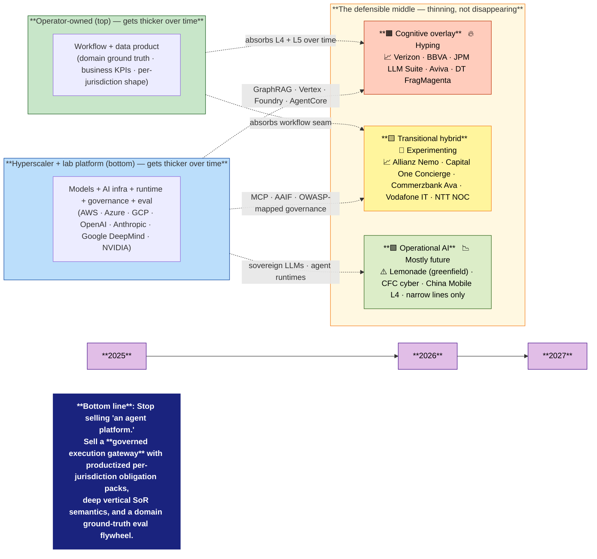

# Slide — The three-track signal map (2025 → 2027)

## The visual

---

## Speaker notes (≈220 words)

**Frame the three tracks in 30 seconds.** Cognitive *overlay* sits on top of the SoR — the agent reads, summarizes, drafts; humans dispose. *Transitional hybrid* writes back into the SoR through a policy gateway with approvals and audit. *Operational AI* replaces the SoR-action surface — agents bind, post, settle. These are not stages of the same maturity curve; they are *different products with different buyers, risk profiles, and revenue today*.

**The 2026 reality (point at the middle band).** Overlay is at production scale across all three verticals — Verizon, JPMorgan, BBVA, Aviva, Vodafone Italy. Transitional hybrid is the live battleground for the next 4–6 quarters — Allianz Project Nemo, Capital One auto-dealer, Microsoft Commerzbank Ava, NTT Docomo NOC. Operational AI is real but narrow — Lemonade is greenfield; CFC is one cyber line; China Mobile L4 is one trial. Treat operational as bets, not a platform investment.

**The pressure (point at the arrows).** The hyperscaler + lab platform is absorbing the bottom — MCP, AAIF, GraphRAG, AgentCore, Foundry. The operator is absorbing the top — workflow + data product. *The middle thins, but it does not disappear*: per-jurisdiction obligation packs, deep vertical SoR semantics, and domain ground-truth eval flywheels are not commoditized.

**Close on the bottom line (point at the dark band).** Reset our 2026 messaging. Stop selling "an agent platform" — that lane is consolidating around Microsoft, AWS, Google. Sell the **governed execution gateway** + **per-jurisdiction obligation packs** + **eval flywheel**. That is what telco / banking / insurance buyers cannot get from a hyperscaler off-the-shelf — and it is the wedge that protects integration economics for the next decade.

---

## Design notes (for production)

- **Theme**: monochrome boardroom palette + two accent bands (operator-blue top, platform-orange bottom). Middle band is a yellow-to-orange gradient signaling pressure. No clip-art.
- **Type**: a single bold sans-serif. Boardroom-serious.
- **One sentence rule**: only the bottom-line sentence is bold-large. Everything else is supporting.
- **If rendered for print**: keep the diagram on the left two-thirds, speaker notes on the right one-third.
- **Alt visual** (optional): replace the Mermaid stack with a 3-row horizontal bar (overlay / transitional / operational) where row width = market activity 2026 and color = hype/decay/experiment status. Same bottom-line sentence.

## Variants the user may request

1. **"Employee in the middle"** version — same three bands, but the middle figure is an employee (CSR, claims handler, network engineer) with the three tracks shown as different *tools they reach for* rather than market layers. Tradeoff: warmer, less strategic. Use only for HR / change-management audiences.
2. **"Hype-decay-radar"** version — separate radar chart with hyping (red), decaying (grey), experimenting (green) signals. Tradeoff: most legible but most generic; every consultancy ships one.
3. **"Pressure heatmap"** version — single heatmap with verticals (rows: telco, banking, insurance) × tracks (columns: overlay, transitional, operational), cell shade = production-evidence intensity. Tradeoff: data-dense, low narrative.
