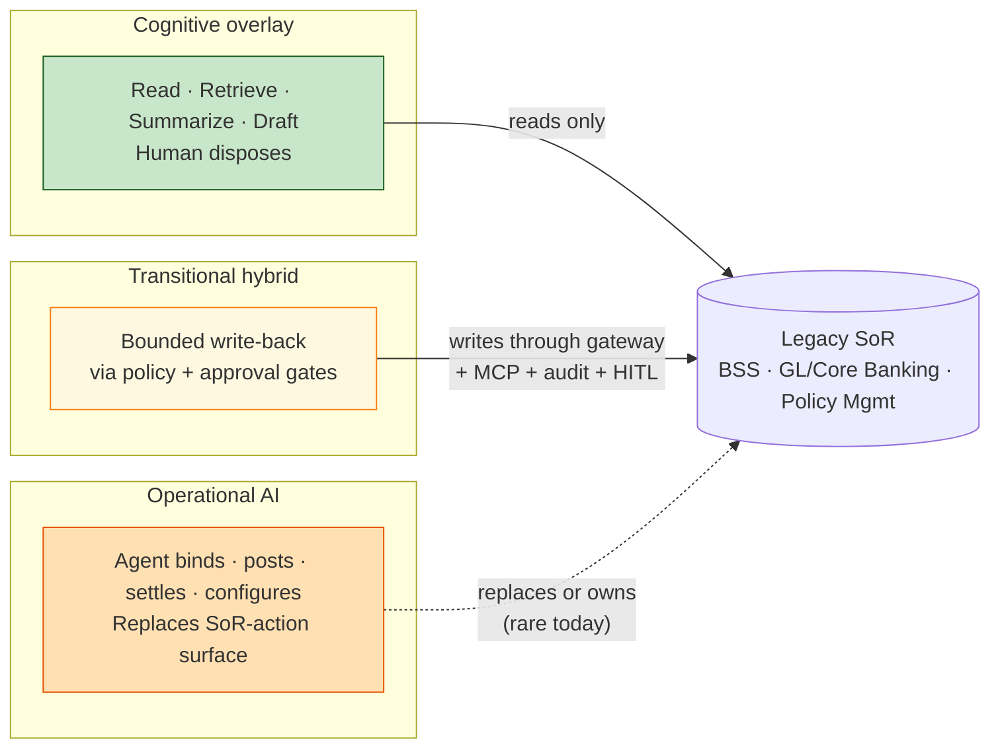
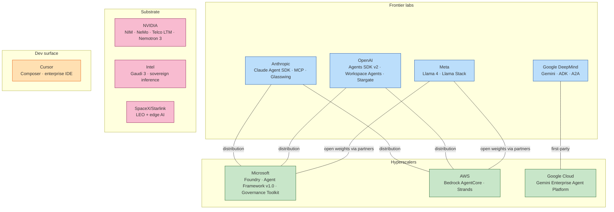
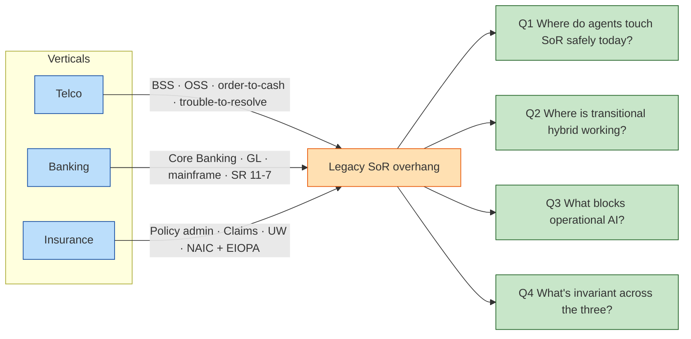
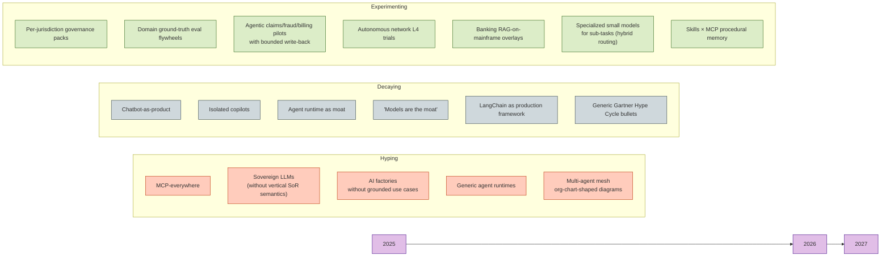

# Agentic AI Industry Trends — A Strategic Analyst Perspective for the Global SI

> **Working thesis.** The agentic AI market does not split into "AI-yes vs AI-no". It splits into three tracks defined by where the agent touches the enterprise system of record: **on top of it (Cognitive overlay)**, **inside it via policy gates (Transitional hybrid)**, or **as a replacement for it (Operational AI)**. For a global SI working telco, banking, and insurance accounts — all of them legacy-SoR-heavy — the three tracks have radically different revenue, risk, and time-to-market profiles. The hype cycle conflates them. The strategic playbook must not.

---

## Executive summary

1. **Overlay is in production at scale; operational is not.** Verizon (28k care reps on Vertex/Gemini), AT&T's Ask AT&T (100k users, ~27B tokens/day), JPMorgan's LLM Suite (200k+ employees), BBVA (120k employees on ChatGPT Enterprise), Allianz Project Nemo (7-agent claims pipeline), Aviva (80+ AI models, £60M saved 2024) all run *Cognitive overlay* in production. *Operational AI* — agents that bind, post, settle — is narrowly scoped, mostly greenfield (Lemonade), narrow line (CFC cyber Lane Assist; Capital One auto-dealer Concierge), or contingent on a writable cloud-native ledger that does not yet exist at most banks (JPM Apex / Thought Machine) *(Cai, 2025; AT&T, 2025; CNBC, 2025; PYMNTS, 2025; Allianz, 2025; Aviva, 2025; Stocktitan, 2025; CFC, 2025; VentureBeat, 2025; Fintech Futures, 2024)*.
2. **The transitional hybrid is the live battleground for the next 4–6 quarters.** Hyperscalers are converging on the same shape: a policy-enforcing gateway between the agent and the SoR, with OpenTelemetry semantics. Microsoft (Agent Governance Toolkit, Foundry), AWS (AgentCore Gateway/Policy/Evaluations), Google (A2A + ADK in Gemini Enterprise Agent Platform) all shipped this stack between Q4 2025 and Q2 2026 *(Microsoft Open Source, 2026; AWS, 2025–2026; Google Cloud, 2026)*. This is where SI revenue actually accrues.
3. **Models are commoditizing; standards are consolidating.** Qwen has overtaken Llama in cumulative HF downloads; DeepSeek V4 ships 1M-token context; Kimi K2.6 demonstrates 300-sub-agent autonomy. MCP went from ~2M to 97M monthly SDK downloads in 16 months and was donated to the Linux Foundation **Agentic AI Foundation (AAIF)** in December 2025 alongside Block's `goose` and OpenAI's `AGENTS.md` *(Linux Foundation, 2025; HuggingFace, 2026; MIT Tech Review, 2026; Marktechpost, 2026)*. The protocol layer is no longer a moat.
4. **The single most dangerous adversary for an SI like Amdocs is Cohere — not the hyperscalers.** Bell Canada (sovereign Canadian stack), STC ("North for Telecom"), and the Aleph Alpha acquisition (April 2026, German public sector) are the precise template the SI sells: vertical agent platform + sovereign data residency + named Tier-1 telco logos *(CNBC, 2026; Bell Canada, 2025; Arab News, 2025)*. Mistral (Orange, Proximus NXT) is the secondary EU threat. LMOS (Deutsche Telekom origin, Eclipse-governed, Q4 2025) is the third — and is the one telco RFPs will name within 18 months *(Eclipse Foundation, 2025; Orange, 2025; Proximus, 2025)*.
5. **The science of evaluation is broken — and that is a strategic opening.** Multi-agent failure taxonomy (MAST, NeurIPS 2025), judge instability (EMNLP 2025), and ~50× cost variance for similar accuracy are now well-documented in Q1 venues. The SI that pairs **domain ground truth** (call-center QA, claim outcome data, billing reconciliations) with continuous online evaluation against real outcomes builds a private flywheel that hyperscaler-shipped OpenInference traces cannot replicate *(Cemri et al., 2025; ACL Findings, 2025; Galileo, 2026)*.

**Confidence**: High on *Cognitive overlay* evidence and the *standards-consolidation* signal. Medium on the per-vertical *Operational AI* evidence (sample skews to Tier-1, vendor PR contamination is real). Low-Medium on long-horizon adoption-rate predictions (the consultancy spread is 14% to 79% on the same questions — see §3.1).

---

## 1. The three-track taxonomy

The user's GTM frame, formalized:

| Track | What the agent does to the SoR | Representative production cases | Risk profile | SI revenue today |
|---|---|---|---|---|
| **Cognitive overlay** | Reads, retrieves, summarizes, drafts. Humans dispose. | Verizon Vertex/Gemini care; JPM LLM Suite; BBVA ChatGPT Enterprise; Allianz Project Nemo; Vodafone SuperTOBi | Lower. Existing governance perimeter. | Largest. Buyers are already signing. |
| **Transitional hybrid** | Bounded write-back through policy gates, approvals, audit trails. Agent commits within a constrained envelope. | Capital One auto-dealer Concierge; Nubank multimodal transfers; Hiscox Hailo UW; RBC AidenResearch; CCB MRM crews; Microsoft Commerzbank "Ava" | Medium. Per-jurisdiction regulatory packs required. | Live battleground. |
| **Operational AI** | Agent binds, posts, settles, configures. Replaces the SoR-action surface. | Lemonade (no legacy SoR); CFC Lane Assist (cyber UW only); Capital One auto-dealer (narrow scope); China Mobile L4 autonomous network trial; NTT Docomo agentic NOC | High. Reversibility, liability, examiner expectations. | Greenfield bets. Mostly future revenue. |

**Decision tree for any agent use case** (used to triage opportunities throughout this memo):
1. *Does the agent commit a transaction to the SoR?* → No: **Overlay**. Yes: continue.
2. *Is the commit reversible without external counterparty involvement?* → No (e.g., GL post, treaty pricing, network reconfiguration in production): high-risk path; require operational gates → **Operational** (rare today).
3. *Reversible, with HITL approval before commit?* → **Transitional hybrid**.
4. *Greenfield (no legacy SoR; insurer/operator/bank built natively)?* → **Operational by default** (Lemonade pattern).

---

## 2. Cross-actor signal map

How the dominant actor classes are anticipating the trends, scored on the three-track taxonomy.

### 2.1 Consultancies — the hype owners

| Firm | Headline 2025–26 thesis | Track tilt | Rigor |
|---|---|---|---|
| **Gartner** | "40% of enterprise apps will be integrated with task-specific AI agents by end of 2026 (up from <5% in 2025)"; "by 2027, over 40% of agentic AI projects will be cancelled" | **Overlay & Transitional bullish; Operational bearish** — the strongest skeptic. | High *(Gartner, 2025a; 2025b)* |
| **Deloitte** | Ambition vs activation gap: 75% plan to deploy agentic AI within 2 years; only 21% have mature governance | **Transitional bullish** | High; n=3,235 across 24 countries *(Deloitte, 2026)* |
| **KPMG** | "2026 is the year of orchestrated super-agent ecosystems"; agent deployment quadrupled (11% → 42% peak) before settling at 26%; 61% of boards "not actively exploring agentic AI" — sharpest contrarian board-level data | **Transitional bullish** | High; longitudinal Pulse *(KPMG, 2026)* |
| **EY** | 89% insist HITL remains crucial; banking 99% awareness vs 31% implementation; insurance ~50% have agentic in test/prod | **Overlay & Transitional bullish; Operational bearish** | High; multi-pulse *(EY, 2025a, 2025b)* |
| **PwC** | "Agentic AI is an exponential workforce multiplier"; 79% report agents adopted; 88% increasing budgets specifically for agentic | **Operational bullish** — most aggressive | Mixed; framing-heavy *(PwC, 2025)* |
| **Bain** | "A purist view of architecture won't meet the moment"; expect "rapid, fitful, hard-to-predict progress"; vendor lock-in and domain solutions, not unified platforms | **Transitional bullish; closest to this memo's posture** | High; named-author research *(Bain, 2025)* |
| **BCG** | "5% of firms are future-built and capture the value gap"; agents reduce low-value work 25–40%, accelerate processes 30–50%; agentic AI is 17% of AI value in 2025 → 29% by 2028 | **Operational bullish** | Mixed; aspirational headline *(BCG, 2025a, 2025b)* |
| **Accenture** | "Declaration of Autonomy" Tech Vision 2025; acquired Avanseus Feb 2026 for autonomous-network telco capability | **Operational bullish; vertical-specific** | Marketing-loaded but capital-deploying *(Accenture, 2025; 2026)* |
| **Thoughtworks** | "Vibe coding" displaced by "context engineering"; AI antipatterns flagged; "sustained human judgment" required | **Overlay & Transitional bullish; Operational skeptic** | High practitioner rigor; low statistical *(Thoughtworks, 2025)* |

**Convergence.** Every firm flags governance, observability, and data readiness as the universal blockers. Every firm reports that most enterprises are not ready to operate agents safely at scale.

**Divergence.** PwC + Accenture + BCG project rapid scaled value; Gartner + Bain + Thoughtworks expect "rapid but fitful" with high failure rates. The KPMG board finding (61% not exploring) directly contradicts the PwC adoption narrative (79% adopted) — these are not the same definition of "adopted."

**Source-quality call for the SI.** Weight Bain, EY, Deloitte, Gartner, KPMG for substantive operational claims. Use Accenture and PwC primarily as evidence of *executive-team narrative pressure* the SI must respond to in client conversations — not as ground truth on adoption maturity.

---

### 2.2 Hyperscalers and labs — the substrate consolidators

**Track consolidation observed (Q1 2026):**

- **Overlay** is consolidating around three winners: Microsoft (M365 Copilot + Dynamics 365 industry agents), OpenAI (ChatGPT Enterprise — Morgan Stanley, BNY, Commonwealth Bank), Google (Gemini Enterprise / Workspace — Verizon, Deutsche Bank Lumina). Anthropic plays as model-of-choice inside others' overlays plus its own Claude for Enterprise (Allianz, PwC, Infosys, SKT) *(Microsoft, 2026; Anthropic, 2026; Google Cloud, 2026; FStech, 2026; PwC press, 2026; CRN Asia, 2026)*.
- **Transitional** is the live battleground. Microsoft Agent Governance Toolkit (open-sourced 2 April 2026) + Foundry, AWS AgentCore Gateway/Policy/Evaluations (Preview 2026), and Google A2A + ADK in Gemini Enterprise Agent Platform (Cloud Next 2026, 22 April 2026) all converge on policy-enforcing gateway + OpenTelemetry semantics + MCP-native tool calls *(Microsoft Open Source, 2026; AWS, 2026; Google Cloud, 2026)*.
- **Operational** splits by vertical. **Telco operational** is NVIDIA-led (Telco LTM 30B + AI-RAN with Nokia $1B partnership + T-Mobile + GSMA Open Telco AI). **Banking operational** is Microsoft-led (Commerzbank "Ava" autonomously resolves 75% of inbound conversations on Azure AI Foundry Agent Service). **Insurance operational** is the least-claimed lane — Allianz×Anthropic and Generali×Google are the early markers *(NVIDIA, 2025; Microsoft Customer Stories, 2026; FStech, 2026)*.

**Distribution patterns confirming the meta-adversary.** AT&T → Microsoft (~100k employees on Azure AI Foundry, 71 GenAI solutions). Verizon → Google Cloud. Deutsche Telekom → OpenAI multi-year (~200k employees, December 2025). SK Telecom → Microsoft Foundry + OpenAI Stargate Korea. None chose a telco-specialist platform vendor. The only Western Tier-1 operator that bet on a non-hyperscaler: Bell Canada → Cohere *(Microsoft Customer Stories, 2026; OpenAI, 2025; Bell Canada, 2025)*.

---

### 2.3 Challengers — Chinese, sovereign, and the OSS ecosystem

**Chinese model layer is now frontier-credible at fractional cost.** DeepSeek V4 Preview (24 April 2026, 1M-token context, MoE), Qwen3.6-Plus (April 2026, MCP-native, AgentScope orchestrator), Moonshot Kimi K2.6 (20 April 2026, 1T MoE, 300 sub-agents over 4,000 coordinated steps autonomously over 5 days), GLM-4.6/4.7 (MIT-licensed, sovereign-friendly), ERNIE 5.0 (Baidu World 2025) — collectively, Qwen has overtaken Llama in cumulative HF downloads (Qwen 942M vs Llama 476M, March 2026) *(MIT Tech Review, 2026; Dataconomy, 2026; Marktechpost, 2026; HuggingFace, 2026)*. **The lead is in raw model economics and open-weights distribution. It is not in named EU/NA telco / bank / insurer enterprise references** outside Greater China.

**Sovereign challengers are converting EU/MENA digital-sovereignty mandates into operator-bundled deals.** Mistral (Orange Le Chat Pro bundled with Mobile Pro subscriptions, February 2025; Proximus NXT November 2025); Cohere (Bell Canada strategic partnership July 2025; STC "North for Telecom" LEAP 2025; Aleph Alpha acquisition CNBC 24 April 2026, $600M Schwarz Group anchor in Cohere Series E); G42 Digital Embassies / Greenshield (January 2026); Humain–stc 1GW JV (December 2025) *(Orange, 2025; Proximus, 2025; CNBC, 2026; Bell Canada, 2025; G42, 2026; DCD, 2025)*. Telco is the wedge in every case — operators are simultaneously customer, distributor, and infrastructure host.

**OSS ecosystem (Q4 2025 – Q1 2026):**

| Layer | Status | Evidence |
|---|---|---|
| **Model weights** | Fully commoditized | Qwen / DeepSeek / Llama / Gemma / Mistral / GLM all open |
| **Inference serving** | Fully commoditized | vLLM, SGLang, TensorRT-LLM |
| **Tool/data plane** | Commoditized as of Dec 2025 | MCP under AAIF, 97M monthly downloads, 5,800+ servers |
| **Agent runtime** | Actively commoditizing | LangGraph 1.0 (Oct 2025); Microsoft Agent Framework 1.0 (April 2026, AutoGen → MS Agent Framework); Eclipse LMOS + ADL (Oct 2025) |
| **Agent governance / eval** | Standardizing — standards layer collapsing | OWASP Agentic Top 10, EU AI Act mappings, OpenInference, OpenTelemetry GenAI semconv |
| **Vertical SoR adapters** | **Defensible** | Telco BSS adapters (Amdocs, Netcracker), banking core adapters (Temenos, TCS BaNCS, Thought Machine), insurance Policy adapters (Guidewire, Sapiens, Cytora) |

**The memo's sharp call.** Margin no longer accrues at the model, runtime, protocol, or eval layer. It accrues at **vertical SoR adapters** + **per-jurisdiction governance packs** + **domain ground-truth flywheels**. This is the SI's defensible footprint *(Linux Foundation, 2025; Eclipse Foundation, 2025; LangChain, 2025; Visual Studio Magazine, 2026)*.

---

### 2.4 Builder & community signal layer (Tier-3, fenced)

This layer is **not load-bearing for any numeric claim**. It captures vibe-shifts and contrarian takes across r/LocalLLaMA, r/AIAgents, r/LangChain, r/ClaudeAI, X (Karpathy, Willison, Swyx, Husain, Yan, Lambert), Latent Space, Cognitive Revolution, AIE Summit, MCP Dev Summit NA 2026.

**Top 10 themes (Q4 2025 – Q1 2026):**

1. 🔥→📉 **The "LangChain Exit"** — production teams quietly migrate to raw vendor SDKs (OpenAI Agents SDK / Claude Agent SDK / direct calls); LangGraph survives where stateful loops/checkpoints are required *(Ravoid, 2026; HN, 2025)*.
2. 🔥 **Context engineering replaces prompt engineering** as the load-bearing skill (Karpathy framing, June 2025, still being cited in Q1 2026) *(Karpathy on X)*.
3. 🔥 **MCP becoming "enterprise plumbing"** — and the audit/auth/governance pain that comes with it. Production teams converging on 5–8 MCP servers behind a gateway, not 30 loose ones *(AAIF, 2026; Vercel AI SDK 6, 2026)*.
4. 📉 **Multi-agent fragility backlash** — Cognition's mid-2025 essay still being cited; "single-agent + rich tools beats multi-agent swarms" is the consensus in r/AIAgents *(Cognition; CT Labs synthesis, 2026; Nate's Newsletter, 2026)*.
5. 🔥 **Evals as the new craft** — Hamel Husain / Shreya Shankar cohorts; 2,000+ trained engineers including OpenAI/Anthropic teams *(Lenny's Newsletter, 2026; Hamel.dev, 2026)*.
6. 🔥 **Claude Code in CI/CD with hooks** — headless mode + PreToolUse/PostToolUse hooks; per-workflow token caps as policy enforcement *(Code With Seb, 2026; Pixelmojo, 2026)*.
7. 🧪 **Agent Skills > MCP for procedural memory** — Simon Willison's framing, used in Anthropic ecosystem; tools (MCP) and procedure (Skills) split cleanly *(Willison, 2026; Subramanya, 2025)*.
8. 🔥 **"Agentic engineering" as the named successor to "vibe coding"** *(Willison, 2026; TeamDay, 2026)*.
9. 🔥 **"Agents breaking containment" — Swyx's 2026 thesis** that 2026 is coding agents leaking into ops/SRE/support/finance *(Latent Space, 2026; Lambert, 2026)*.
10. 🧪 **Specialized small open models for repetitive agent sub-tasks** — hybrid routing (~70% local / 30% frontier cloud) becoming canonical for high-volume flows *(Lambert, 2026; Latent Space top-local-models list, April 2026)*.

**Builder pushback against the analyst/hyperscaler narrative:**

- Direct rebuttal of McKinsey's "agentic mesh" framing — *"consultants reach for org-chart-shaped diagrams; builders reach for single-agent + tools"* *(Nate's Newsletter, 2026)*.
- Cognition's "multi-agent systems are fragile" stance routinely weaponized in r/LangChain and r/AIAgents whenever vendors ship orchestrator decks.
- Gartner's own "agent washing" caveat (legacy RPA rebranded as agentic) gets cited *against* the hyperscaler / SI sales motion in the same breath that consultants cite Gartner's optimistic curves *(xpander.ai, 2026; Gartner Hype Cycle, 2025)*.

**Practical implication for the SI.** Two of these themes (#1 LangChain Exit and #4 multi-agent fragility) are direct headwinds for any SI architecture deck still leaning on multi-framework orchestration. Reset to: single-agent + rich tool catalog + deterministic checkpoints + headless Claude Code in CI + MCP gateway + Skills for procedural memory + ensemble evals. This is what builders will actually accept in production reviews.

---

### 2.5 Academic Q1 (industry-impact) — what the literature is producing

Twelve papers have direct, actionable impact for an SI in 2026. Highlights:

| Paper | Venue | Headline finding | Why the SI cares |
|---|---|---|---|
| **MAST: Why Multi-Agent LLM Systems Fail** *(Cemri et al., 2025)* | NeurIPS 2025 | 14 failure modes, 3 categories, 200+ tasks, 7 frameworks; Cohen's κ=0.88 | The first FMEA-grade checklist for agentic delivery. Mandate it as a vendor/internal pre-prod review gate. |
| **MCP-Bench** | NeurIPS 2025 | 28 live MCP servers, 250 tools, persistent failures in cross-tool grounding even in frontier models | Procurement gate. Require MCP-Bench-style scores against the SI's tool catalog. |
| **τ-bench / τ²-bench / τ³-bench** *(Sierra)* | ICLR 2025 + 2026 patches | Frontier models still resolve <60% of multi-turn airline tasks | Closest fit for telco care, retail-banking, claims call-deflection eval. Use τ³ banking as the starting harness. |
| **DataMorgana** *(Filice et al., 2025)* | ACL 2025 Industry | Programmatic Q&A benchmark synthesis from enterprise corpora | Removes "we have no eval data" as an excuse on Day 1 of any RAG/agent engagement. |
| **GraphRAG-Bench** *(Xiang et al., 2026)* | ICLR 2026 | Multi-hop accuracy moves 43% → 91% with the right graph variant; vector RAG still cheaper for single-fact lookups | Settles the GraphRAG-vs-RAG religious war with a decision matrix. Reject blanket "GraphRAG everywhere" pitches. |
| **A-Mem: Agentic Memory** *(Xu, Yu et al., 2025)* | NeurIPS 2025 | Zettelkasten-inspired dynamic memory; F1 +35% over LoCoMo, +192% over MemGPT | Treat agent memory as a first-class subsystem with its own SLO, especially for telco/insurance customer journeys spanning months. |
| **FinAgentBench** | NeurIPS / ICAIF 2025 | Top agents under-rank the right chunk in ~30%+ of cases despite getting the right document | Banking/wealth advisory copilots need *chunk-level* evaluation, not retrieval@k. Audit-ready eval pattern. |
| **JPM MRM Crews** *(Dasgupta et al., 2025)* | arXiv / FinAI | Multi-agent crews with explicit HITL checkpoints applied to model-risk management (SR 11-7-style validation) | The canonical pattern for regulated SoR-touching workflows. Copy the artifact schema. |
| **LLM-Based Network Management Survey** *(Hong et al., 2025)* | IJNM (Wiley) Q1 | Catalog of measured wins (intent translation >90%) and gaps (closed-loop control, multi-vendor tool standardization) | Best entry-point reference for telco transformation leaders mapping NOC use cases. |
| **Intent-Based Management of Next-Gen Networks** | IEEE Network 2024 | Closed-loop intent translation with human-overridable rollback on a testbed | Direct mapping to BSS/OSS portfolio. The architectural pattern to reference by name in telco engagements. |
| **NanoFlow** | OSDI 2025 | 1.9–2.3× throughput over vLLM on production traces | Multi-tenant SI hosting costs are dominated by inference. Benchmark NanoFlow / DistServe-class serving against vendor managed-inference pricing — the gap is often >40%. |
| **Rating Roulette: Self-Inconsistency in LLM-as-a-Judge** | EMNLP 2025 Findings | Pairwise judge agreement across reruns drops below 0.6 Cohen's κ on subjective tasks | Kills any agentic eval program built on a single LLM-judge call. Mandate ensemble judging with disagreement-based escalation. |

**The single paper an SI executive should read this quarter: MAST.** It is the only paper here that gives the executive a *defensive* tool — a checklist to apply against any agentic vendor pitch or internal pilot, grounded in 200+ real failures, that maps cleanly onto existing risk-and-controls vocabulary *(Cemri et al., 2025)*.

**Where the literature is silent and the industry needs work.** SoR write-back safety (idempotency, compensating transactions, rollback under partial failure); EU AI Act / GDPR / SR 11-7 operationalization; telco-specific eval benchmarks (no τ-bench equivalent for OSS fault management); multi-tenant agent serving economics; production drift detection with measured customer impact. These are research opportunities the SI could publish into to shape the standard.

---

## 3. Vertical chapters (coequal depth)

### 3.1 Telco

(Telco is the deepest case in this memo; for the full operator-by-operator and standards build-out — TM Forum Manifesto, ETSI ENI Rel-4 Agent-Based Interface, 3GPP SA5 Rel-19, Linux Foundation AAIF — see the prior memo `research/telco-genai-control-layers.md`. Highlights below for cross-vertical comparison.)

**Production overlay anchors.** Verizon × Google Cloud (28k care reps + retail; ~95% answerability; ~40% sales lift since January 2025); AT&T "Ask AT&T" + Workflows (100k users, ~27B tokens/day, 71 GenAI solutions); Vodafone SuperTOBi on Azure OpenAI (~9.5M customers across IT/PT/DE/TR, PT first-time resolution 15% → 60%); Bell Canada Network AI Ops on Google Cloud (productivity +75%, customer-reported issues –25%) *(Cai, 2025; Microsoft Customer Stories, 2026; Vodafone, 2024; PR Newswire, 2025)*.

**Transitional-hybrid anchors.** Vodafone Italy / Fastweb multi-agent care platform on LangGraph + LangSmith (production); Deutsche Telekom Frag Magenta OneBOT on Eclipse LMOS / Qdrant (>2M conversations across 3 countries, 380 use cases, agent build time 15d → 2d); Telus NEO Assistant (75% field-tech adoption); Telefónica Kernel + Microsoft Azure AI Studio *(LangChain, 2025; Qdrant, 2025; RCR Wireless, 2025; Telefónica, 2025)*.

**Operational anchors.** NTT Docomo commercial agentic AI for network maintenance with 15-second failure isolation in transport + RAN; China Mobile L4 trial completed in Guangdong with Jiutian 1T-param LLM in Computing Network Brain 3.0 (VIP-complaint resolution from 2 days → 1.5 hours); Vivo Brazil first commercial test of Ericsson Agentic rApp-as-a-Service *(TelecomTV, 2025; Telecoms.com, 2025)*.

**Strategic implication for the SI.** Telco is the vertical where *Operational AI* has the most production momentum — but only in network operations, not in BSS write-back. The SI must compete with NVIDIA (Telco LTM, AI-RAN, Nokia 6G), Cohere (Bell, STC sovereign), and Eclipse LMOS (DT-origin, telco-native, Eclipse-governed). The defensive moat is not the runtime; it is the BSS / Order-to-Cash / Trouble-to-Resolve process map.

### 3.2 Banking

**Production overlay anchors.**

- **JPMorgan Chase** — LLM Suite to ~200k+ employees combining OpenAI + Anthropic models; >450 active AI use cases including AML false-positive reduction (95% claim, bank-disclosed, not independently audited) *(CNBC, 2025; CEFPro, 2025)*.
- **Bank of America** — 270 AI/ML models in production; Erica virtual assistant; 18,000 developers using coding agents *(CIO Dive, 2025)*.
- **Citi** — Citi Stylus Workspaces with agentic AI; Cognition Devin rolling out to 40,000 developers *(Citi press release, 2025; American Banker, 2025)*.
- **Wells Fargo** — Fargo customer assistant (1B+ transactions); Google Agentspace agents bank-wide for 215k employees; FX post-trade triage agent; contract-management agent over ~250k vendor docs *(Google Cloud blog, 2025; American Banker, 2025)*.
- **BBVA** — ChatGPT Enterprise across 120k employees in 25 countries; "The Eight" — eight domain agent suites co-built with OpenAI *(PYMNTS, 2025; BBVA, 2025)*.
- **DBS** — Joy GenAI chatbot for corporate clients (~120k unique chats/month, ~4k corporate clients); ADA + ALAN proprietary AI factory; in-house build strategy *(Fortune, 2025)*.

**Transitional-hybrid anchors.**

- **Microsoft × Commerzbank "Ava"** — 30k+ conversations / month, **75% autonomous resolution** on Foundry Agent Service. The clearest non-greenfield bank example of an agent crossing into bounded write-back at production scale *(Microsoft Customer Stories, 2026)*.
- **Nubank** — multimodal agentic transfer assistant via WhatsApp (voice/image/chat); 55% Tier-1 inquiry auto-resolution; transfer time 70s → <30s; 2M+ chats/month *(ZenML LLMOps DB, 2025; OpenAI, 2025)*.
- **JPMorgan** — agentic layer in pilot for multi-step employee tasks; **Apex re-platform onto Thought Machine Vault** is a multi-year program creating a writable, cloud-native ledger that can become the SoR target for governed write-back later *(Fintech Futures, 2024)*.
- **RBC AidenResearch** — fleet of specialized agents for Global Research; separate trade-execution agents adapting in real time *(NVIDIA, 2025)*.
- **CCB (China Construction Bank)** — agentic MRM crew model with grey-release deployment + dynamic fusion *(InfoTechLead, 2025)*.

**Operational anchors (narrow).**

- **Capital One auto-dealer "Chat Concierge"** — production multi-agent system that takes real actions on dealer systems (appointment booking, test-drive scheduling) *(VentureBeat, 2025)*.
- **Lemonade** — AI Maya (sales) + AI Jim (claims) + CX.AI; 96% FNOL fully bot-handled; 55% claims fully automated end-to-end; 98% policy sales via Maya/API; ~2,300 customers per employee. *Operational by virtue of having no legacy SoR.*

**Bank-tech vendor signals.** Temenos (Product Manager Co-Pilot + FCM AI Agent for compliance), TCS BaNCS AI Compass (no-code agent builder, December 2025), FIS agentic-commerce platform (Q1 2026 GA, partnered with Visa/Mastercard "Know Your Agent" credentials), NICE Actimize X-Sight ActOne InvestigateAI (50%+ investigation-time reduction claim), Backbase Agentic AI product line, Bloomberg ASKB roadmap, Murex MX.3 with MCP support *(Fintech Futures, 2025; TCS, 2025; American Banker, 2026; PYMNTS, 2025; Backbase, 2026; Bloomberg, 2026; Bounteous, 2025)*.

**Banking-specific blockers (why operational AI is structurally slower in banking than in telco):**

1. **SR 11-7 (US Fed/OCC, 2011)** defines a "model" as a stable, validatable artifact with conceptual-soundness review and outcomes analysis on fixed cycles. Agentic systems that recalibrate, plan, and call tools dynamically *break that frame*. GARP and ECB commentary in 2025–26 has openly flagged this *(GARP, 2026)*.
2. **GL write-back blast radius** — a posted entry has unbounded downstream impact (regulatory reporting, capital ratios, customer balances) and is far harder to reverse than a telco order. Banks therefore wrap any write-back in policy + dual-control gates → real cases live in *Transitional* track, not Operational.
3. **Mainframe / COBOL inertia** — even with agentic COBOL-modernization (AWS Transform, Microsoft, GitHub Copilot, Capgemini, Kyndryl), the migration window is multi-year. Operational agents have nowhere reliable to write for most of the decade.
4. **Model Risk Management governance** — SR 11-7 pillars (independent validation, ongoing monitoring, model inventory) extending to non-deterministic agentic chains is unsolved.

**Single bank leading transitional-hybrid: JPMorgan Chase.** It is the only Tier-1 simultaneously running (a) production overlay (LLM Suite, 200k+ users), (b) explicit agentic layer in pilot for multi-step employee tasks, and (c) **the ledger-replacement program (Apex / Thought Machine Vault) that creates a writable cloud-native SoR for governed write-back later**. No peer has all three legs in motion.

### 3.3 Insurance

**Production overlay anchors.**

- **Aviva** — 80+ AI models across motor claims (QuantumBlack/McKinsey); £60M saved 2024; liability assessment –23 days; routing accuracy +30%; complaints –65%. AI underwriting tool launching November 2025 *(Aviva, 2025)*.
- **Travelers** — generative AI voice agent for FNOL; ~20k internal AI users; quoting platform >1M transactions / year *(Carrier Management, 2026)*.
- **Liberty Mutual** — LibertyGPT (~25% employee usage), AI Auto Damage Estimator, document-to-structured-data for commercial UW *(Liberty Mutual, 2025)*.
- **MetLife** — MetIQ AI platform; Melli customer-service agent (wait time → 0; +languages; 85% customer approval) *(Innovation Leader, 2025)*.
- **Manulife / John Hancock** — ChatMFC (100% workforce, 75% engagement); 35+ genAI use cases live, 70+ planned by EOY 2025; Akka selected to operationalize agentic AI platform; **John Hancock genAI UW tool cuts life quote from 1 day → 15 min** *(Manulife press, 2026)*.

**Transitional-hybrid anchors.**

- **Allianz Project Nemo** — **7-agent workflow** (Planner, Coverage, etc.) for food spoilage claims under $327; Anthropic partnership extending to motor / health intake. **80% claim cycle reduction; full workflow <5 minutes; expanding to travel / auto / property.** *Single cleanest published reference design for governed-execution, bounded write-back* *(Allianz, 2025; FStech, 2026)*.
- **AXA Group** — ~400 predictive / generative / agentic use cases; **60+ agentic in test or partial deployment** in contact centers, underwriting, claims; AXA Switzerland early adopter of Shift Claims (3% lower claims losses, 30% faster handling) *(Computing UK, 2026; Shift Technology, 2025)*.
- **Zurich Insurance** — "Agentic AI Hyperchallenge" yielded **5 systems into production**: travel claims, motor liability, internal knowledge; multinational contract-certainty AI tool *(Zurich press, 2025)*.
- **Hiscox Hailo** — Google Cloud AI lead-underwriting model; **lead open-market quote: 3 days → 3 minutes** *(Hiscox Group, 2024)*.
- **Tokio Marine & Nichido** — Salesforce Agentforce for contact center + claims; Shift Technology genAI for fraud / claims intake; EIS ClaimPulse for travel claims; formal AI governance policy (5-principle framework June 2025) *(Shift Technology, 2025)*.

**Operational anchors.**

- **Lemonade** — 96% of FNOL fully bot-handled; 55% claims fully automated end-to-end. *Operational by virtue of having no legacy SoR* *(Stocktitan, 2025 10-K)*.
- **CFC Underwriting "Lane Assist"** — agentic UW system processing email submission → quote recommendation in seconds; live in cyber UW team on real new-business submissions; small volume *(Insurance Business Mag, 2025)*.
- **Chubb** — "Radical automation" program targeting **85% of major UW + claims processes**; up to 20% workforce reduction announced. *Stated target; production scope still emerging* *(Insurance Business Mag, 2025)*.

**Insurance-tech vendor signals.** **Guidewire Palisades** cloud release ships *Agentic Framework* (early access) and *Agent Studio* with **50 new AI agents announced across upcoming releases**; **Shift Claims** (September 2025) — agentic AI claims platform with ~60% automation rate, >99% claim-assessment accuracy claim; **Cytora Autopilot** (acquired by Applied Systems 2025–26) — agentic risk workflows that "run themselves"; **Verisk Commercial GenAI Underwriting Assistant** (September 2025); **Sapiens Decision Model.AI** (Azure OpenAI integration); **Moody's RMS IRP Navigator** *(Guidewire, 2026; Shift Technology, 2025; Applied Systems, 2026; Verisk, 2025; Sapiens, 2025; Moody's, 2024)*.

**Insurance-specific blockers (operational AI is structurally slow):**

1. **NAIC Model Bulletin (December 2023)** — adopted by >50% of US states by 2025. Mandates a written **AIS Program** with explicit accountability for AI-system decisions; consumer decisions made or supported by AI must comply with unfair-trade-practices and unfair-discrimination laws *(NAIC, 2023)*.
2. **EIOPA Opinion on AI Governance and Risk Management** (6 August 2025) — risk-based, proportionate framework spanning data governance, record-keeping, fairness, cybersecurity, explainability, human oversight; bridges to **EU AI Act** for prohibited / high-risk classifications *(EIOPA, 2025)*.
3. **Adversarial-fairness / disparate impact** — state insurance commissioners increasingly demand bias audits in UW (Colorado SB21-169 set the US precedent). For **operational** UW agents that bind risk autonomously, this becomes a per-state, per-line approval problem.
4. **Long-tail liability + audit on claims decisions** — denial or coverage determinations made by an autonomous agent must be reproducible, explainable, and reviewable across the **full statute of limitations** of the line.
5. **Reinsurance-treaty model approval cycles** — RMS / Verisk model versions are negotiated under treaties; substituting a genAI cat-modeling component triggers re-approval and capital-charge re-negotiation.

**Single insurer leading transitional-hybrid: Allianz.** Project Nemo's named architecture (7 specialized agents, Planner + Coverage agents, sub-5-minute execution, mandatory human review on bounded action), governance principle ("ultimate responsibility always rests with a claims professional"), and Anthropic partnership with explicit human-in-the-loop architecture make Allianz the cleanest reference design *(Allianz, 2025; FStech, 2026)*.

**Citation correction (carried from agent 7).** EvolutionIQ was acquired by **CCC Intelligent Solutions** ($730M, closed January 2025), **not** Munich Re. Munich Re has a 2022 partnership / reseller relationship with EvolutionIQ for disability claims guidance. *Update upstream materials accordingly.*

---

## 4. Cross-vertical synthesis: "Legacy SoR enterprises"

The four invariant questions across telco / banking / insurance:

### Q1 — What is the SoR overhang?

| Vertical | Dominant SoR(s) | Modernization status (2026) |
|---|---|---|
| Telco | Amdocs / Netcracker BSS, OSS for fulfillment / assurance, mediation, charging, mainframe billing | Multi-year cloud migrations underway (TIM × Oracle Turin region; T-Mobile, AT&T, Verizon mainframes still load-bearing). |
| Banking | Mainframe COBOL ledgers, FIS / Finastra / TCS BaNCS / Temenos / Mambu cores; Murex / Calypso for capital markets | JPM Apex/Thought Machine Vault is the only Tier-1 actively replacing the core; most peers run cloud overlays on mainframe-anchored ledgers. |
| Insurance | Guidewire / Duck Creek / Sapiens / Insurity Policy admin and Claims; reinsurance treaty engines | Cloud transitions underway (Guidewire Palisades), but legacy admin systems often >20 years old; rip-and-replace is rare. |

### Q2 — Where do agents touch SoR safely today? (Cross-vertical overlay anchors)

- **CX / care summarization and routing** is unambiguously safe and at production scale across all three verticals (Verizon, Vodafone, AT&T; Wells Fargo Fargo, BBVA, JPM LLM Suite; Aviva, Travelers, MetLife Melli).
- **Document → structured data** (claims, contracts, regulatory filings) is safe (Liberty Mutual commercial UW, Wells Fargo contract-management agent, BT Openreach engineer notes).
- **Code modernization / engineering productivity** is safe (Goldman Sachs + Citi on Devin; AT&T 20k Copilot seats; China Telecom Xingchen for SDLC; BT engineering productivity).

### Q3 — Where is transitional hybrid working? (Named cases)

| Pattern | Telco | Banking | Insurance |
|---|---|---|---|
| Field / agent productivity (HITL approves) | Telus NEO Assistant | Citi Stylus, Wells Fargo Agentspace | Manulife/John Hancock UW (1d→15min); Aviva UW launch |
| Bounded customer-facing action | Vivo + Sprinklr; SuperTOBi cross-channel | Capital One auto-dealer; Nubank transfers | Allianz Project Nemo <$327 spoilage; CFC Lane Assist (cyber) |
| Network / claims / fraud triage with bind delegated to human | NTT Docomo NOC; BT Dark NOC | RBC AidenResearch, NICE Actimize InvestigateAI | Shift Claims (AXA CH); Tokio Marine fraud + intake |

### Q4 — What blocks operational AI? Invariants across all three verticals.

1. **Reversibility and blast radius.** Telco network reconfig, banking GL post, insurance claim denial all share one trait: errors are expensive and partially-irreversible. Operational autonomy requires the gateway to know what is reversible and what is not.
2. **Per-jurisdiction regulatory packs.** EU AI Act (telco, banking, insurance), SR 11-7 + SR 11-13 (banking), NAIC Model Bulletin + EIOPA Opinion + Colorado SB21-169 (insurance), TM Forum / GSMA + national telecom regulators (telco). The SI's *moat* lives in shipping packaged controls per jurisdiction.
3. **Auditability across long tails.** Banking SR 11-7 outcomes analysis, insurance long-tail liability, telco lawful-intercept and number-portability records — all require replay, lineage, and immutability across years, not days.
4. **Adversarial fairness.** Banking lending fairness (ECOA), insurance disparate-impact obligations, telco non-discrimination on service provisioning. Bias audits must be operationalizable on agent decisions, not just on traditional ML scorecards.

**The legacy-SoR enterprise playbook (cross-vertical, opinionated):**

- **Track 1 (Cognitive overlay):** *Industrialize and ride the wave.* Sell into the buyers who are signing today (head of CX, head of contact center, CIO office). Defend the seam by integrating into the operator/bank/insurer's *proprietary* knowledge graph (telco context graph, bank product+regulation graph, insurance policy+claims graph). Compete on retrieval quality, not model swap.
- **Track 2 (Transitional hybrid):** *Win the next 4–6 quarters.* Ship per-jurisdiction governance packs as a productized SKU (EU AI Act bundle, NAIC bundle, SR 11-7 bundle, telco lawful-intercept bundle). Build a bounded-write-back gateway (MCP-native, OpenInference-traced, OWASP-mapped) that wraps the SoR with policy + approval + replay. *Use the prior memo's six-layer model* to articulate the gateway-of-record position.
- **Track 3 (Operational AI):** *Greenfield bets only, no over-investment.* Pursue narrow, high-value pilots only where reversibility is bounded (Capital One pattern, Allianz Nemo pattern, Lemonade pattern). Do not over-invest in horizontal autonomous-orchestration platforms; the science is broken and consultancies disagree on the rate of progress (Gartner says 40% project cancellation by 2027; PwC says workforce-multiplier in months).

---

## 5. Hype / Decay / Experiment radar (2025 → 2027)

**One signal sentence.** The market is *over-indexing* on runtimes and sovereign LLMs, *under-indexing* on per-jurisdiction governance packs and domain ground-truth flywheels — and the SI's strategic posture must invert that ratio.

---

## 6. Three-track strategic playbook for the SI

### Cognitive overlay — defend, industrialize, expand

**Posture**: defend the installed base; industrialize delivery via productized SKUs (claims summarization, FNOL voice agent, BSS care copilot, code-modernization pack); expand into adjacent buyer surfaces (HR, Finance) where the same overlay primitives apply.

**KPIs**: license attach rate inside existing accounts; time-to-deploy per overlay SKU; cost-to-serve per agent-supported transaction.

**Watch out for**: hyperscaler industry-SKU encroachment (Microsoft Dynamics 365 industry agents, Salesforce Agentforce for Communications / FSI, Google Cloud + ServiceNow Autonomous Network Ops). The defence is *deeper SoR semantics* — context graph, entity resolution, lineage — not "another copilot".

### Transitional hybrid — where to win the next 4–6 quarters

**Posture**: build the **governed write-back gateway** as the SI's productized middleware. Mandatory components: MCP-native tool catalog; OpenInference-compliant traces; OWASP Agentic Top-10-mapped policy library; per-jurisdiction obligation packs (EU AI Act, NAIC, EIOPA, SR 11-7, GSMA / TM Forum); ensemble-LLM-judge eval with disagreement → HITL escalation.

**KPIs**: agent-decision-to-commit latency; reversibility ratio; HITL-escalation rate; per-jurisdiction audit-pass rate.

**Reference patterns to copy**: Allianz Nemo (insurance), Capital One Concierge (banking), JPM MRM Crews (banking risk), Vodafone Italy/Fastweb LangGraph + LangSmith (telco care), Microsoft Commerzbank Ava (banking).

### Operational AI — greenfield bets, no over-investment

**Posture**: invest in narrow, high-value, reversibility-bounded pilots; partner with greenfield-native operators / insurers / banks (Lemonade-class) where there is no legacy SoR; co-build with NVIDIA (telco), Anthropic (regulated industries), Microsoft (Dynamics-anchored banking + insurance).

**KPIs**: pilot success rate; conversion-to-production rate; reversibility coverage.

**Watch out for**: PwC / Accenture / BCG framing pressure on the SI's executive committee. *They will overstate operational readiness*. The defensive answer is named-case data: 14% Lloyd's firms have agents in UW (April 2025); only 21% of enterprises have mature agent governance (Deloitte, 2026); EY banking 99% awareness vs 31% implementation. The SI should not let consultancy framing drive capex into operational platforms before the science settles.

---

## 7. Adversary overlay (consolidated)

| Track | Adversary thesis (best counter) | Strongest evidence | Thesis defense |
|---|---|---|---|
| **Cognitive overlay** | "Hyperscalers absorb it via Bedrock GraphRAG / Vertex / Fabric — overlay is a managed service by 2027." | AWS Bedrock Knowledge Bases GraphRAG GA (March 2025); Verizon stack on Vertex *(AWS, 2025; Google Cloud, 2025)* | Telco / bank / insurance entity resolution + 20+ legacy-system reconciliation is not commoditized. |
| **Transitional hybrid** | "MCP + AAIF + open agents + Microsoft / AWS / Google governance toolkits collapse this — no SI moat." | MCP donated to AAIF; Microsoft Agent Governance Toolkit OSS; AWS AgentCore Policy/Evaluations *(Linux Foundation, 2025; Microsoft Open Source, 2026; AWS, 2026)* | Per-jurisdiction obligation packs (EU AI Act, NAIC, SR 11-7, GSMA) are *implementation*, not *standard*. The SI's moat is the obligation pack, not the protocol. |
| **Operational AI** | "Greenfield agentic enterprises do not exist at scale — operational is decade-out, the SI should not over-invest." | 14% of Lloyd's firms with agents in UW; 21% of enterprises with mature governance; EY 99/31 banking gap *(Lloyd's data; Deloitte, 2026; EY, 2025)* | True for horizontal operational. *Vertical-bounded* operational pilots (Lemonade, CFC Lane Assist, Capital One auto-dealer, Allianz Nemo) are real and growing 30–50% per year. |

### Meta-adversary — "the three-track taxonomy collapses to two within 24 months"

**The strongest counter to this entire memo's framing**: by 2027–28, LLMs absorb the overlay (frontier model + tool-use becomes the overlay), leaving only operational greenfield. The middle (transitional hybrid) collapses because MCP + AAIF + Microsoft/AWS/Google governance toolkits + open standards make the gateway a managed feature, not a defensible product.

**Evidence pattern (2025–2026)**: AT&T → Microsoft, Verizon → Google, DT → OpenAI 200k seats, SK Telecom → Microsoft + OpenAI, MCP donated to AAIF, Microsoft Agent Framework GA, Microsoft Agent Governance Toolkit OSS, Bedrock GraphRAG GA. Every one of these moves *flattens* the stack the SI wants to defend.

**Defense.** Standards collapse stacks but **operators do not run their businesses on raw standards**. Somebody integrates, certifies, governs per jurisdiction, and absorbs liability. Historically every major IT collapse-to-two-layers prediction (mainframe → cloud, on-prem → SaaS) has produced a thick, persistent middle layer that captured most of the integration economics. The strongest adversary response is that *this time the middle layer is the model itself* — and labs already know it.

The SI's response is not to deny the meta-adversary; it is to *specialize the middle layer so deeply into vertical SoR semantics and per-jurisdiction obligation packs that no horizontal hyperscaler stack can absorb it economically*.

---

## 8. Conclusions

**Sharpened final position.** The three-track taxonomy (Cognitive overlay / Transitional hybrid / Operational AI) is correct as a 2025–2026 framing for legacy-SoR enterprises, and is *brittle* as a 2027–28 framing. The strongest adversary case (collapse-to-two-layers, hyperscaler + lab platform absorbs the middle) is real, well-evidenced, and accelerating. But it does not erase the middle: it *thins* it.

The defensible posture for an Amdocs-class global SI in 2026:

1. **Concede the runtime layer.** Open frameworks + hyperscaler primitives win L2 (in the prior memo's six-layer model). Differentiate above them, not at them.
2. **Defend the context graph.** Depth of telco / bank / insurance entity resolution + lineage is the moat; "data lake" is not.
3. **Win governed execution through obligation packs.** EU AI Act, NAIC, EIOPA, SR 11-7, GSMA, TM Forum — productized per-jurisdiction packs are the SI's defensible footprint. MCP is the protocol; the obligation pack is the product.
4. **Industrialize the business workflow interface.** Industry SKUs that wrap proprietary process maps; expect Salesforce, ServiceNow, and Microsoft to pressure margin here, but the seam to telco / banking / insurance process is durable.
5. **Use developer workflow as the wedge for legacy modernization.** This is the only place agents can directly *reduce* the multi-decade cost stack the operator / bank / insurer carries.
6. **Treat evaluation and observability as the long bet.** The science is unstable today; the SI that pairs domain ground truth with continuous online evaluation owns a flywheel that compounds for a decade.

**Per-vertical sharpened call.**

- *Telco*: defend overlay (Verizon-class) and transitional (Vodafone Italy / DT LMOS class). Do not chase NVIDIA on operational L4 autonomous network alone. Partner-or-perish with NVIDIA, but compete on the BSS / O2C / T2R process map.
- *Banking*: industrialize overlay (LLM Suite class), defend transitional via obligation packs (SR 11-7 native), bet on a small number of operational pilots in narrow lines (auto-dealer, intra-app transfers). Watch JPMorgan's Apex closely — it is the only Western Tier-1 simultaneously solving overlay, transitional, and the writable-ledger precondition for operational.
- *Insurance*: industrialize overlay (Aviva / Travelers / Liberty class), defend transitional via NAIC + EIOPA packs, lead with claims triage / FNOL / UW copilot patterns. Allianz Nemo is the reference architecture to copy. Lemonade is the reference *for greenfield-only* operational; do not generalize.

**The single thing the SI must change about its 2026 messaging**: stop selling "an agent platform." Sell **a governed execution gateway with productized per-jurisdiction obligation packs, deep vertical SoR semantics, and a domain ground-truth eval flywheel**. The market is saturated with "agent platforms"; it is starving for the gateway-of-record.

---

## 9. Limitations

1. **Time-horizon decay.** Evidence base is Q1 2024 → Q2 2026. Production maturity at 36 months is unknown. Useful life of this framing: ~12–18 months.
2. **Tier-1 sample bias.** Operator / bank / insurer evidence skews to ~40 named Tier-1s. Tier-2 / Tier-3 / digital-native patterns are inferred, not measured.
3. **Vendor-PR contamination.** Many KPIs (Verizon ~40% sales lift, Bell Canada +75% productivity, Vodafone PT FTR 15→60%, JPM 95% AML false-positive reduction, Goldman 3–4× developer productivity) are partner-co-marketed numbers. Direction, not magnitude.
4. **Eval / observability evidence is structurally thin.** Operators / banks / insurers rarely publish hallucination rates, regression frameworks, drift cadence, or red-team results. Layer-6 conclusions rest on industry-wide research more than vertical telemetry.
5. **Standards forward-looking risk.** TM Forum Agentic NOC Catalyst (DTW Ignite June 2026), ETSI ENI Rel-4 ABI, Linux Foundation AAIF are demonstration / declaration grade for 2026; not production deployment evidence.
6. **Tier-3 community signals are fenced.** Not load-bearing for any numeric claim. Anglophone-builder bias acknowledged.
7. **Anglophone bias.** Chinese / Korean / Japanese / Arabic operator and bank disclosures rely on translated press; technical depth and KPI definitions may differ from the original.
8. **Adversary asymmetry.** The adversary overlay is constructed from public artefacts (AWS, Microsoft, Anthropic, OpenAI, Linux Foundation announcements). Private hyperscaler product roadmaps may be substantially more (or less) aggressive than what is public.
9. **No counterfactuals on revenue / cost claims.** Reported productivity / cost / sales gains are typically gross, not net of platform run-rate, integration cost, or opportunity cost.
10. **The memo is opinionated.** Where evidence is mixed, the synthesis chose the conservative reading (operational-AI scoring is intentionally lower than PwC / Accenture marketing materials would imply). A more aggressive reading is defensible from the same evidence.

---

## 10. Bibliography

All URLs accessed **2026-04-27** unless otherwise noted. Source tiers: **T1** primary disclosures / peer-reviewed; **T2** trade press / consultancies / regulators; **T3** community signal (fenced).

### T1 — Primary disclosures (operators, banks, insurers, vendors, standards bodies)

- **3GPP**. 2025. *AI/ML management — SA5*. https://www.3gpp.org/technologies/ai-ml-management2 ; https://www.3gpp.org/technologies/sa5-rel19
- **Allianz**. 2025. *When the storm clears, so should the claim queue (Project Nemo)*. https://www.allianz.com/en/mediacenter/news/articles/251103-when-the-storm-clears-so-should-the-claim-queue.html
- **Anthropic**. 2025. *Donating the Model Context Protocol and establishing the Agentic AI Foundation*. https://www.anthropic.com/news/donating-the-model-context-protocol-and-establishing-of-the-agentic-ai-foundation
- **Anthropic**. 2026. *Project Glasswing*. https://www.anthropic.com/glasswing
- **Anthropic**. 2026. *SK Telecom partnership announcement*. https://www.anthropic.com/news/skt-partnership-announcement
- **Anthropic + Infosys**. 2026. *Anthropic partners with Infosys to integrate Claude into enterprise AI deployments*. https://www.anthropic.com/news/anthropic-infosys
- **AT&T**. 2025. *Agentic AI*. https://about.att.com/blogs/2025/agentic-ai.html
- **AWS**. 2025a. *Amazon Bedrock Knowledge Bases supports GraphRAG (GA)*. March 2025. https://aws.amazon.com/about-aws/whats-new/2025/03/amazon-bedrock-knowledge-bases-graphrag-generally-available/
- **AWS**. 2025b. *Amazon Bedrock AgentCore is now generally available*. October 2025. https://aws.amazon.com/blogs/machine-learning/amazon-bedrock-agentcore-is-now-generally-available/
- **AWS**. 2026. *Amazon Bedrock AgentCore adds Quality Evaluations and Policy Controls*. https://aws.amazon.com/blogs/aws/amazon-bedrock-agentcore-adds-quality-evaluations-and-policy-controls-for-deploying-trusted-ai-agents/
- **Aviva**. 2025. *Aviva to launch groundbreaking AI underwriting tool*. November 2025. https://www.aviva.com/newsroom/news-releases/2025/11/aviva-to-launch-groundbreaking-ai-underwriting-tool/
- **Backbase**. 2026. *Agentic AI platform*. https://www.backbase.com/platform/data-and-ai/agentic-ai
- **BBVA**. 2025. *BBVA deploys "The Eight"*. https://www.bbva.com/en/innovation/bbva-deploys-the-eight-its-strategy-to-transform-the-financial-experience-with-ai/
- **Bell Canada**. 2025. *Bell Canada and Cohere forge strategic partnership for sovereign AI-powered solutions*. July 2025. https://www.bce.ca/news-and-media/releases/show/Bell-Canada-and-Cohere-forge-strategic-partnership-to-deliver-sovereign-AI-powered-solutions-for-government-and-business
- **Bell Canada**. 2026. *North by Cohere rolls out to Bell team members*. https://explore.business.bell.ca/news-and-events/north-by-cohere-rolls-out-to-bell-team-members
- **Bloomberg**. 2026. *Bloomberg unveils ASKB roadmap for agentic AI on the Terminal*. https://www.bloomberg.com/professional/insights/press-announcement/bloomberg-unveils-askb-roadmap-for-clients-to-augment-their-investment-process-with-agentic-ai/
- **BT**. 2025. *BT Group's Digital unit launches GenAI Gateway platform*. https://newsroom.bt.com/bt-groups-digital-unit-launches-genai-gateway-platform-powered-by-aws-accelerating-the-companys-safe-adoption-of-generative-ai-at-scale/
- **CCC Intelligent Solutions**. 2025. *CCC completes acquisition of EvolutionIQ ($730M)*. https://ir.cccis.com/news-releases/news-release-details/ccc-intelligent-solutions-completes-acquisition-evolutioniq
- **Citi**. 2025. *Citi unveils Citi Stylus Workspaces with agentic AI*. https://www.citigroup.com/global/news/press-release/2025/citi-unveils-citi-stylus-workspaces-agentic-ai-turbocharging-productivity
- **Cohere–Aleph Alpha**. 2026 (CNBC report). *Cohere to acquire Aleph Alpha; $600M Schwarz Group anchor*. April 24, 2026. https://www.cnbc.com/2026/04/24/cohere-aleph-alpha-germany-ai-europe-expansion.html
- **Eclipse Foundation**. 2025. *Eclipse LMOS redefines agentic AI: industry's first Agent Definition Language*. October 2025. https://newsroom.eclipse.org/news/announcements/eclipse-lmos-redefines-agentic-ai-industry%E2%80%99s-first-open-agent-definition
- **EIOPA**. 2025. *Opinion on AI Governance and Risk Management*. August 2025. https://www.eiopa.europa.eu/eiopa-publishes-opinion-ai-governance-and-risk-management-2025-08-06_en
- **e&**. 2025a. *e& collaborates with IBM to launch AI governance platform*. https://www.eand.com/en/news/22-jan-2025-eand-collaborates-with-ibm-to-launch-al-governance-platform.html
- **e&**. 2025b. *e& unveils Sovereign Agentic AI Platform with Intel*. GITEX 2025. https://www.eand.com/en/news/eand-unveils-blueprint-for-ai-app.html
- **Ericsson**. 2025. *Ericsson and Vodafone announce major five-year programmable networks partnership*. October 2025. https://www.ericsson.com/en/press-releases/2025/10/ericsson-and-vodafone-announce-major-five-year-programmable-networks-partnership
- **ETSI**. 2025. *GR ENI 051 v4.1.1 — Agent-Based Interface*. February 2025. https://www.etsi.org/deliver/etsi_gr/ENI/001_099/051/04.01.01_60/gr_ENI051v040101p.pdf
- **FIS**. 2026. *FIS launches industry-first AI transaction platform to help banks lead*. https://www.fisglobal.com/about-us/media-room/press-release/2026/fis-launches-industry-first-ai-transaction-platform-to-help-banks-lead
- **G42**. 2026. *G42 introduces Digital Embassies and Greenshield*. https://www.g42.ai/resources/news/g42-introduces-digital-embassies-and-greenshield-make-ai-sovereignty-portable
- **Google Cloud**. 2025. *Google Cloud and Verizon drive customer experience improvements with Gemini integration*. April 9, 2025. https://www.googlecloudpresscorner.com/2025-04-09-Google-Cloud-and-Verizon-Drive-Customer-Experience-Improvements-for-Verizon-Customers-with-Gemini-Integration
- **Google Cloud**. 2026. *Introducing the Gemini Enterprise Agent Platform*. https://cloud.google.com/blog/products/ai-machine-learning/introducing-gemini-enterprise-agent-platform
- **Google Cloud**. 2026. *Wells Fargo agentic AI on Agentspace*. https://cloud.google.com/blog/topics/financial-services/wells-fargo-agentic-ai-agentspace-empowering-workers
- **Guidewire**. 2026. *Guidewire Cloud Platform releases (Palisades — Agentic Framework + Agent Studio)*. https://www.guidewire.com/products/technology/guidewire-cloud-platform-releases
- **Hiscox Group**. 2024. *Hiscox launches Hiscox AI Laboratories (Hailo)*. https://www.hiscoxgroup.com/news/press-releases/2023/12-12-23
- **JPMorgan / Cognition / Apex**. 2024–26. *Thought Machine wins major core banking deal with JPMorgan Chase*. https://www.fintechfutures.com/core-banking-technology/thought-machine-wins-major-core-banking-deal-with-jp-morgan-chase
- **Linux Foundation**. 2025. *Linux Foundation announces the formation of the Agentic AI Foundation*. December 9, 2025. https://www.linuxfoundation.org/press/linux-foundation-announces-the-formation-of-the-agentic-ai-foundation
- **Microsoft Customer Stories**. 2026. *AT&T creates digital coworkers with Azure*. https://www.microsoft.com/en/customers/story/25679-at-and-t-azure
- **Microsoft Customer Stories**. 2026. *Commerzbank "Ava" on Azure AI Foundry Agent Service*. https://www.microsoft.com/en/customers/story/25676-commerzbank-ag-azure-ai-foundry-agent-service
- **Microsoft DevBlogs**. 2026. *Microsoft Agent Framework v1.0*. https://devblogs.microsoft.com/agent-framework/microsoft-agent-framework-version-1-0/
- **Microsoft Industry**. 2026. *Microsoft accelerates telecom return on intelligence with a unified, trusted AI platform*. February 2026. https://www.microsoft.com/en-us/industry/blog/telecommunications/2026/02/24/microsoft-accelerates-telecom-return-on-intelligence-with-a-unified-trusted-ai-platform/
- **Microsoft Open Source**. 2026. *Introducing the Agent Governance Toolkit*. April 2026. https://opensource.microsoft.com/blog/2026/04/02/introducing-the-agent-governance-toolkit-open-source-runtime-security-for-ai-agents/
- **NAIC**. 2023. *Model Bulletin on the Use of AI Systems by Insurers*. December 2023. https://content.naic.org/sites/default/files/inline-files/2023-12-4%20Model%20Bulletin_Adopted_0.pdf
- **NICE Actimize**. 2025. *X-Sight ActOne InvestigateAI*. https://www.nice.com/press-releases/nice-actimize-x-sight-actone-platform-redefines-financial-crime-investigations-with-agentic-ai
- **Nokia**. 2026. *Q1 2026 interim report (€1B AI/Cloud orders)*. https://www.nokia.com/newsroom/nokia-corporation-interim-report-for-q1-2026/
- **NVIDIA**. 2025. *NVIDIA, Nokia AI telecommunications partnership*. https://nvidianews.nvidia.com/news/nvidia-nokia-ai-telecommunications
- **OpenAI**. 2025. *Deutsche Telekom collaboration*. December 2025. https://openai.com/index/deutsche-telekom-collaboration/
- **OpenAI**. 2025. *Samsung and SK join OpenAI's Stargate*. https://openai.com/index/samsung-and-sk-join-stargate/
- **OpenAI**. 2026. *The next evolution of the Agents SDK*. https://openai.com/index/the-next-evolution-of-the-agents-sdk/
- **Orange**. 2025. *Orange and Mistral AI strategic partnership*. https://newsroom.orange.com/orange-and-mistral-ai-join-forces-to-accelerate-artificial-intelligence-development-in-europe/
- **PwC press**. 2026. *PwC and Anthropic enterprise agents*. https://www.pwc.com/us/en/about-us/newsroom/press-releases/pwc-anthropic-ai-native-finance-life-sciences-enterprise-agents.html
- **Qdrant**. 2025. *Case study — Deutsche Telekom*. https://qdrant.tech/blog/case-study-deutsche-telekom/
- **Salesforce / SiliconANGLE**. 2026. *Salesforce launches Agentforce for Communications*. https://siliconangle.com/2026/02/26/salesforce-launches-telco-specific-ai-agents-improve-sales-customer-retention/
- **Sapiens**. 2025. *Sapiens introduces Decision Model.AI*. https://sapiens.com/newsroom/sapiens-introduces-decision-model-ai-a-generative-ai-solution-to-enhance-automation-speeds-integrating-microsoft-azure-openai-service/
- **Shift Technology**. 2025. *Shift Claims*. https://www.shift-technology.com/resources/news/shift-technology-launches-shift-claims-to-power-claims-transformation-with-agentic-ai
- **SK Telecom**. 2025. *A.X K1*. https://news.sktelecom.com/en/2533
- **TCS**. 2025. *TCS BaNCS AI Compass*. https://www.tcs.com/who-we-are/newsroom/press-release/tcs-bancs-ai-upgrade-new-core-tool-supercharge-innovation
- **Telefónica**. 2025. *Telefónica Tech launches generative AI platform*. https://www.telefonica.com/en/communication-room/press-room/telefonica-tech-launches-generative-ai-platform-create-customisable-virtual-assistants/
- **TM Forum**. 2025. *Autonomous Networks Manifesto*. https://www.tmforum.org/autonomous-networks-manifesto/
- **TM Forum**. 2026. *Catalyst C26.0.924 — Agentic NOC*. https://www.tmforum.org/catalysts/projects/C26.0.924/agentic-noc-ainative-operations-for-the-autonomous-telco
- **Verisk**. 2025. *Verisk launches generative AI Commercial Underwriting Assistant*. https://www.verisk.com/company/newsroom/verisk-launches-generative-ai-commercial-underwriting-assistant-to-revolutionize-risk-assessment-and-underwriting-efficiency/
- **Vodafone**. 2024. *Meet SuperTOBi*. https://www.vodafone.com/news/newsroom/technology/meet-super-tobi-vodafone-s-new-generative-ai-virtual-assistant-now-serving-customers-in-multiple-countries

### T1 — Peer-reviewed (Q1 venues, industry-impact)

- **Cemri, Pan, Yang et al.** 2025. *MAST: Why Do Multi-Agent LLM Systems Fail?* NeurIPS 2025. arXiv 2503.13657. https://arxiv.org/abs/2503.13657
- **Dasgupta et al.** 2025. *Agentic AI Systems for Financial Services: Modeling and MRM Crews*. JPMorgan AI Research / FinAI Workshop. arXiv 2502.05439. https://arxiv.org/abs/2502.05439
- **EMNLP Findings**. 2025. *Rating Roulette: Self-Inconsistency in LLM-as-a-Judge Frameworks*. https://aclanthology.org/2025.findings-emnlp.1361.pdf
- **Filice et al.** 2025. *DataMorgana — Q&A Benchmarks for Enterprise RAG*. ACL 2025 Industry Track. https://aclanthology.org/2025.acl-industry.33/
- **Hong et al.** 2025. *LLM-Based Network Management and Operations: A Comprehensive Survey*. International Journal of Network Management (Wiley). https://onlinelibrary.wiley.com/doi/abs/10.1002/nem.70029
- **IEEE Network**. 2024. *Intent-Based Management of Next-Generation Networks: an LLM-Centric Approach*. https://ieeexplore.ieee.org/document/10574890/
- **MCP-Bench**. 2025. *Benchmarking Tool-Using LLM Agents via MCP Servers*. NeurIPS 2025 / OpenReview. https://openreview.net/pdf?id=2InRbaYve7
- **NanoFlow**. 2025. *Towards Optimal LLM Serving Throughput*. OSDI 2025.
- **Sierra Research**. 2025. *τ-bench / τ²-bench / τ³-bench*. ICLR 2025. arXiv 2406.12045. https://arxiv.org/pdf/2406.12045
- **Xiang, Wu, Zhang et al.** 2026. *When to use Graphs in RAG (GraphRAG-Bench)*. ICLR 2026. https://arxiv.org/html/2506.05690v3
- **Xu, Yu et al.** 2025. *A-Mem: Agentic Memory for LLM Agents*. NeurIPS 2025. https://openreview.net/forum?id=FiM0M8gcct

### T2 — Trade press / consultancies / regulators

- **Accenture**. 2025. *Technology Vision 2025: A Declaration of Autonomy*. https://newsroom.accenture.com/news/2025/accenture-technology-vision-2025-new-age-of-ai-to-bring-unprecedented-autonomy-to-business
- **Accenture**. 2026. *Accenture acquires Avanseus to accelerate autonomous network journeys*. February 2026. https://newsroom.accenture.com/news/2026/accenture-acquires-advanced-ai-technology-to-help-communications-companies-accelerate-autonomous-network-journeys
- **American Banker**. 2025. *Citi rolling Devin to 40,000 developers*. https://www.americanbanker.com/news/citi-is-rolling-out-agentic-ai-to-its-40-000-developers
- **American Banker**. 2026. *FIS launches agentic AI suite to target banks*. https://www.americanbanker.com/payments/news/fis-launches-agentic-ai-suite-to-target-banks
- **Applied Systems**. 2026. *Cytora launches Autopilot*. https://www1.appliedsystems.com/en-us/news/press-releases/2026/cytora-launches-autopilot-to-deliver-insurance-workflows-that-run-themselves/
- **Bain**. 2025. *State of the Art of Agentic AI Transformation (Technology Report 2025)*. https://www.bain.com/insights/state-of-the-art-of-agentic-ai-transformation-technology-report-2025/
- **BCG**. 2025. *AI Leaders Outpace Laggards*. https://www.bcg.com/press/30september2025-ai-leaders-outpace-laggards-revenue-growth-cost-savings
- **Cai, K. (Reuters)**. 2025. *Verizon says Google AI for customer service agents has led to sales jump*. April 9, 2025. https://www.reuters.com/technology/artificial-intelligence/verizon-says-google-ai-customer-service-agents-has-led-sales-jump-2025-04-09/
- **Carrier Management**. 2026. *Travelers FNOL voice agent*. https://www.carriermanagement.com/news/2026/01/22/283686.htm
- **CIO Dive**. 2025. *Bank of America AI agents strategy*. https://www.ciodive.com/news/bank-of-america-AI-agents-strategy-compliance/805178/
- **CNBC**. 2025. *JPMorgan Chase fully AI-connected megabank*. September 30, 2025. https://www.cnbc.com/2025/09/30/jpmorgan-chase-fully-ai-connected-megabank.html
- **Computing UK**. 2026. *How AXA is using AI to rewrite the insurance model*. https://www.computing.co.uk/feature/2026/how-axa-using-ai-rewrite-insurance-model
- **Data Center Dynamics**. 2025. *stc–Humain MoU 1GW*. December 2025. https://www.datacenterdynamics.com/en/news/saudi-telecom-company-signs-mou-with-humain-to-develop-1gw-of-data-center-capacity/
- **Deloitte**. 2026. *State of AI in the Enterprise (2026 edition)*. January 2026. https://www.deloitte.com/us/en/about/press-room/state-of-ai-report-2026.html
- **EY**. 2025a. *AI investments surge, but agentic AI understanding and adoption lag*. July 2025. https://www.ey.com/en_us/newsroom/2025/07/ai-investments-surge-but-agentic-ai-understanding-and-adoption-lag-behind
- **EY**. 2025b. *GenAI in Insurance: key survey findings*. September 2025. https://www.ey.com/en_us/insights/insurance/gen-ai-in-insurance-key-survey-findings
- **Fortune**. 2025. *DBS Joy GenAI rollout*. November 2025. https://fortune.com/2025/11/10/dbs-joy-rolls-out-gen-ai-chatbot/
- **FStech**. 2026. *Allianz–Anthropic strike global deal*. https://www.fstech.co.uk/fst/Allianz_Anthropic_Strike_Global_Deal_To_Deploy_Responsible_AI_In_Insurance.php
- **Fintech Futures**. 2025. *Temenos charts AI-focused future at TCF 2025*. https://www.fintechfutures.com/core-banking-technology/temenos-charts-ai-focused-future-at-tcf-2025
- **Galileo**. 2026. *Agent Evaluation Framework 2026*. https://galileo.ai/blog/agent-evaluation-framework-metrics-rubrics-benchmarks
- **GARP**. 2026. *SR 11-7 in the age of agentic AI*. https://www.garp.org/risk-intelligence/operational/sr-11-7-age-agentic-ai-260227
- **Gartner**. 2025a. *Predicts 2026: The new era of agentic automation begins*. https://www.gartner.com/en/documents/7180130
- **Gartner**. 2025b. *Press release — 40% of enterprise apps will feature task-specific AI agents by 2026*. August 2025. https://www.gartner.com/en/newsroom/press-releases/2025-08-26-gartner-predicts-40-percent-of-enterprise-apps-will-feature-task-specific-ai-agents-by-2026-up-from-less-than-5-percent-in-2025
- **Innovation Leader**. 2025. *Inside MetLife's AI platform*. https://www.innovationleader.com/inside-look/inside-look-how-metlife-built-an-ai-platform-to-be-a-force-multiplier/
- **Insurance Business Magazine**. 2025. *Chubb to cut up to 20% of workforce in radical AI drive*. https://www.insurancebusinessmag.com/us/news/breaking-news/chubb-to-cut-up-to-20-of-workforce-in-radical-ai-drive-559950.aspx
- **Insurance Business Magazine**. 2025. *CFC pilots agentic AI system that underwrites in seconds*. https://www.insurancebusinessmag.com/au/news/cyber/cfc-pilots-agentic-ai-system-that-underwrites-in-seconds-572451.aspx
- **KPMG**. 2026. *AI at scale: Q4 AI Pulse*. January 2026. https://kpmg.com/us/en/media/news/q4-ai-pulse.html
- **LangChain**. 2025. *LangChain 1.0 / LangGraph 1.0 GA*. October 2025. https://blog.langchain.com/langchain-langgraph-1dot0/
- **LangChain**. 2025. *Customers — Vodafone Italy / Fastweb*. https://blog.langchain.com/customers-vodafone-italy/
- **Liberty Mutual**. 2025. *AI in commercial UW*. https://www.libertymutualgroup.com/about-lm/news/articles/liberty-mutual-continues-harness-artificial-intelligence-enhance-commercial-insurance-underwriting
- **Manulife**. 2026. *Manulife selects Akka to operationalize agentic AI*. April 2026. https://www.manulife.com/ca/en/about-us/news/manulife-selects-akka-to-operationalize-agentic-ai
- **MIT Technology Review**. 2026. *Why DeepSeek's V4 matters*. April 2026. https://www.technologyreview.com/2026/04/24/1136422/why-deepseeks-v4-matters/
- **Marktechpost**. 2026. *Moonshot AI releases Kimi K2.6 with long-horizon coding agent swarm*. April 2026. https://www.marktechpost.com/2026/04/20/moonshot-ai-releases-kimi-k2-6-with-long-horizon-coding-agent-swarm-scaling-to-300-sub-agents-and-4000-coordinated-steps/
- **Proximus**. 2025. *Proximus NXT and Mistral AI deploy European AI at scale*. https://www.proximus.com/news/2025/202511-pxs-nxt-and-mistral-ai-deploy-european-artificial-intelligence-at-scale.html
- **PR Newswire**. 2025. *Bell Canada launches AI-powered network operations on Google Cloud*. February 2025. https://www.prnewswire.com/news-releases/bell-canada-launches-ai-powered-network-operations-solution-built-on-google-cloud-302385987.html
- **PwC**. 2025. *The Fearless Future: 2025 Global AI Jobs Barometer*. https://www.pwc.com/gx/en/services/ai/ai-jobs-barometer.html
- **PYMNTS**. 2025. *NICE Actimize adds agentic AI financial-crime prevention*. https://www.pymnts.com/news/artificial-intelligence/2025/nice-actimize-adds-agentic-ai-financial-crime-prevention-platform/
- **PYMNTS**. 2025. *No more pilots — BBVA deploys AI across the bank with OpenAI partnership*. https://www.pymnts.com/artificial-intelligence-2/2025/no-more-pilots-bbva-deploys-ai-across-the-bank-with-openais-partnership/
- **RCR Wireless**. 2025. *TELUS NEO Assistant; SK Telecom A-dot Biz; Bell AI revenue*. https://www.rcrwireless.com/20250926/ai-infrastructure/telus-ai-factory ; https://www.rcrwireless.com/20251016/ai-infrastructure/bell-ai-revenue
- **Reuters**. 2024. *Verizon uses GenAI to improve customer loyalty*. June 18, 2024.
- **Telecoms.com**. 2025. *China Mobile accelerates toward AI-powered L4 autonomous network*. https://www.telecoms.com/partner-content/china-mobile-accelerates-toward-ai-powered-l4-autonomous-network
- **TelecomTV**. 2025. *NTT Docomo puts AI to work*. https://www.telecomtv.com/content/telcos-and-ai-channel/ntt-docomo-puts-ai-to-work-53855/
- **Thoughtworks**. 2025. *Technology Radar Volume 33*. November 2025. https://www.thoughtworks.com/content/dam/thoughtworks/documents/radar/2025/11/tr_technology_radar_vol_33_en.pdf
- **VentureBeat**. 2025. *Capital One builds agentic AI to supercharge auto sales*. https://venturebeat.com/ai/capital-one-builds-agentic-ai-to-supercharge-auto-sales
- **Visual Studio Magazine**. 2026. *Microsoft ships production-ready Agent Framework 1.0*. https://visualstudiomagazine.com/articles/2026/04/06/microsoft-ships-production-ready-agent-framework-1-0-for-net-and-python.aspx
- **ZenML LLMOps Database**. 2025. *Building an AI private banker — Nubank*. https://www.zenml.io/llmops-database/building-an-ai-private-banker-with-agentic-systems-for-customer-service-and-financial-operations
- **Zurich Insurance**. 2025. *Agentic AI Hyperchallenge*. https://www.zurich.com/media/news-releases/2025/2025-1029-01

### T3 — Community signal layer (fenced; not load-bearing for numeric claims)

- **Hamel Husain**. 2026. *Evals skills for coding agents*. https://hamel.dev/blog/posts/evals-skills/
- **Karpathy, Andrej** on context engineering. https://x.com/karpathy/status/1937902205765607626
- **LangChain Exit (Ravoid)**. 2026. https://ravoid.com/blog/langchain-exit-raw-sdk-migration-2026
- **Latent Space**. 2026. *AIE Europe debrief + Agent Labs Thesis*. https://www.latent.space/p/unsupervised-learning-2026
- **Lambert, Nathan (Interconnects)**. 2026. *My bets on open models, mid-2026*. https://www.interconnects.ai/p/my-bets-on-open-models-mid-2026
- **Lenny's Newsletter (Hamel + Shreya)**. 2026. *Why AI evals are the hottest new skill*. https://www.lennysnewsletter.com/p/why-ai-evals-are-the-hottest-new-skill
- **Linux Foundation AAIF — MCP Dev Summit NA 2026**. https://aaif.io/blog/mcp-is-now-enterprise-infrastructure-everything-that-happened-at-mcp-dev-summit-north-america-2026/
- **Nate's Newsletter**. 2026. *Software 3.0 vs AI agentic mesh — why McKinsey got it wrong*. https://natesnewsletter.substack.com/p/software-30-vs-ai-agentic-mesh-why
- **Pixelmojo**. 2026. *Claude Code hooks: all 12 events*. https://www.pixelmojo.io/blogs/claude-code-hooks-production-quality-ci-cd-patterns
- **Subramanya**. 2025. *Agent Skills: the missing piece of the enterprise AI puzzle*. https://subramanya.ai/2025/12/18/agent-skills-the-missing-piece-of-the-enterprise-ai-puzzle/
- **Vercel**. 2026. *AI SDK 6 release notes*. https://vercel.com/blog/ai-sdk-6
- **Willison, Simon**. 2026. *Claude Skills are awesome — maybe a bigger deal than MCP*. https://simonw.substack.com/p/claude-skills-are-awesome-maybe-a
- **xpander.ai**. 2026. *Gartner Hype Cycle for Agentic AI — analysis*. https://xpander.ai/blog/gartner-hype-cycle-for-agentic-ai-what-it-means-for-ai-agent-development-platforms

---

## Companion artifacts

- **Executive slide**: `research/agentic-ai-trends-executive-slide.md` — single-frame Mermaid + speaker notes for the boardroom.
- **Per-actor briefing matrix**: `research/agentic-ai-trends-actor-matrix.md` — every named actor scored on overlay-readiness, transitional-readiness, operational-readiness, with key 2025–26 evidence and citation URL.
- **Telco baseline**: `research/telco-genai-control-layers.md` — six-layer control framework feeding §3.1 of this memo.
