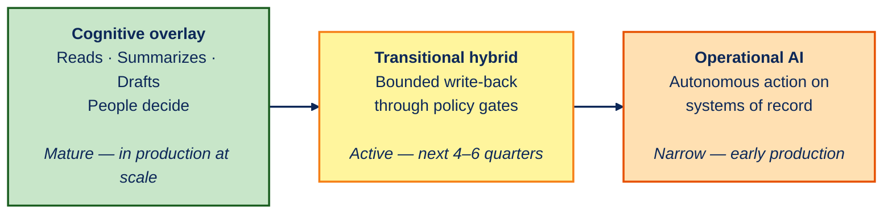

---
pdf_options:
  format: A4
  landscape: true
  margin:
    top: 8mm
    right: 11mm
    bottom: 6mm
    left: 11mm
  printBackground: true
  preferCSSPageSize: true
---

# Enterprise AI in 2026 — Six Trends Shaping Adoption

Where the market is moving, what has matured, and what to watch over the next 18 months — April 2026 · Adoption is progressing through three stages

1

Agents become an architecture category, not a feature

Foundational

The market is converging on a <strong>six-layer stack</strong> — model, context, tool execution, orchestration, governance, observability. Buyers now evaluate platforms across all six.

Gartner forecasts 40% of enterprise applications will include task-specific AI agents by end-2026, up from less than 5% in 2025.

2

Standards consolidated faster than expected

Mainstream

The Model Context Protocol went from <strong>~2 million to ~97 million</strong> monthly SDK downloads in 16 months, then was donated to the Linux Foundation Agentic AI Foundation in December 2025.

AWS, Anthropic, Block, Google, Microsoft, and OpenAI are founding members. The protocol layer is now neutral infrastructure.

3

Models and runtimes are commoditizing

Mainstream

Open-weight Chinese models (<strong>DeepSeek, Qwen</strong>) and open agent frameworks (<strong>LangGraph, Microsoft Agent Framework, Eclipse LMOS</strong>) are eroding model-as-moat. Qwen has overtaken Llama in cumulative downloads.

Differentiation moves up the stack — to context, governance, and evaluation.

4

Governance is becoming the buying criterion

Emerging

Deloitte: 75% plan agentic AI within 2 years; <strong>only 21%</strong> have mature governance. Bain: 80% of GenAI use cases met expectations, but <strong>only 23%</strong> can tie them to measurable revenue or cost.

Through 2027, vendors shipping audit-ready governance, identity, and evaluation packs win disproportionate share.

5

Evaluation is the unsolved problem

Emerging

Production agents show a <strong>37% gap</strong> between lab benchmark scores and real-world performance. LLM-as-judge frameworks have approximately <strong>50%</strong> pairwise error rates on subjective tasks.

Enterprises pairing domain ground-truth data with continuous online evaluation build a flywheel that compounds over time.

6

Coding agents have crossed into production

Mainstream

Goldman Sachs and Citi together run coding agents across approximately <strong>52,000 developers</strong>. EY has embedded a multi-agent framework into <strong>160,000</strong> audit engagements with Microsoft.

Through 2027, modernization, testing, and migration become outcome-priced agent services, not hourly labor.

Across regulated industries — telco, banking, insurance — the moat is moving from model to context, governance, and evaluation. The shape is the same in every vertical.

Sources: Gartner · Deloitte · Bain · Linux Foundation AAIF · Hugging Face · NeurIPS / EMNLP 2025 · BCG · EY · April 2026

