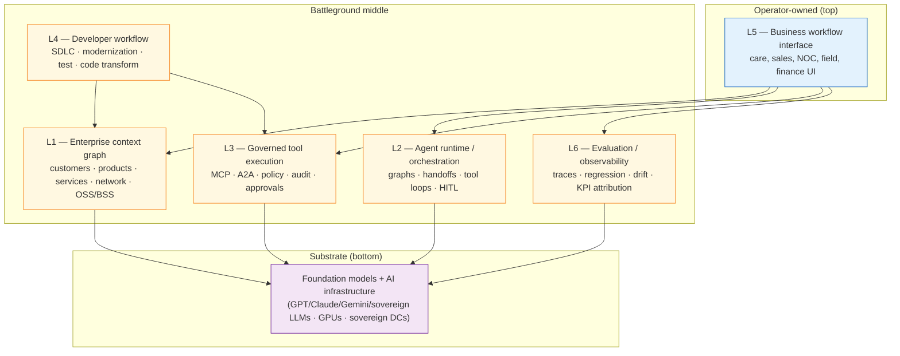
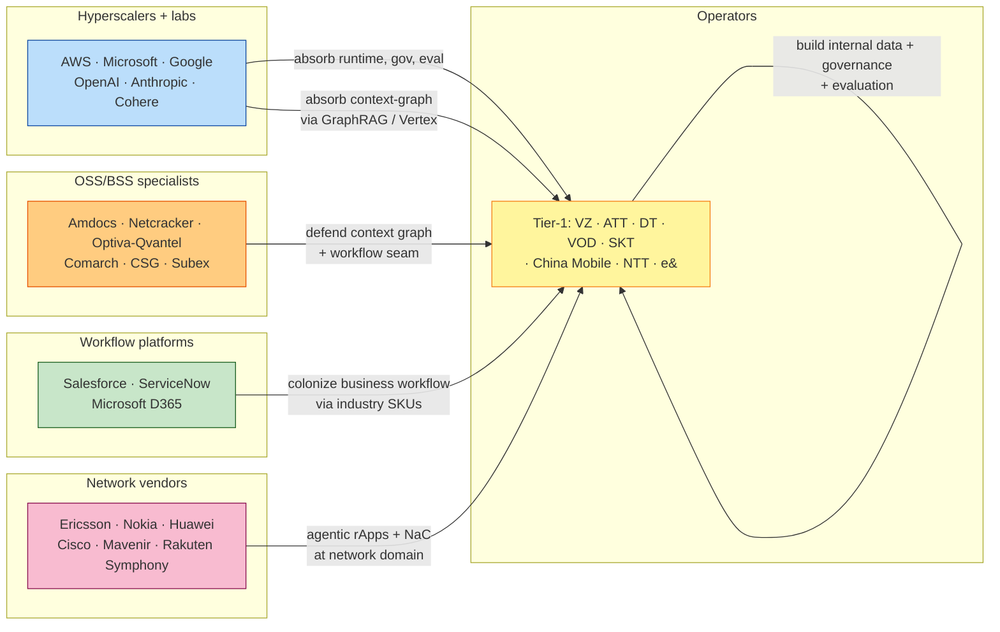
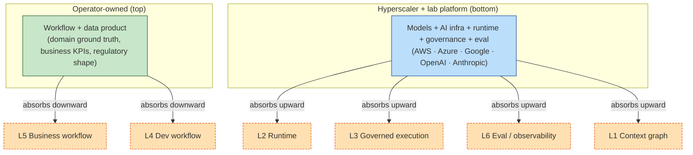

# Telco GenAI: The Six Enterprise Control Layers

> **Working thesis (preserved from the source draft).** In telco, agentic AI becomes strategically valuable only when a player controls one or more enterprise execution layers. Models alone are not the moat. The moat is control over **context, execution, workflow, and trust**.

This memo enriches the original "six control layers" thesis with: (i) primary-source validation of every cited claim, (ii) named-operator and standards-body evidence, (iii) a refreshed vendor matrix, (iv) regional posture refresh, (v) an explicit adversary overlay per layer plus a meta-adversary, (vi) sharpened conclusions, and (vii) explicit limitations. Inline citations use *(Author/Org, Year)*; full bibliography is at the end.

---

## Executive Summary

1. The six-layer thesis survives 2026 evidence. Production cases at Verizon, AT&T, Deutsche Telekom, Vodafone, SK Telecom, China Mobile, and NTT Docomo confirm the pattern: deployments that move beyond pilot are layered, not model-centric *(Cai, 2025; Microsoft, 2026; Qdrant, 2025; Telecoms.com, 2025; TelecomTV, 2025)*.
2. The strongest emerging counter-thesis is **collapse-to-two-layers**: a hyperscaler-plus-lab platform on the bottom, an operator-owned workflow/data product on top, with the middle (runtime, governance, context graph, evaluation) absorbed downward into managed services. Evidence: AWS Bedrock GraphRAG GA *(AWS, 2025a)*; Microsoft Agent Framework GA *(Microsoft DevBlogs, 2026)*; MCP donated to the Linux Foundation Agentic AI Foundation *(Linux Foundation, 2025; Anthropic, 2025)*; Microsoft Agent Governance Toolkit OSS *(Microsoft Open Source, 2026)*.
3. The most defensible telco-specific layer remains the **enterprise context graph**, where hyperscaler GraphRAG primitives are still telco-naïve. Operators publish "data platforms" (Telefónica Kernel, Airtel Xtelify, BT GenAI Gateway) but rarely publish entity-resolution schemas or lineage; this is the white space.
4. **Evaluation and observability** is the most underestimated layer and currently the *least* solved scientifically: documented 37% lab-to-production gap and >50% LLM-as-judge error rates *(Galileo, 2026; Eisenstadt et al., 2026)*. Operators that pair domain ground truth with continuous online evaluation can build a private flywheel competitors cannot replicate.
5. The **business workflow interface** is where the money is in 2026 (Verizon-Google +~40% service-team sales; AT&T 100k+ users; Vodafone SuperTOBi 9.5M customers) — but it is also the most copyable layer and is being colonized by Microsoft / Google / Salesforce / ServiceNow industry SKUs *(Salesforce, 2026; ServiceNow, 2026; Microsoft, 2026)*.
6. For services-heavy OSS/BSS vendors (Amdocs, Netcracker, Comarch), the **strategic risk is not that hyperscalers win; it is that an exposed context graph hands the client the cognitive map to reduce dependency**. The recommended posture: keep the deep graph internal; expose bounded, policy-filtered agent capabilities through governed APIs and workflow surfaces.

**Confidence**: High on layer 5 (business workflow) and layer 4 (developer workflow); Medium on layers 1–3; Low-Medium on layer 6 because production telemetry is sparse and judge methodology is unstable.

---

## Figure 1 — The Six-Layer Stack

*Figure note.* The adversary's "collapse-to-two-layers" thesis is represented by pressure on the middle: each yellow box is being absorbed downward into the substrate (managed hyperscaler + lab services) or upward into the operator's workflow product. The thesis of this memo is that the middle survives, with a thinner but still-defensible profile.

---

## 1. Layer-by-layer benchmark

For each layer, the structure is: **Definition → Evidence (2024–2026) → Adversary thesis → Thesis defense → Verdict.**

### Layer 1 — Enterprise context graph

**Definition.** The structured operational understanding of the telco estate: customers, products, services, subscriptions, service orders, trouble tickets, network topology, inventory, billing and usage events, policies, SLAs, field operations, and the code, configuration, APIs and process flows that bind them.

**Evidence (production-grade or near).**

- Deutsche Telekom's **Frag Magenta OneBOT** is the single most-published telco context-graph case. Built on the Eclipse LMOS open agentic framework with Qdrant vector search, it serves >2M conversations across three countries and 380 use cases; agent build time fell from ~15 days to 2 days. DT donated LMOS Agent Definition Language (ADL) to the Eclipse Foundation in October 2025 *(Qdrant, 2025; Eclipse Foundation, 2025; InfoWorld, 2025)*.
- **Telefónica's "Kernel"** data-and-AI platform, integrating with Microsoft Azure AI Studio, anchors a Next-Best-Action AI Brain across Group operating companies *(Tecknexus, 2025; Nasdaq/Zacks, 2025)*.
- **Bharti Airtel's Xtelify** data platform underlies six in-house customer-facing AI agents now live in the Thanks app *(Business Standard, 2025)*.
- **e& (Etisalat)** UAE has 1,100+ AI use cases live and 160+ ML models in production, layered with IBM watsonx.governance and the Sovereign Agentic AI Platform with Intel and Dell unveiled at GITEX 2025 *(e&, 2025a; e&, 2025b)*.
- **AWS Bedrock Knowledge Bases GraphRAG** went GA in March 2025; multimodal retrieval added in November 2025 *(AWS, 2025a; AWS, 2025b)* — i.e., a managed-service alternative to specialist context-graph vendors.

**Adversary thesis.** The context graph is becoming a managed hyperscaler primitive. AWS Bedrock GraphRAG, Google Vertex AI Search, Microsoft Fabric, and Databricks Genie can auto-extract entities, facts and relationships from S3/cloud-storage; Verizon's flagship "Personal Research Assistant" runs on Vertex AI plus Customer Engagement Suite, not a telco-specialist context graph *(Google Cloud, 2025)*. If Bedrock can ship 95%-answerability on stock knowledge-base GraphRAG, the "telco context graph" reduces to ETL and a TM Forum schema mapping — table stakes, not a moat.

**Thesis defense.** Generic GraphRAG does not encode telco-specific semantics: SID/eTOM mappings, service inventory, RAN topology, OSS/BSS state, regulatory lineage, and identity reconciliation across 20+ legacy systems. This integration burden is the actual hard part, and no hyperscaler ships it out of the box.

**Verdict.** **Critical layer; partial commoditization at the edges; deep-telco semantics still defensible.** Operators that publish *only* a "data platform" without a documented entity resolution / lineage discipline are at risk.

---

### Layer 2 — Agent runtime and orchestration

**Definition.** The substrate that decides which agent acts, what tools it can invoke, what context it sees, when humans must approve, and how multi-step work decomposes across NOC, care, billing investigation, field, order fallout, product configuration, code modernization, test generation, and incident response.

**Evidence.**

- Production multi-agent runtimes are now real: **Vodafone Italy / Fastweb** runs a multi-agent care platform on LangGraph + LangSmith *(LangChain, 2025)*; **Deutsche Telekom's LMOS** is the most scaled open telco agentic runtime *(Eclipse Foundation, 2025)*; **NTT Docomo** has commercially deployed agentic AI for mobile-network maintenance with 15-second failure isolation in transport and RAN *(TelecomTV, 2025; ITBusinessToday, 2025)*.
- **AT&T's "Ask AT&T"** — and the newer **Ask AT&T Workflows** drag-drop agent builder on Azure — serves 100k users, ~27B tokens/day; AT&T extended Microsoft Copilot to ~20,000 staff *(AT&T, 2025; Microsoft, 2026)*.
- **TM Forum's Agentic NOC Catalyst (C26.0.924)** is positioned for DTW Ignite 2026 (Copenhagen, 23–25 June 2026) as the industry blueprint for Autonomous Network Level 4+, with "self-healing, self-optimizing capabilities" and closed-loop fault remediation *(TM Forum, 2026a)*.
- **ETSI ENI Release 4** (GR ENI 051, February 2025) introduces an Agent-Based Interface (ABI) using LLM/NLP and intent-based methods — a standardized substrate for layer-2 runtimes *(ETSI, 2025a)*.

**Adversary thesis.** The runtime is the most commoditized layer. The 2023–2024 framework explosion has narrowed to four near-equivalent options — **LangGraph 1.0** (Nov 2025), the merged **Microsoft Agent Framework** (AutoGen + Semantic Kernel, GA Q1 2026), **OpenAI Agents SDK**, and **Anthropic's Claude Agent SDK**. Microsoft now publishes guides for running Claude Agent SDK *inside* Microsoft Agent Framework *(Microsoft DevBlogs, 2026)*. Anything a "telco runtime" does, a competitor can build in 6 weeks on LangGraph + a YAML policy file.

**Thesis defense.** Open-source frameworks supply the engine; they do not supply deterministic execution semantics for telco failure modes (network state divergence, billing idempotency, change-window enforcement) or the policy/audit hooks regulated agent runs require. That integration is real work.

**Verdict.** **High strategic weight, medium-to-high commoditization risk.** Telco-specific runtime constraints (policy boundaries, change windows, network blast radius, billing correctness) are where defensibility lives — not in the orchestration primitives themselves.

---

### Layer 3 — Governed tool execution

**Definition.** The layer where agents stop being copilots and start taking action: opening tickets, modifying orders, triggering tests, querying CRM, reconfiguring service, recommending credits, deploying configuration, creating pull requests.

**Evidence.**

- **BT's GenAI Gateway** on AWS (a central LLM access layer with prompt security, privacy controls, and Openreach engineer-notes summarization) is the cleanest published example of a telco gateway-style execution layer *(BT, 2025; TM Forum Inform, 2025)*.
- **e&-IBM watsonx.governance** delivers AI/GenAI governance over 1,100+ live use cases *(e&, 2025a)*.
- **Anthropic's Model Context Protocol (MCP)** has scaled from ~2M to ~97M monthly SDK downloads in 16 months *(DigitalApplied, 2026)*; Anthropic donated MCP to the Linux Foundation's **Agentic AI Foundation (AAIF)** in December 2025, with OpenAI, Google, Microsoft, AWS, Cloudflare, and Block backing *(Anthropic, 2025; Linux Foundation, 2025; TechCrunch, 2025)*. MCP is now the *de facto* standard for tool-call schemas and sits at the heart of governed-execution architectures.
- **Microsoft Agent Governance Toolkit** (open-source, April 2026) ships runtime security covering all 10 OWASP agentic risks with sub-millisecond enforcement *(Microsoft Open Source, 2026)*. **Databricks Unity AI Gateway** offers governance as a managed layer *(Databricks, 2025)*.
- **EU AI Act** Article 6/Annex III high-risk obligations bind from August 2026 (governance/transparency) and August 2027 (high-risk including critical-infrastructure AI safety components), with fines up to 7% of global turnover; DT, KPN, Orange, Telefónica, TIM, Vodafone are AI Pact signatories *(GSMA, 2025)*.

**Adversary thesis.** Governance is collapsing into open protocols plus hyperscaler gateway services. MCP defines the schema; OWASP AI Top-10 defines the threat model; Microsoft, Databricks, and the AAIF ship the enforcement. Governance is a *policy you write*, not a *platform you buy*. Vendors implement standards; they do not own them.

**Thesis defense.** Telco governance is not generic OWASP — it is specific obligations against billing accuracy, lawful intercept, number portability, regulatory reporting, and per-jurisdiction operator licenses. Standards define the protocol; the actuator that decides "is this a legal action against this BSS in this country at this time" is still domain-built.

**Verdict.** **Critical procurement battleground.** No agent platform should be accepted without traceability, replay, regression suites, policy validation, and business-KPI attribution. Generic OWASP-aligned governance is necessary but nowhere near sufficient.

---

### Layer 4 — Developer workflow

**Definition.** Legacy modernization, code comprehension, API rationalization, test generation, defect triage, release automation, configuration analysis, product customization, monolith decomposition, OSS/BSS extension, and impact analysis across code, configuration, catalog and process.

**Evidence.**

- **AT&T**, **BT**, **TELUS** (Fuel iX processed 2T tokens in 2025), **China Telecom** (Xingchen 100B/177B params, used internally for SDLC), and **Telstra** (AskTelstra, One Sentence Summary; Accenture global AI JV) all run developer-workflow GenAI in production *(AT&T, 2025; BT, 2025; RCR Wireless, 2025; Developing Telecoms, 2025; Accenture, 2025)*.
- **Claude Agent SDK / OpenAI Agents SDK / Google ADK / AWS Strands** define how developers actually build agents in 2026; Claude Code (an SDK packaged as a CLI) is the most-deployed engineering substrate inside hyperscaler-aligned operators *(Composio, 2026; Anthropic, 2026)*.
- **GitHub Copilot** has reached 20M users and 90% of Fortune 100 *(Amplifi Labs, 2026)*. **Sourcegraph Amp** is the polyglot-codebase agentic CLI relevant to telco brownfield estates.

**Adversary thesis.** Developer workflow is being captured by the model labs, not the platform layer. SDKs are engineered to pull workflow gravity to the lab's foundation model: **Claude Managed Agents** runs only on Anthropic infrastructure; **OpenAI Threads / Vector Stores / File Search** are platform-locked. The IDE-to-deployment seam is the lock-in surface, and the labs own it.

**Thesis defense.** Telco developers don't write agents from scratch — they assemble against domain DSLs, low-code studios, and product owners who don't touch SDKs. The developer workflow that matters in telco is the *business analyst* workflow on top of TM Forum-aware scaffolding, which the labs do not build.

**Verdict.** **High strategic weight for legacy-heavy operators and OSS/BSS vendors.** The strategic question for an Amdocs-class vendor: can agents understand and safely change the operator's BSS/OSS estate faster than the incumbent vendor can protect its services moat?

---

### Layer 5 — Business workflow interface

**Definition.** The surface users actually touch: contact-center desktop, sales cockpit, retention console, NOC dashboard, field-tech mobile app, product-manager workspace, billing-ops cockpit, executive operating dashboard, enterprise customer portal.

**Evidence (the strongest evidence layer today).**

- **Verizon × Google Cloud** Personal Research Assistant + Conversational Agents on Vertex AI / Gemini is deployed across **28,000 service representatives and retail**, with reported 95% answerability and a **~40% sales lift** since full deployment in January 2025 *(Cai, 2025; Google Cloud, 2025)*. Vestberg's June 2024 framing — Verizon receives ~170M calls per year, GenAI now identifies the call reason ~80% of the time, intended to retain ~100,000 subscribers in 2024 — is the underlying source for the widely cited "80%" figure *(Reuters, 2024; Mobile World Live, 2024)*.
- **Vodafone SuperTOBi** on Azure OpenAI is in production across IT, PT, DE, TR, serving ~9.5M customers; Portugal first-time resolution rose from 15% to 60% post-deployment *(Vodafone, 2024; Total Telecom, 2025)*.
- **Bell Canada** Network AI Ops on Google Cloud reports software-delivery productivity +75% and customer-reported issues –25% *(PR Newswire, 2025)*.
- **TELUS NEO Assistant** for field technicians, built on Gemini, has crossed 75% field-tech adoption *(RCR Wireless, 2025)*.
- **AT&T** has 71 GenAI solutions live to 100k+ employees with multi-agent orchestration in Azure AI Foundry *(Microsoft, 2026)*.
- **Salesforce Agentforce for Communications** GA in February 2026 ships industry SKUs (billing-resolution, quoting, site-grouping, SLO insights, guided sales agents); One NZ and Lumen are named customers *(Salesforce / SiliconANGLE, 2026)*.
- **ServiceNow Telecom AI Agents** (March 2025) plus **ServiceNow + Google Cloud Autonomous Network Operations** (April 2026) are the two biggest workflow-platform announcements aimed directly at telcos *(ServiceNow, 2025; ServiceNow + Google Cloud, 2026)*.
- **EE (BT consumer)** "Aimee" handles ~60,000 conversations/week with ~50% auto-success on several journeys *(BT, 2024)*.

**Adversary thesis.** This layer is being colonized by hyperscaler-plus-SI deals signed *directly* with operators, bypassing telco-specialist platforms. AT&T → Microsoft, Verizon → Google, SK Telecom → Microsoft Foundry + OpenAI Stargate Korea, Deutsche Telekom → OpenAI multi-year (~200k employees, December 2025), FiberCop → Microsoft Dynamics 365 Contact Center *(Microsoft, 2026; OpenAI, 2025; Fierce Network, 2025)*. Three of the world's most strategic operators all chose hyperscaler workflow platforms in 2025 — none chose a telco-specialist platform.

**Thesis defense.** The operator deals are real, but the *order-to-cash, trouble-to-resolve, RAN energy-ops* business-workflow seams still require telco-domain process maps. Hyperscalers provide the agent platform; specialist vendors (Amdocs aOS, Netcracker autonomous ops) still own the business-workflow seam — which is precisely why both shipped agentic platforms in 2025–2026 *(Amdocs / The Mobile Network, 2026; Netcracker, 2025)*.

**Verdict.** **Where the money is now; not where the long-term moat is.** Defensibility comes only when the workflow is connected to proprietary context (L1) and governed execution (L3).

---

### Layer 6 — Evaluation and observability

**Definition.** The layer that proves agents are correct, safe, auditable, and improving: did the agent retrieve the right evidence, hallucinate, violate policy, execute the right tool, require human approval, take a reversible action; did SLA, churn, cost, NPS improve; can we audit the chain; can we compare vendors.

**Evidence.**

- **Real-world deployments show a 37% gap between lab benchmark scores and production agent performance, with up to 50× cost variance for similar accuracy** *(Galileo, 2026)*.
- **LLM-as-judge — the dominant eval primitive — has documented error rates exceeding 50%, with position bias, length bias, and agreeableness bias** *(Eisenstadt et al., 2026)*. No judge has been shown to be uniformly reliable.
- **Vendor field is fragmented and well-funded**: LangSmith, Arize ($70M Series C), Galileo (Luna-2 EFMs), Langfuse, Maxim, Patronus, Braintrust ($80M Series B at ~$800M valuation), all converging on OpenInference/OpenTelemetry instrumentation.
- **3GPP SA5 Rel-19** standardizes model-monitoring NRMs and AI/ML management in the telco context, providing a compliance substrate for layer-6 *(3GPP, 2025)*.
- **ETSI ISG SAI** addresses adversarial robustness, supply-chain attacks, and data-poisoning mitigation for AI in network operations *(ETSI, 2025b)*.
- **Vodafone Italy / Fastweb** is the cleanest named-tooling production case — LangSmith for tracing/eval inside a multi-agent care platform *(LangChain, 2025)*.

**Adversary thesis.** No one wins this layer because the science is broken. If lab-to-production gaps are 37% and judge error rates exceed 50%, evaluation is an unsolved research problem masquerading as a product category. Fragmented OTel-aligned tooling will commoditize observability the moment the science stabilizes.

**Thesis defense.** Precisely because eval is broken everywhere, the operator who pairs **domain ground truth** (call-center QA, network KPI deltas, billing reconciliations) with **continuous online evaluation against real outcomes** builds a private flywheel. Generic OTel traces cannot replicate this.

**Verdict.** **Most underestimated layer.** No agent platform should be accepted into telco production without traceability, replay, regression suites, policy validation, business-KPI attribution. This is the layer most likely to sort serious vendors from theatrical ones.

---

## 2. Strategic benchmark matrix (refreshed)

Scoring: 5 = clear leader with telco production evidence; 4 = strong product, partial telco evidence; 3 = credible but not telco-specific; 2 = weak/partner-dependent; 1 = not a player. Layers: **CG**=Context Graph, **RT**=Runtime, **GE**=Governed Execution, **DW**=Developer Workflow, **BW**=Business Workflow, **EO**=Eval/Observability.

| Vendor | CG | RT | GE | DW | BW | EO | Overall | Headline telco evidence |
|---|---|---|---|---|---|---|---|---|
| **Microsoft (Foundry, Copilot, Fabric, D365)** | 5 | 5 | 5 | 5 | 5 | 4 | **5** | AT&T 100k+ users; Vodafone NOA blueprint; SKT Foundry; FiberCop D365 |
| **Google Cloud (Vertex, Gemini Enterprise, Agentspace)** | 5 | 5 | 4 | 4 | 5 | 4 | **5** | Verizon 28k reps, 95% answerability; Bell Canada Net AI Ops; Nokia NaC |
| **AWS (Bedrock, AgentCore, GraphRAG)** | 4 | 5 | 4 | 4 | 4 | 4 | **4** | AgentCore GA Oct 2025; Amdocs multi-year; BT GenAI Gateway |
| **Anthropic (Claude Agent SDK, MCP)** | 4 | 5 | 4 | 5 | 3 | 3 | **4** | MCP donated to AAIF; Cisco Project Glasswing; Salesforce multi-model |
| **OpenAI (Agents SDK, ChatGPT Enterprise)** | 3 | 5 | 4 | 4 | 4 | 3 | **4** | Deutsche Telekom 200k seats; SKT B2C+B2B; Stargate Korea |
| **Amdocs (amAIz, aOS, Cognitive Core)** | 5 | 5 | 5 | 3 | 5 | 3 | **5** | e& UAE amAIz across care/retail/network ops; aOS Feb 2026 |
| **Netcracker (Agentic AI Solution)** | 5 | 5 | 4 | 3 | 5 | 3 | **4** | C Spire revenue mgmt; 60+ pre-built telco agents; Agent Design Studio |
| **Salesforce (Agentforce for Comms)** | 4 | 5 | 4 | 3 | 5 | 3 | **5** | Agentforce GA Feb 2026; One NZ + Lumen; Bandwidth voice integration |
| **ServiceNow (Now Assist, Telecom AI Agents, TSM)** | 5 | 5 | 5 | 3 | 5 | 4 | **5** | TSM-based AI agents (Mar 2025); Google Cloud co-build (Apr 2026) |
| **Cohere (North, Command)** | 4 | 4 | 5 | 2 | 4 | 3 | **4** | Bell Canada largest commercial customer; STC "North for Telecom" |
| **Ericsson (Cognitive Software, agentic rApps)** | 4 | 4 | 4 | 2 | 3 | 4 | **4** | 5-yr Vodafone programmable networks; Vivo Brazil agentic-rApp pilot |
| **Nokia (Network-as-Code, Autonomous Net Fabric)** | 4 | 4 | 4 | 2 | 3 | 4 | **4** | €1B AI/Cloud orders Q1 2026; NaC w/ Google Cloud across 8+ operators |
| **Huawei (AI-Native O&M, Agentic BSS, AUTINOps)** | 4 | 4 | 3 | 2 | 4 | 3 | **3** | MWC26 Agentic BSS / SmartCare; geographic constraints in West |
| **GitHub Copilot** | 3 | 4 | 4 | 5 | 2 | 3 | **4** | 20M users, 90% of F100; standard inside hyperscaler-aligned telcos |
| **Anthropic Claude Code** | 4 | 5 | 4 | 5 | 2 | 3 | **4** | De-facto agent dev kit; Claude Agent SDK + MCP |
| **Sourcegraph (Amp)** | 4 | 3 | 3 | 5 | 1 | 2 | **3** | Polyglot brownfield; relevant to telco legacy modernization |
| **LangSmith / LangChain** | 3 | 3 | 3 | 4 | 1 | 5 | **3** | Vodafone Italy/Fastweb production multi-agent + tracing |
| **Datadog / Dynatrace** | 3 | 3 | 3 | 2 | 2 | 5 | **3** | LLM Observability + Bits AI; deep telco SRE footprint |
| **Sierra / Decagon / Maven AGI** | 3 | 4 | 3 | 1 | 4 | 2 | **3** | Strong CX traction broadly; no named telco logos surfaced (2026) |
| **Mistral** | 2 | 3 | 3 | 2 | 2 | 2 | **2** | Sovereign-EU positioning (Orange Codestral); no telco prod KPIs |
| **Mavenir / Openet / Comarch / Subex / CSG** | 3 | 2–3 | 2–3 | 1 | 3 | 2 | **2** | Generic market presence; no flagship 2025–2026 agentic deployment |

### Figure 2 — Vendor pressure points

---

## 3. Regional posture (refreshed)

### Figure 3 — Six-layer posture by region

| Region | CG | RT | GE | DW | BW | EO | Distinguishing posture |
|---|---|---|---|---|---|---|---|
| **North America** | M | S | M | S | S | M | "AI landlord" — monetize compute + fiber as AI-edge |
| **Europe** | S | M | S | M | S | S | Governance-first; multi-operator collaboration (Edge Federation, Open Telco AI) |
| **MEA** | W–M | S/W | M | W–M | M | W | Sovereign-AI champions (G42, Humain) above the operator |
| **APAC** | S | S | M | S | S | M–S | Foundation-model control (Syntelligence, Jiutian); end-to-end stack |
| **LATAM** | W | W–M | W–M | M | M | W | Derivative — agentic AI arrives via parent groups & hyperscalers |

S = Strong, M = Medium, W = Weak.

### North America
- **Verizon** — Vertex/Gemini deployment to 28k care reps with 95% answerability and ~40% sales lift; "Verizon AI Connect" infrastructure-as-a-service pivot *(Cai, 2025; Verizon, 2025)*.
- **AT&T** — "Ask AT&T" + Ask AT&T Workflows on Azure; 100k users; 71 GenAI solutions; ~$1B 2025 cost-savings target *(AT&T, 2025; Microsoft, 2026; Light Reading, 2025)*.
- **T-Mobile US** — OpenAI IntentCX is announcement-grade only; production telemetry remains thin.
- **Bell Canada** — Cohere strategic customer; sovereign Canadian-stack tilt; CAD ~700M AI revenue 2025 target, ~CAD 1.07B by 2028 *(Bell, 2025; RCR Wireless, 2025)*.
- **Regulatory pattern**: sectoral US (FCC, FTC, NIST AI RMF, state-level CA/CO/NY); Canada PIPEDA + AIDA + Quebec Law 25 pushing Bell sovereign.
- **Vendor pattern**: hyperscaler-led multi-vendor (AWS, Azure/OpenAI, Google Cloud, NVIDIA), Bell as the sovereign outlier.

### Europe
- **Deutsche Telekom** — Frag Magenta OneBOT (production); LMOS/ADL donated to Eclipse; OpenAI multi-year (200k seats); RAN Guardian agents w/ Google Cloud *(Eclipse Foundation, 2025; OpenAI, 2025; voip.review, 2025)*.
- **Vodafone** — SuperTOBi 9.5M customers across IT/PT/DE/TR; Ericsson 5-yr programmable networks (Germany first); Microsoft NOA blueprint *(Vodafone, 2024; Ericsson, 2025; Microsoft, 2026)*.
- **BT** — GenAI Gateway + EE Aimee; Dark NOC autonomous network ops *(BT, 2025; ZenML, 2025)*.
- **Telefónica** — Kernel + Microsoft Azure AI Studio; MasOrange GenGraph RCA pilot *(Telefónica, 2025)*.
- **Orange** — 800-strong AI team; Mistral partnership (Codestral, Le Chat Pro); cautious agentic posture *(TelecomTV, 2025)*.
- **Regulatory pattern**: EU AI Act binds in two phases (Aug 2026 transparency; Aug 2027 high-risk); top operators are AI Pact signatories; Connect Europe & GSMA shaped Digital Omnibus on AI position.
- **Distinguishing**: only region with (a) genuine multi-operator collaboration (Edge Federation across DT/Orange/Telefónica/TIM/Vodafone), (b) binding regulatory regime forcing layer-3 maturity ahead of peers, and (c) named network-internal agentic AI (RAN Guardian, Dark NOC).

### MEA
- **e& (Etisalat)** — Sovereign Agentic AI Platform with Intel + Dell at GITEX 2025; AWS Sovereign Launchpad (Nov 2025); IBM watsonx.governance; 1,100+ AI use cases live *(e&, 2025a/b)*.
- **stc** — center3 + Humain JV (Dec 2025) for 1GW AI data-centre buildout (250MW initial); Vision 2030 sovereign-AI play *(Data Center Dynamics, 2025)*.
- **Safaricom** — $500M AI infrastructure commitment (May 2025); Zuri on AWS Bedrock; Huawei Idea-to-Cash GenAI for product launches *(TechAfrica, 2025)*.
- **MTN, du** — strategic ambitions but execution evidence is thin.
- **Regulatory pattern**: GCC sovereign-cloud regimes (UAE NESA, Saudi NCA, KSA PDPL); G42 Greenshield/Digital Embassies frame portable sovereignty.
- **Distinguishing**: the only region where the operator is structurally subordinated to a sovereign-AI champion (G42 in UAE, Humain in KSA) rather than competing with it. The telco's role is shifting from AI-platform owner to AI-grid operator (power, fiber, cooling, sovereign edge).

### APAC
- **SK Telecom** — A.X K1 (519B params); A-dot Biz target ~80k employees / 25 group cos by end 2025; Aster agentic assistant; Anthropic investment; Syntelligence JV anchor; Microsoft Foundry + OpenAI Stargate Korea *(SK Telecom, 2025; RCR Wireless, 2025; Fierce Network, 2025; OpenAI, 2025b)*.
- **Singtel/NCS** — RE:AI sovereign cloud; Sunshine.AI suite (S$130M); MERaLiON Consortium for SE-Asian conversational AI *(NCS, 2025; TelecomTalk, 2025)*.
- **NTT Docomo / NTT Data** — Smart AI Agent ecosystem ($2B revenue target by 2027); commercial agentic AI for network maintenance with 15-second failure isolation *(NTT Data, 2025; TelecomTV, 2025)*.
- **China Mobile** — Jiutian LLM (1T params) integrated into Computing Network Brain 3.0; L4 trial completed Guangdong; nationwide rollout begun 2025; VIP-complaint resolution from 2 days to 1.5 hours *(Telecoms.com, 2025; TM Forum Inform, 2025)*.
- **China Telecom** — Xingchen 100B/177B-param LLM in pilot commercial deployment (177B distributed training over 500 km fiber) *(Developing Telecoms, 2025)*.
- **Bharti Airtel + Reliance Jio** — Visakhapatnam mega AI hub w/ Google; Jio-Gemini distribution to ~hundreds of millions *(Airtel, 2025; TechCrunch, 2025)*.
- **Regulatory pattern**: most heterogeneous globally — China deep-synthesis + data-localization; India DPDP Rules 2025; Japan permissive; Singapore Model AI Governance Framework v2; Korea AI Basic Act.
- **Distinguishing**: the only region producing a true cross-operator multilingual telco-LLM JV (Syntelligence) AND running sovereign LLMs at trillion-parameter scale (Jiutian) AND scaling consumer AI distribution to hundreds of millions (Jio-Gemini, Airtel-Perplexity).

### LATAM
- **Vivo (Telefónica Brasil)** — Microsoft GenAI for call-center; Sprinklr AI for social-channel CX (response time -65%); Ericsson Agentic rApp-as-a-Service pilot on AWS *(BNamericas, 2025; Sprinklr, 2025; TelecomTV, 2025)*.
- **TIM Brasil / Vivo / Claro** — Aduna network-API commercial launch (Q4 2025) *(Aduna, 2025)*.
- **América Móvil / Telmex / Claro** — broader regional GenAI strategy lightly disclosed.
- **Regulatory pattern**: Brazil LGPD + draft AI law (PL 2338/2023, EU-influenced); Mexico fragmented; Argentina, Colombia national strategies but enforcement light.
- **Distinguishing**: structurally a *derivative* region — agentic AI arrives via parent groups (Telefónica Aura/Tech) and hyperscaler distribution; the bright spot is Brazil's network-API commercialization leadership which could become a substrate for LATAM-grown agentic services.

**Cross-region call.** APAC is most likely to produce the first end-to-end agentic telco at scale, with **SK Telecom** the candidate-of-record and **China Mobile** in a parallel non-Western track. **Bell Canada + Cohere** is the strongest single Western bet.

---

## 4. Adversary overlay (consolidated)

### Figure 4 — Per-layer adversary thesis vs. defense

| Layer | Adversary thesis (best counter) | Strongest evidence | Thesis defense (where the moat survives) |
|---|---|---|---|
| **L1 Context graph** | Hyperscalers absorb it via Bedrock GraphRAG / Vertex / Fabric / Genie. | AWS Bedrock GraphRAG GA Mar 2025; multimodal Nov 2025 *(AWS, 2025a/b)*; Verizon stack on Vertex *(Google Cloud, 2025)*. | Telco-specific entity resolution + 20+ legacy reconciliation is not commoditized. |
| **L2 Runtime** | Open frameworks (LangGraph, MS Agent Framework, OpenAI/Anthropic SDKs) make orchestration a substrate, not a moat. | LangGraph 1.0; Microsoft Agent Framework GA Q1 2026; Microsoft DevBlogs hosting Claude SDK inside MS framework *(Microsoft DevBlogs, 2026)*. | Deterministic execution, telco failure modes, and policy hooks are not in the open framework. |
| **L3 Governed execution** | MCP + AAIF + OWASP + Agent Governance Toolkit standardize this. Vendors implement; they don't own. | MCP 97M downloads *(DigitalApplied, 2026)*; Linux Foundation AAIF *(Linux Foundation, 2025)*; Microsoft Toolkit *(Microsoft Open Source, 2026)*. | Per-jurisdiction telco obligations (lawful intercept, billing accuracy) are still domain-built. |
| **L4 Developer workflow** | Labs capture the IDE-to-deployment seam via SDKs + managed agents. | Claude Managed Agents = Anthropic-only; OpenAI Threads/Vector Stores platform-locked *(Composio, 2026)*. | Telco low-code studios + business-analyst surfaces sit above the SDK. |
| **L5 Business workflow** | Hyperscalers + Salesforce + ServiceNow industry SKUs sign direct with operators. | AT&T-MS, VZ-Google, SKT-MS+OpenAI, DT-OpenAI, FiberCop-D365 *(Microsoft, 2026; Fierce Network, 2025)*. | Order-to-cash / trouble-to-resolve / RAN energy-ops process maps are still telco-specialist. |
| **L6 Eval/observability** | Science is broken (37% lab-to-prod gap; >50% judge error rates). No one wins this. | Galileo, 2026; Eisenstadt et al., 2026. | Domain ground-truth flywheel + business-KPI attribution is private and non-replicable. |

### Meta-adversary — collapse to two layers

The single most dangerous counter-thesis is **collapse-to-two-layers**: by 2027 the six layers compress into **(1) a hyperscaler + lab platform** and **(2) an operator-specific workflow + data product**. Everything in the middle becomes a managed feature shipped jointly by AWS / Azure / Google in partnership with OpenAI / Anthropic / Google DeepMind. Evidence pattern (2025–2026): MCP donated to AAIF; Microsoft Agent Framework GA; Microsoft Agent Governance Toolkit OSS; Bedrock GraphRAG GA; AT&T-Microsoft, Verizon-Google, SK Telecom-Microsoft+OpenAI, DT-OpenAI all consolidate the bottom layer.

### Figure 5 — Collapse-to-two-layers pressure

**Counter to the meta-adversary.** Standards collapse stacks but **operators do not run their businesses on raw standards**. Somebody integrates, certifies, governs per-jurisdiction, and absorbs liability. Historically every major IT collapse-to-two-layers prediction (mainframe→cloud, on-prem→SaaS) has produced a thick, persistent middle layer that captured most of the integration economics. The strongest adversary response is that *this time the middle layer is the model itself* — and labs already know it.

---

## 5. Strategic implications for OSS/BSS vendors (Amdocs / ACM-class)

The original draft's framing — that giving a client a deep ACM-like graph over product logic, implementation history, code structure, configuration, integration patterns, and business flows is **strategically dangerous** for a services-heavy vendor — survives 2026 evidence intact. If anything it sharpens.

Recommended posture for an Amdocs / Netcracker / Comarch class vendor:

1. **Keep the deep graph internal.** Expose bounded, purpose-specific, policy-filtered agent capabilities through governed APIs, skills, and workflow surfaces. Do not give the client the full cognitive map of the BSS/OSS estate.
2. **Lead with workflow surfaces (L5) and developer workflow (L4).** Pair these with a thin, MCP-aligned governed-execution layer (L3). This is where the buyer signs the cheque today.
3. **Co-opt — don't fight — hyperscaler runtime (L2) and substrate.** The runtime war is lost in the open-framework era; differentiate on telco semantics above it (Amdocs aOS Cognitive Core, Netcracker Agent Design Studio).
4. **Build a private evaluation flywheel (L6).** Domain ground truth from N operator deployments is the only durable moat against hyperscaler eval/observability commoditization. This is where the AAIF / OpenInference standardization actually helps the specialist vendor: standard traces flow into a private eval corpus.
5. **Anchor regional regulatory positions early.** EU AI Act August 2026 obligations bind the next 18 months; sovereign-AI requirements in MEA and APAC are growing constraint surfaces. Vendors that ship audit-ready packs for these regimes win RFPs.
6. **Watch the M&A cadence.** Optiva → Qvantel; Matrixx → Amdocs ($200M); Salesforce + Bandwidth voice integration — the BSS / workflow / voice perimeter is consolidating around AI-native suites. The vendor that is *not* consolidating is, by 2027, the legacy.

---

## 6. Conclusions

**Sharpened final position.** The original six-layer thesis is correct *as a 2025–2026 framing*, and it is **brittle** as a 2027–2028 framing. The strongest adversary case (collapse-to-two-layers) is real, well-evidenced, and accelerating. But it does not erase the middle: it *thins* it.

The defensible posture for a telco-specialist vendor in 2026 is:

- **Concede L2 (runtime)** to open frameworks + hyperscaler primitives. Differentiate above them, not at them.
- **Defend L1 (context graph)** by depth of telco semantics, not breadth of data. Graph + entity resolution + lineage is the moat; "data lake" is not.
- **Win L3 (governed execution)** through per-jurisdiction obligation packs (lawful intercept, billing correctness, regulatory reporting), with MCP as the protocol layer below.
- **Industrialize L5 (business workflow)** with industry SKUs that wrap proprietary process maps; expect Salesforce, ServiceNow, and Microsoft to pressure margin here, but the seam to telco process is durable.
- **Make L4 (developer workflow)** the wedge for legacy modernization — the only place agents can directly *reduce* the multi-decade cost stack the operator carries.
- **Treat L6 (evaluation)** as the *long bet*. The science is unstable today, but the operator who pairs domain ground truth with continuous online evaluation owns a flywheel that compounds for a decade.

**Realistic market pattern (2026 update).**
- Today's evidence leader: business workflow interface, especially customer care.
- Near-term battleground: governed tool execution (procurement RFPs already require MCP / OWASP-aligned governance + AAIF traces).
- Long-term moat: enterprise context graph (depth of telco semantics).
- Most underestimated layer: evaluation and observability (the science is broken, the operator can build a flywheel anyway).
- Most overhyped layer: generic agent orchestration without telco context.
- Most dangerous exposure for services-heavy vendors: client-owned context graph over legacy/product internals.

**The winning telco stack will not be a single product.** It will be a layered architecture — telco context graph + (hyperscaler) agent runtime + governed tool layer + workflow surfaces + evaluation layer — where the control battle is **architectural, not product-based**.

---

## 7. Limitations

This memo is an analyst document, not a market study. Its claims are bounded by the following limitations.

1. **Time horizon and ageing.** The evidence base is 2024 Q1 through 2026 Q1. A meaningful share of the cited deployments are <12 months old; production maturity at 36 months is unknown. The memo's framing has an estimated useful life of 12–18 months.
2. **Tier-1 sample bias.** Operator evidence skews to ~25 named Tier-1 operators. Tier-2 / Tier-3 / MVNO behaviour is inferred, not measured.
3. **Vendor-PR contamination.** Many KPIs (Verizon ~40% sales lift; Bell Canada +75% productivity; Vodafone PT FTR 15→60%) are partner-co-marketed numbers (Google, Cohere, Microsoft) rather than independent audits. Treat as direction, not magnitude.
4. **Eval/observability evidence is structurally thin.** Operators rarely publish hallucination rates, regression frameworks, drift cadence, or red-team results. Layer-6 conclusions rest on industry-wide research (Galileo, 2026; Eisenstadt et al., 2026) more than telco-specific telemetry.
5. **Standards forward-looking risk.** Several standards items (TM Forum Agentic NOC Catalyst C26.0.924, ETSI ENI Rel-4 ABI, Linux Foundation AAIF) are demonstration / declaration grade for 2026; they are not production deployment evidence.
6. **Paywalled primary sources.** Omdia's 2025 Telco Network Automation Survey *(Omdia, 2025)* is subscription-gated; the headline 47% / "agentic AI very important for transport" figure is verifiable in publicly summarized form (Light Reading, Ciena) but the full methodology and cross-tabs are not.
7. **Translation/Anglophone bias.** Chinese, Korean, Japanese, and Arabic operator disclosures rely on translated press; some technical depth and KPI definitions may differ from the original.
8. **Adversary asymmetry.** The adversary overlay is constructed from public artefacts (AWS, Microsoft, Anthropic, OpenAI, Linux Foundation announcements). Private telco product roadmaps from these same vendors may be substantially more or less aggressive than what is public.
9. **No counterfactuals on revenue/cost claims.** Reported productivity / cost / sales gains are typically gross, not net of platform run-rate, integration cost, or opportunity cost.
10. **The memo is opinionated.** Where evidence is mixed, the synthesis chose the conservative reading (e.g., scoring runtime defensibility lower than some vendors' marketing materials would imply). A more aggressive reading is defensible from the same evidence.

---

## 8. Bibliography

All URLs accessed **2026-04-27** unless otherwise noted.

### Primary disclosures (operators, vendors, standards bodies)

- **3GPP**. 2025. *AI/ML management — SA5*. https://www.3gpp.org/technologies/ai-ml-management2 ; https://www.3gpp.org/technologies/sa5-rel19
- **Aduna**. 2025. *Aduna accelerates network API commercialization in Brazil with Vivo, Claro and TIM Brasil*. https://adunaglobal.com/newsroom/aduna-accelerates-network-api-commercialization-in-brazil-with-vivo-claro-and-tim-brasil/
- **Airtel**. 2025. *Airtel partners with Google to establish India's first mega AI hub and data center in Visakhapatnam*. https://www.airtel.in/press-release/10-2025/airtel-partners-with-google-to-establish-indias-first-mega-ai-hub-and-data-center-in-visakhapatnam/
- **Amdocs / The Mobile Network**. 2026. *Amdocs seeks agentic-era telco relevance with aOS*. https://the-mobile-network.com/2026/02/amdocs-seeks-agentic-era-telco-relevance-with-aos/
- **Anthropic**. 2025. *Donating the Model Context Protocol and establishing the Agentic AI Foundation*. https://www.anthropic.com/news/donating-the-model-context-protocol-and-establishing-of-the-agentic-ai-foundation
- **Anthropic**. 2026. *Building agents with the Claude Agent SDK*. https://www.anthropic.com/engineering/building-agents-with-the-claude-agent-sdk
- **AT&T**. 2025. *Agentic AI*. https://about.att.com/blogs/2025/agentic-ai.html
- **AWS**. 2025a. *Amazon Bedrock Knowledge Bases supports GraphRAG (GA)*. March 2025. https://aws.amazon.com/about-aws/whats-new/2025/03/amazon-bedrock-knowledge-bases-graphrag-generally-available/
- **AWS**. 2025b. *Multimodal retrieval for Bedrock Knowledge Bases now GA*. November 2025. https://aws.amazon.com/about-aws/whats-new/2025/11/multimodal-retrieval-bedrock-knowledge-bases/
- **AWS**. 2025c. *Amazon Bedrock AgentCore is now generally available*. October 2025. https://aws.amazon.com/blogs/machine-learning/amazon-bedrock-agentcore-is-now-generally-available/
- **Bell Canada**. 2025. *Bell Canada launches AI-powered network operations solution built on Google Cloud*. February 2025. https://www.prnewswire.com/news-releases/bell-canada-launches-ai-powered-network-operations-solution-built-on-google-cloud-302385987.html
- **Bell Canada**. 2026. *North by Cohere rolls out to Bell team members*. https://explore.business.bell.ca/news-and-events/north-by-cohere-rolls-out-to-bell-team-members
- **BT**. 2024. *BT Group leans on AI to transform customer service experience*. https://newsroom.bt.com/bt-group-leans-on-ai-to-transform-customer-service-experience/
- **BT**. 2025. *BT Group's Digital unit launches GenAI Gateway platform powered by AWS*. https://newsroom.bt.com/bt-groups-digital-unit-launches-genai-gateway-platform-powered-by-aws-accelerating-the-companys-safe-adoption-of-generative-ai-at-scale/
- **Eclipse Foundation**. 2025. *Eclipse LMOS redefines agentic AI: industry's first open Agent Definition Language*. October 2025. https://newsroom.eclipse.org/news/announcements/eclipse-lmos-redefines-agentic-ai-industry%E2%80%99s-first-open-agent-definition
- **e&**. 2025a. *e& collaborates with IBM to launch AI governance platform*. January 2025. https://www.eand.com/en/news/22-jan-2025-eand-collaborates-with-ibm-to-launch-al-governance-platform.html
- **e&**. 2025b. *e& unveils blueprint for AI app — Sovereign Agentic AI Platform with Intel*. GITEX 2025. https://www.eand.com/en/news/eand-unveils-blueprint-for-ai-app.html
- **Ericsson**. 2025. *Ericsson and Vodafone announce major five-year programmable networks partnership*. October 2025. https://www.ericsson.com/en/press-releases/2025/10/ericsson-and-vodafone-announce-major-five-year-programmable-networks-partnership
- **ETSI**. 2025a. *GR ENI 051 v4.1.1 — Agent-Based Interface*. February 2025. https://www.etsi.org/deliver/etsi_gr/ENI/001_099/051/04.01.01_60/gr_ENI051v040101p.pdf
- **ETSI**. 2025b. *White Paper No. 69 — AI in the evolution of autonomous networks*. https://www.etsi.org/images/files/ETSIWhitePapers/ETSI-WP-69-AI-in_the_evolution_of_Autonomous_Networks.pdf
- **Google Cloud**. 2025. *Google Cloud and Verizon drive customer experience improvements with Gemini integration*. April 9, 2025. https://www.googlecloudpresscorner.com/2025-04-09-Google-Cloud-and-Verizon-Drive-Customer-Experience-Improvements-for-Verizon-Customers-with-Gemini-Integration
- **GSMA**. 2025. *GSMA AI policy guide — the EU AI Act*. https://www.gsma.com/about-us/regions/europe/general/eu-ai-act-policy-guide/
- **Linux Foundation**. 2025. *Linux Foundation announces the formation of the Agentic AI Foundation*. December 2025. https://www.linuxfoundation.org/press/linux-foundation-announces-the-formation-of-the-agentic-ai-foundation
- **McKinsey & Company** (Tournesac, A., Gundurao, A., Lau, L., Sachdeva, P.). 2026. *Reimagining tech infrastructure for and with agentic AI*. April 2026. https://www.mckinsey.com/capabilities/mckinsey-technology/our-insights/reimagining-tech-infrastructure-for-and-with-agentic-ai
- **Microsoft DevBlogs**. 2026. *Build AI agents with Claude Agent SDK and Microsoft Agent Framework*. https://devblogs.microsoft.com/semantic-kernel/build-ai-agents-with-claude-agent-sdk-and-microsoft-agent-framework/
- **Microsoft Industry**. 2026. *Microsoft accelerates telecom return on intelligence with a unified, trusted AI platform*. February 2026. https://www.microsoft.com/en-us/industry/blog/telecommunications/2026/02/24/microsoft-accelerates-telecom-return-on-intelligence-with-a-unified-trusted-ai-platform/
- **Microsoft Open Source**. 2026. *Introducing the Agent Governance Toolkit: open-source runtime security for AI agents*. April 2026. https://opensource.microsoft.com/blog/2026/04/02/introducing-the-agent-governance-toolkit-open-source-runtime-security-for-ai-agents/
- **Microsoft Customer Stories**. 2026. *AT&T creates digital coworkers with Azure*. https://www.microsoft.com/en/customers/story/25679-at-and-t-azure
- **Microsoft Customer Stories**. 2026. *SK Telecom deepens customer connections with agentic workflows in Microsoft Foundry*. https://www.microsoft.com/en/customers/story/25680-sk-telecom-azure-ai-foundry
- **Netcracker**. 2025. *Netcracker advances agentic AI for telecom — scale, openness, measurable business impact*. https://www.netcracker.com/news/press-releases/netcracker-advances-agentic-ai-for-telecom-with-a-focus-on-scale,-openness-and-measurable-business-impact.html
- **Nokia**. 2026a. *Interim Report for Q1 2026*. April 23, 2026. https://www.nokia.com/newsroom/nokia-corporation-interim-report-for-q1-2026/ ; PDF: https://www.nokia.com/system/files/2026-04/nokia_results_2026_q1.pdf
- **Nokia**. 2026b. *Nokia expands Network-as-Code ecosystem, advances API-based agentic AI with Google Cloud*. MWC26. https://www.nokia.com/newsroom/nokia-expands-network-as-code-ecosystem-advances-api-based-agentic-ai-with-google-cloud-mwc26/
- **OpenAI**. 2025a. *OpenAI and Deutsche Telekom collaboration*. December 2025. https://openai.com/index/deutsche-telekom-collaboration/
- **OpenAI**. 2025b. *Samsung and SK join OpenAI's Stargate*. October 2025. https://openai.com/index/samsung-and-sk-join-stargate/
- **Salesforce / SiliconANGLE**. 2026. *Salesforce launches telco-specific AI agents to improve sales and customer retention*. February 2026. https://siliconangle.com/2026/02/26/salesforce-launches-telco-specific-ai-agents-improve-sales-customer-retention/
- **ServiceNow**. 2025. *ServiceNow introduces AI agents built for the telecom industry*. March 2025. https://newsroom.servicenow.com/press-releases/details/2025/ServiceNow-introduces-AI-agents-built-for-the-telecom-industry-to-drive-productivity-across-the-entire-service-lifecycle-03-03-2025-traffic/default.aspx
- **ServiceNow + Google Cloud**. 2026. *ServiceNow and Google Cloud unite AI agents for autonomous enterprise operations*. April 2026. https://www.businesswire.com/news/home/20260422263377/en/ServiceNow-and-Google-Cloud-unite-AI-agents-for-autonomous-enterprise-operations
- **SK Telecom**. 2025. *A.X K1 introduction*. https://news.sktelecom.com/en/2533
- **Telefónica**. 2025. *Telefónica Tech launches generative AI platform to create customisable virtual assistants*. https://www.telefonica.com/en/communication-room/press-room/telefonica-tech-launches-generative-ai-platform-create-customisable-virtual-assistants/
- **TM Forum**. 2025a. *IG1369 — GenAI Use Cases v1.1.0*. January 2025. https://www.tmforum.org/resources/introductory-guide/ig1369-genai-use-cases-v1-1-0/
- **TM Forum**. 2025b. *Autonomous Networks Manifesto*. https://www.tmforum.org/autonomous-networks-manifesto/
- **TM Forum**. 2026a. *Catalyst C26.0.924 — Agentic NOC: AI-native operations for the autonomous telco*. DTW Ignite 2026. https://www.tmforum.org/catalysts/projects/C26.0.924/agentic-noc-ainative-operations-for-the-autonomous-telco
- **TM Forum**. 2026b. *Catalyst C25.0.816 — Agentic & autonomous AI for business excellence*. https://www.tmforum.org/catalysts/projects/C25.0.816/agentic-autonomous-ai-for-business-excellence
- **Verizon**. 2025. *Verizon AI Connect*. https://www.verizon.com/business/solutions/ai-connect/
- **Vodafone**. 2024. *Meet SuperTOBi — Vodafone's new generative AI virtual assistant*. https://www.vodafone.com/news/newsroom/technology/meet-super-tobi-vodafone-s-new-generative-ai-virtual-assistant-now-serving-customers-in-multiple-countries

### Trade press, analysts, and academic

- **Amplifi Labs**. 2026. *2026 round-up: top 10 AI coding assistants compared*. https://www.amplifilabs.com/post/2026-round-up-the-top-10-ai-coding-assistants-compared-features-pricing-best-use-cases
- **BNamericas**. 2025. *Vivo, in collaboration with Microsoft, creates generative AI for call-center agents*. https://www.bnamericas.com/en/news/vivo-in-collaboration-with-microsoft-creates-generative-ai-for-call-center-agents
- **Business Standard**. 2025. *Airtel builds 6 AI agents in Thanks app to transform customer search*. August 2025. https://www.business-standard.com/companies/news/airtel-builds-6-ai-agents-thanks-app-to-transform-customer-search-125083100585_1.html
- **Cai, K. (Reuters)**. 2025. *Verizon says Google AI for customer-service agents has led to sales jump*. April 9, 2025. https://www.reuters.com/technology/artificial-intelligence/verizon-says-google-ai-customer-service-agents-has-led-sales-jump-2025-04-09/
- **Composio**. 2026. *Claude Agents SDK vs OpenAI Agents SDK vs Google ADK*. https://composio.dev/content/claude-agents-sdk-vs-openai-agents-sdk-vs-google-adk
- **CX Today**. 2025. *Verizon is using AI agents to improve customer experiences*. https://www.cxtoday.com/contact-center/verizon-is-using-ai-agents-to-improve-customer-experiences-heres-how/
- **Data Center Dynamics**. 2025. *Saudi Telecom Company signs MoU with Humain to develop 1GW of data center capacity*. December 2025. https://www.datacenterdynamics.com/en/news/saudi-telecom-company-signs-mou-with-humain-to-develop-1gw-of-data-center-capacity/
- **Databricks**. 2025. *AI Gateway: governance layer for agentic AI*. https://www.databricks.com/blog/ai-gateway-governance-layer-agentic-ai
- **Developing Telecoms**. 2025. *China Telecom successfully completes pilot commercial deployment of 177B-parameter LLM distributed training over 500 km*. https://developingtelecoms.com/telecom-technology/data-centres-networks/18795-china-telecom-successfully-completes-the-pilot-commercial-deployment-of-large-language-model-distributed-training-with-177-billion-parameters-over-500-km-distance.html
- **DigitalApplied**. 2026. *MCP hits 97 million downloads — Model Context Protocol mainstream*. March 2026. https://www.digitalapplied.com/blog/mcp-97-million-downloads-model-context-protocol-mainstream
- **Eisenstadt et al.** 2026. *Judge Reliability Harness*. arXiv 2603.05399. https://arxiv.org/abs/2603.05399
- **Fierce Network**. 2025. *SK Telecom doubles down on AI with OpenAI tie-up and new subsidiary*. https://www.fierce-network.com/cloud/sk-telecom-doubles-down-ai-openai-tie-and-new-subsidiary
- **Galileo**. 2026. *Agent Evaluation Framework 2026*. https://galileo.ai/blog/agent-evaluation-framework-metrics-rubrics-benchmarks
- **InfoWorld**. 2025. *How Deutsche Telekom designed AI agents for scale*. https://www.infoworld.com/article/4018349/how-deutsche-telekom-designed-ai-agents-for-scale.html
- **ITBusinessToday**. 2025. *NTT Docomo begins commercial deployment of agentic AI for network maintenance*. https://itbusinesstoday.com/tech/ai/ntt-docomo-begins-commercial-deployment-of-agentic-ai-for-network-maintenance/
- **LangChain**. 2025. *Customers — Vodafone Italy / Fastweb*. https://blog.langchain.com/customers-vodafone-italy/
- **Light Reading**. 2025. *"Ask AT&T" gives network management a GenAI facelift*. https://www.lightreading.com/ai-machine-learning/-ask-at-t-gives-network-management-a-genai-facelift
- **Mobile World Live**. 2024. *Verizon CEO at Money 20/20 Europe — GenAI to retain ~100,000 subscribers in 2024* (paraphrasing Reuters / Vestberg).
- **NCS**. 2025. *NCS launches S$130M AI transformation initiative across Asia-Pacific*. https://www.ncs.co/en-sg/about-us/newsroom/ncs-launches-130m-ai-transformation-initiative-across-asia-pacific-focused-on-intelligentisation-internationalisation-and-inspiration/
- **Nasdaq / Zacks**. 2025. *Telefónica × Microsoft boost Open Gateway uptake — Kernel platform*. https://www.nasdaq.com/articles/telefonica-microsoft-boost-open-gateway-uptake-kernel
- **NTT Data**. 2025. *Smart AI Agent ecosystem*. January 2025. https://www.nttdata.com/global/en/news/press-release/2025/january/012800
- **Omdia**. 2025. *Telco Network Automation Survey Report 2025* (OM138381, subscription). https://omdia.tech.informa.com/om138381/telco-network-automation-survey-report--2025
- **Qdrant**. 2025. *Case study — Deutsche Telekom*. https://qdrant.tech/blog/case-study-deutsche-telekom/
- **RCR Wireless**. 2025. *TELUS AI factory; SK Telecom A-dot Biz; Bell AI revenue*. https://www.rcrwireless.com/20250926/ai-infrastructure/telus-ai-factory ; https://www.rcrwireless.com/20250930/ai-infrastructure/sk-telecom-ai-6 ; https://www.rcrwireless.com/20251016/ai-infrastructure/bell-ai-revenue
- **Reuters**. 2024. *Verizon uses GenAI to improve customer loyalty*. June 18, 2024. https://www.reuters.com/technology/artificial-intelligence/verizon-uses-genai-improve-customer-loyalty-2024-06-18/
- **Sprinklr**. 2025. *Vivo case study*. https://www.sprinklr.com/stories/vivo/
- **TechAfrica**. 2025. *Safaricom commits $500M to AI infrastructure*. May 2025. https://techafricanews.com/2025/05/29/safaricom-commits-500m-to-ai-infrastructure-in-bold-move-to-shape-east-africas-digital-future/
- **TechCrunch**. 2025a. *OpenAI, Anthropic and Block join new Linux Foundation effort to standardize the AI agent era*. https://techcrunch.com/2025/12/09/openai-anthropic-and-block-join-new-linux-foundation-effort-to-standardize-the-ai-agent-era/
- **TechCrunch**. 2025b. *Google partners with Ambani's Reliance to offer free AI Pro to millions of Jio users*. October 30, 2025. https://techcrunch.com/2025/10/30/google-partners-with-ambanis-reliance-to-offer-free-ai-pro-access-to-millions-of-jio-users-in-india/
- **TecknExus**. 2025. *Telefónica's generative AI integration enhancing telecom operations*. https://tecknexus.com/telefonicas-generative-ai-integration-enhancing-telecom-operations-customer-experience/
- **Telecoms.com**. 2025. *China Mobile accelerates toward AI-powered L4 autonomous network* (partner content). https://www.telecoms.com/partner-content/china-mobile-accelerates-toward-ai-powered-l4-autonomous-network
- **TelecomTV**. 2025a. *NTT Docomo puts AI to work*. https://www.telecomtv.com/content/telcos-and-ai-channel/ntt-docomo-puts-ai-to-work-53855/
- **TelecomTV**. 2025b. *Vivo Brazil puts Ericsson's agentic rApp-as-a-Service to the test*. https://www.telecomtv.com/content/ai/vivo-brazil-puts-ericsson-s-agentic-rapp-as-a-service-to-the-test-54866/
- **Total Telecom**. 2025. *Vodafone invests €120M in AI chatbot SuperTOBi*. https://totaltele.com/vodafone-invests-120m-in-ai-chatbot-supertobi/
- **3GPP / arXiv**. 2025. *AI/ML in 3GPP 5G Advanced — survey* (arXiv:2512.03728). https://arxiv.org/abs/2512.03728
- **TM Forum Inform**. 2025. *Educating autonomous networks: how China Telecom is harnessing LLMs*. https://inform.tmforum.org/features-and-opinion/educating-autonomous-networks-how-china-telecom-is-harnessing-large-language-models
- **voip.review**. 2025. *Deutsche Telekom unveils AI-powered RAN Guardian with Google*. November 2025. https://voip.review/2025/11/14/deutsche-telekom-unveils-ai-powered-ran-guardian-with-google/
- **ZenML**. 2025. *Journey towards autonomous network operations with AI/ML and Dark NOC*. https://www.zenml.io/llmops-database/journey-towards-autonomous-network-operations-with-ai-ml-and-dark-noc/

---

## Appendix — Citation hygiene corrections vs the original draft

| Original draft phrasing | Correction applied | Reason |
|---|---|---|
| "Reuters reported that Verizon's GenAI customer-care can predict the reason for about 80% of customer calls" | "Per Reuters reporting on CEO Hans Vestberg's June 2024 remarks at Money 20/20 Europe, Verizon's GenAI tooling identifies the reason for ~80% of inbound customer calls (out of ~170M annually); the figure is from spoken remarks, not an SEC filing." | Date and source-of-record clarified; figure is a CEO estimate, not an audited disclosure. |
| "Reuters reported in 2025 that Verizon's Google-model-based AI assistant helped customer service representatives reduce call times and sell more effectively." | "Reuters (Cai, 9 April 2025) reported that Verizon's Gemini-based assistant — trained on ~15,000 internal documents — cut handle times and lifted sales from its 28,000-rep service team by ~40% after full deployment in January 2025." | Underclaim — original missed the headline 40% number and the deployment date. |
| "TM Forum's GenAI use-case guide…" | "TM Forum Introductory Guide IG1369 v1.1.0 (January 2025)…" | Specify version; TM Forum revs these. |
| "TM Forum's Agentic NOC Catalyst…" | "TM Forum Catalyst C26.0.924 (DTW Ignite 2026, Copenhagen, 23–25 June 2026)…" | The Catalyst is forward-looking; not a production deployment. |
| "Reuters reported €1 billion in new orders" (Nokia) | "Nokia's Q1 2026 interim report (April 23, 2026, primary disclosure) reports €1B in AI & Cloud customer orders, +49% YoY revenue in that segment." | Primary source is Nokia, not Reuters. |
| "Omdia's 2025 telco network automation survey" | "Omdia's 2025 Telco Network Automation Survey (n=61 senior CSP decision-makers; fielded Aug–Sep 2024); 47% rate agentic AI ≥'very important' for transport networks; full report subscription-gated." | Add methodology, n, and a primary headline number. |
| "McKinsey's recent agentic-infrastructure analysis…" | "McKinsey (Tournesac, Gundurao, Lau, Sachdeva, April 2026), *Reimagining tech infrastructure for and with agentic AI* — introducing the 'agentic mesh'." | Author and title clarified; near-verbatim match to the memo's framing — strongest of the seven claims. |
